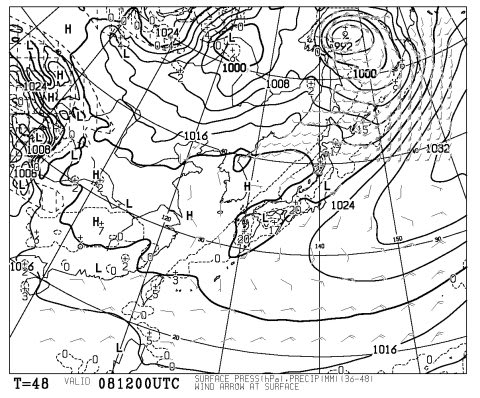
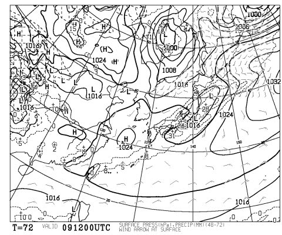
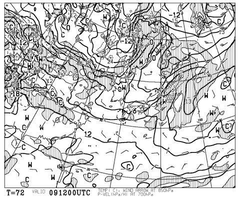
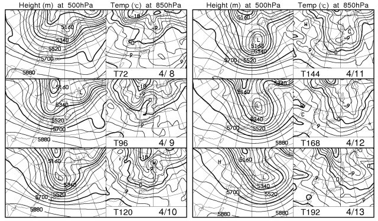

# この週末は，天気あんまり良くないなぁ…

📅 投稿日時: 2011-04-07 01:31:20

うーーーむ．

現時点では．

この週末．

…特に土曜日ですね．

天気．

悪いです．

すっごく．

金曜夜から，雨ですね．

雨．

掛け値なく雨．

雪である可能性は100％ありません．

で，土曜日も降り続けます．

時々強く降るかも．

これが，金曜夜9時の地上気圧・降水量予想ですが．

点線で囲まれた，降水量エリアが西日本から日本海側に

広がってます…

で，土曜夜9時の地上気圧・降水量予想では．

こんな感じで，土曜になっても日本全域，降水量を示す

点線に囲まれています．

…つまり，金曜から土曜の夜にかけて，ずっと降り続ける

ということでしょうか…

それも，土曜は結構降水量が多そう…

で，土曜夜9時の850hpa予想気温ですが．

こんな感じで，信州はプラス3度の線が横切ってます．

標高1500mでの雪の目安の0度線は，はるか秋田～青森あたり．

うーーーーん．

信州は，2000mクラスでも雪は厳しいか…

雨だろうなぁ…

日曜は，雨は上がりますが，雲は多め．

午後は信州は晴れるかな～

新潟は曇りそう．

前日の雨を吸って，昼間はドボドボ雪でしょうね～．

夕方，冷えてくるとそのまま凍りそう．

あーー．

現時点の天気予報では，今週末はちょいと悲惨な

状況になりそうですね…

うーーん．

まだ2日間あるので，奇跡的に天気予報ががらっと

変わることを期待．

しかし，

日曜夜から冷えそうです．

ここにあるように．

11，12日と，日本が0度の線にすっぽり覆われてます．

11日は冬型になり，ちょっと雪もちらつくかも．

…でも，13日以降は気温も上がりますね…

うーん．来週はいいコンディションになってほしいなぁ．

しかし．

3月以降これまで．

この時期としては，雪が良すぎたのかも．

これが普通の状況のような気がする…
