# 4月26日，GW初日の志賀高原は…晴れてがらがら，結構いい一日！

📅 投稿日時: 2014-04-26 21:01:04

えー．

ってことで．（何が？）

志賀高原に来てます．

ということで，GW初日の本日．

…志賀草津道路が開通したので，

草津越えでやってきましたが…

うはー．

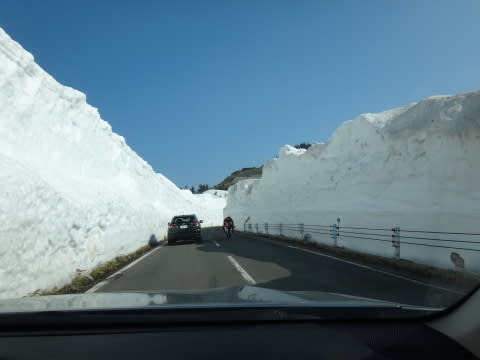

例年に比べると．

雪が多いですな～．

スノーシェードの中は，雪解け水が流れてて．

気温が下がった日の朝とかは凍結する

かもしれませんが，

…今日は，スタッドレスがなくても

突っ切れるレベルでしたねー．

＃大量に凍結防止剤がまいてありました

で．

通常営業開始の8時に到着して，

ゲレンデに出ると…

朝というのに，山頂の気温は9度近く．

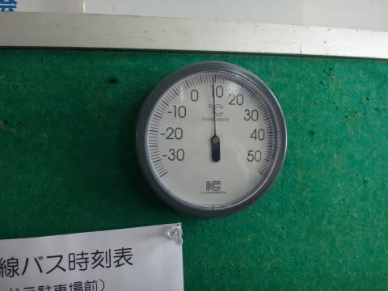

ちょっと暖かいなぁ…(涙）

でも．

朝イチのゲレンデは．

ドボドボかと思いきや…

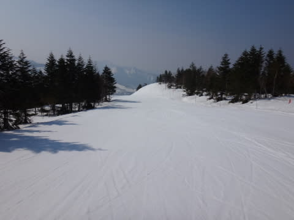

表面がやわらかくなっているものの，

下は固さが残っていて．

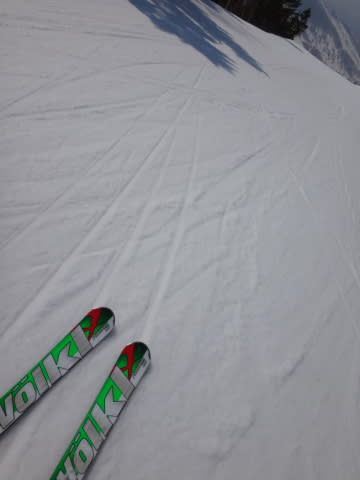

板が潜ってしまうザブザブではない，

かなり滑りやすい大回りバーン！！

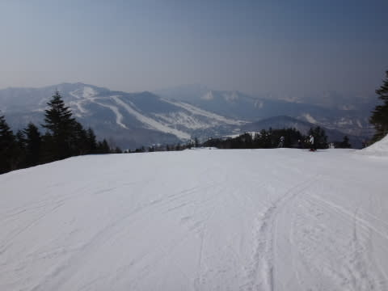

なんと！

気温が意外と高いのに…

これは，いい！

結構良いじゃないですか～！！

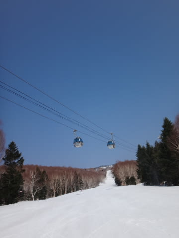

天気もピカピカ晴天で，

朝10時になっても．

意外なことに，

雪はざぶざぶにならず，快適大回りバーン！

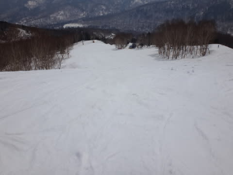

そして．

ゲレンデの写真にも人が写ってないことから

わかるように．

超がらがらで．

ゴンドラを待ってる人もほとんどいないんですが…

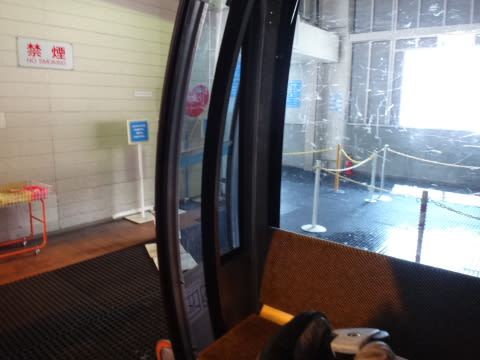

おかげで，ゲレンデはフラットを維持！

昼間には予想通り，気温は10度を超えちゃったとはいえ…

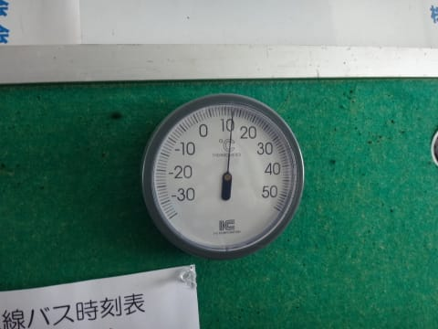

朝からは結局3度ほどしか気温が上がらず．

で，雪も湿ったザラメになってきましたが…

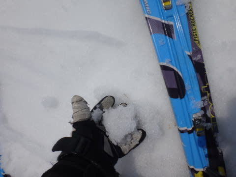

んでも．

雪に汚れや水が浮いてくることはなく．

きれいな白い雪のままで．

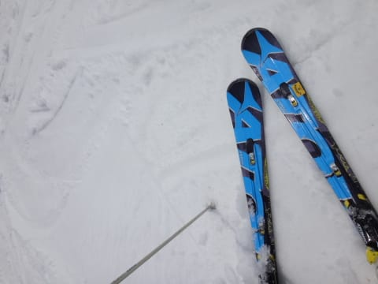

午後になっても，板に張り付くストップスノーにならず．

板は気持ちよく滑ってくれるし，

人も少なく，ゲレンデはそんなに荒れないまま！

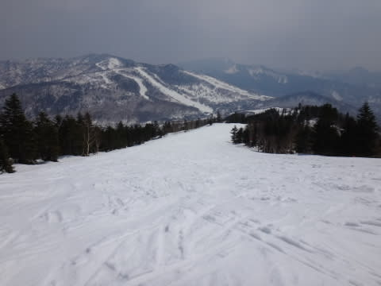

うむ．

この時期に，夕方まで板が潜るような

ザブザブ雪にならず．

ストップスノーにもならないなんて！

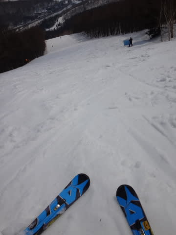

いやー．

これは，私の願いが通じた違いない！！←こうやって，また天気予想の

雪質が外れたのをごまかしている

で．

この時期にしては雪も多く．

コース全面に，完璧に雪がついているし．

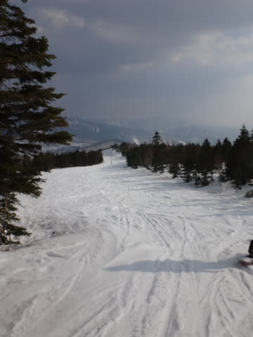

それどころか．

例年のGWなら熊笹が全面に現れているリフト下も…

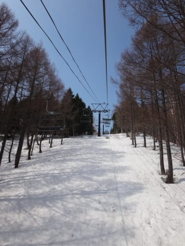

まだ完璧雪に覆われてます！！

…って感じで，雪はいっぱいあるのに．

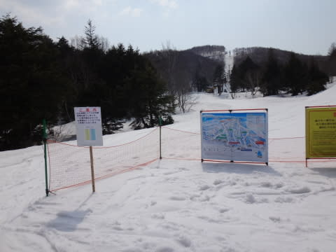

なぜか先週で一の瀬山の神の営業が終了しちゃってます…（涙)

なんで，GW前の週まで営業して．

GWはリフト止めるかな～(泣）．

でも．

今日は．

さすがに夕方はちょっと雪が荒れたものの．

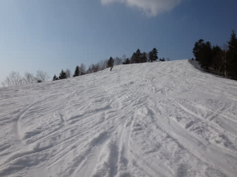

リフトストップまで，ざぶざぶ雪にならず．

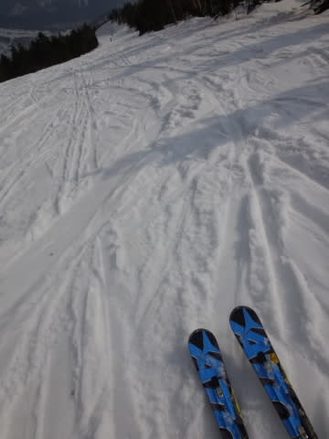

真っ白な雪の，4月上旬くらいの

ゲレンデ状態をキープしたのでした！

…下界は気温が上がったようですが．

志賀は，GWと考えると，コンディションは恵まれてますよ～っ！！

でも，経営が心配になるくらいガラガラなんですが．

＃ゲレンデ写真に人が全く人が写ってない…

晴れていいコンディションの日に，こんな

ガラガラで良いのか～っ！！

## 💬 コメント一覧

### 💬 コメント by (いか)
**タイトル**: Unknown
**投稿日**: 2014-04-27 00:20:29

志賀は人が本当に少なそうですね…。大丈夫なのでしょうか？

下界の東京は暑かったですね…

後半は行けるかな！？

### 💬 コメント by (Skier_S)
**タイトル**: いかさま
**投稿日**: 2014-04-27 06:11:32

いや～

ホントマズいくらいガラガラ

でしたよ！

GW後半はホテルも結構混んでる

らしいので、４連休そこそこ混みそう

ですが…

いま、早朝すべってますが、

ぼちぼち人がいますよ～

