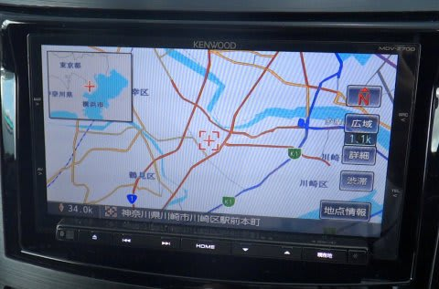
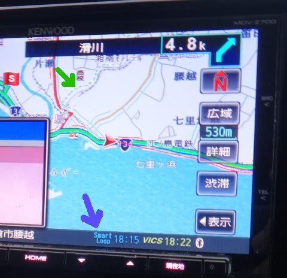
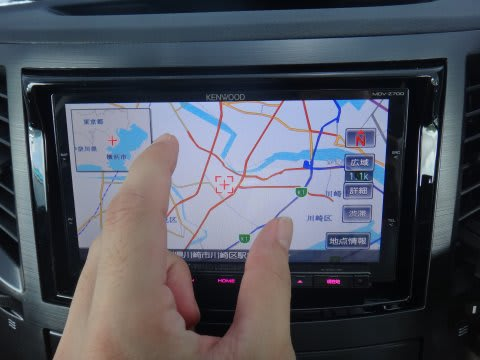

# プロジェクトX第2章…新しいナビの使い勝手は…

📅 投稿日時: 2013-07-06 06:25:00

🏷️ カテゴリ: [車](cba0e8330b3f2ded7c1addfacc75d4547.md)

…もう，飽きてきたころかもしれませんが．

まだまだ続く，プロジェクトX第2章．

…今度は，新しいカーナビについて．

＃今日の記事は，深夜で疲れてるので，あんまり面白く書けなかった…

今回，KENWOODの彩速ナビ，[MDV-Z700を買ったのは報告済み](e09e2ec6505c6a1935719a3fdc95d554d.md)ですが．

…まぁ，

あれですね．

ナビ機能自体は，7年前からそんなに大きく進歩してるわけじゃないですね～．

画面が高精細になったとか，詳細データが増えたとかの進歩は

ありますけど．

ナビ機能自体に，驚きはそんなにない気が…

しいて言えば，ここ1年のナビ．

スマホ連携が一気に強化されてますね～．

iPhoneだけじゃなく，Andoroidスマホとも連携して，

スマホ経由でスマートループ渋滞情報が取れます．

あー．スマートループってのは，ホンダのインターナビみたいに．

車の移動情報をリアルタイムで集めた渋滞情報です．

んで，このスマートループ情報を使って．

VICS以上の詳細街路の渋滞情報・渋滞時間情報を元に経路

を探索してくれるという…

　(Bluetoothでスマホとつないで，スマートループ情報取得中(青矢印)．

　緑矢印で示した点線が，VICSではなくスマートループによる渋滞情報)

さらに．ガソリンスタンド価格情報なんかの情報もスマホ経由で取得して，

画面に表示してくれますし．

スマホのナビ連携ソフト(NaviCon)を使えば，スマホで探した場所

情報をBluetoothで送信，自動的にナビに目的地として設定することが可能です．

…って感じのスマホ連携機能ですが．

うーん．

スマホの情報を利用するなら．

スマホで直接探す方が便利かも…(笑）．

まぁ，新しいナビが昔と変わったのは．

スマホと同じ操作感．

フリックやピンチといった操作で，地図スクロールができます．

＃今，こういう操作ができるカーナビはKENWOODだけなのかも？？

スマホでGoogleマップを使った後に，カーナビを使うと

スクロールのさせ方の違いに

「うがーっ！」

ってなったものですが．

このナビは，そんな心配はないですね～．

まぁしかし．

私がカーナビをつけるのは．

ナビだけが目的ではなく．

バックカメラはぜったい欲しい…という理由と．

あとは，AV機能なのだ…

AV機能は，また次回以降に報告します～
