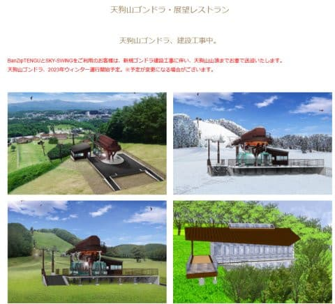
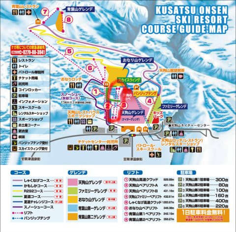
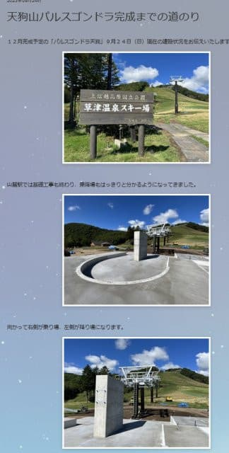
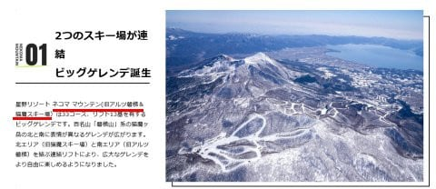
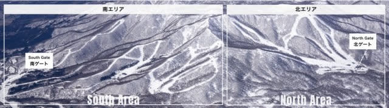
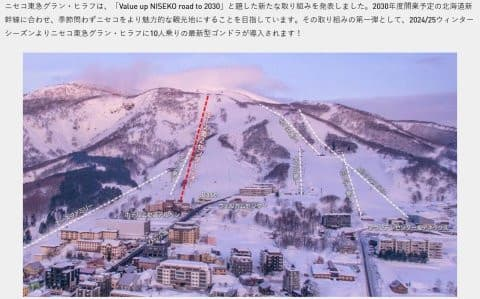
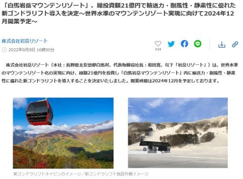

# 2024年に設備新設するスキー場…草津にパルスゴンドラ，アルツ磐梯と猫魔が接続！

📅 投稿日時: 2023-09-30 01:05:06

コロナ禍このかた，

スキー場はお客さんも減り．

ついにウイングヒルズもアイスクラッシュでの

営業をやめたり，他のスキー場でもリフトの

廃止・営業期間の短縮などが相次いだり

しましたが…

そんな中でも，2021年には野沢がゴンドラを

新しく架け替えて，人工降雪機が導入されたり，

同じく横手山にも人工降雪機が導入されたり，

あとは地味なところで志賀高原もブナ平が

クワッドからゴンドラに搬器を付け替えたりと，

ここしばらく止まっていたスキー場への

投資が一部戻ってきたところもあります…

ということで．

果たして，来る2023/2024シーズン，新たに

変わるスキー場は何かあるかというと…

まずはこれまで話題になった，

菅平スキー場へのアイスクラッシュ導入．

これまでのイエティとほぼ同時，10月21日の

オープンとなるという，かなり衝撃的

ニュースでした！

（[菅平高原スノーリゾートホームページ](https://sugadaira-snowresort.com/)より）

そして次は…

草津に新ゴンドラ導入．

火山活動でゴンドラが廃止になった

草津温泉スキー場．

ここの天狗山ゲレンデのペアリフトが

パルスゴンドラになるようです…！

（[草津温泉スキー場ホームページ](https://www.932-onsen.com/green/lift)より）

ただ，ゴンドラになるのは長さ430mの

天狗山ペアリフトらしく…

これ，志賀高原でいえばタンネの森のリフト

くらいの長さしかない，かなり短い

ゴンドラですね…

（[草津温泉スキー場ホームページ](https://www.932-onsen.com/winter/course)より）

建設現場を見ると…

ゴンドラ建屋もなく，志賀のパルスゴンドラと

ほぼ同じ作りですね…

（[草津温泉スキー場スタッフブログ](http://blog.livedoor.jp/kusatsu932/archives/52595416.html)より）

そして次は，

アルツ磐梯と猫魔を繋ぐリフト架設，

両方のスキー場がつながる！

という，結構大きなニュースです…！

両方がつながって，スキー場そのものも

「ネコママウンテン」

という名前に変わるようですが…

（[ネコママウンテンスキー場ホームページ](https://www.nekoma.co.jp/feature/welcome/)より）

両方がつながって，かなり広大な

エリアになりますね～！！

ただ，アルツ磐梯に昔あったゴンドラが

廃止されているのが惜しい…

（[ネコママウンテンスキー場ホームページ](https://www.nekoma.co.jp/feature/welcome/)より）

でも，さすが星野リゾート…

効果的に投資して，スキー場の魅力を

見事にアップしている感じがしますね～！

ってな感じで．

来るシーズンの大型投資で目立つのはこの

あたりですかね～．

コロナが落ち着いても値上げやスキー場の

廃止が相次ぎ，

スキー業界は大丈夫か？？

と心配になりながらも，来るシーズンも

いくつか明るいニュースがあることに

ちょっと安心…

で．

ここからはさらに次のシーズン，2024/2025シーズンの

話ですが．

一つは，

ニセコエース第2センターのクワッドリフトを

最新ゴンドラに架け替え

というニュース！

これ，かなり長い滑りごたえのある

リフトでしたが…こいつがゴンドラに

なるのか…！！

（[ニセコユナイテッドホームページ](https://www.niseko.ne.jp/ja/news/a-new-all-season-gondola-at-niseko-tokyu-grand-hirafu-resort/)より）

さすがリフト1日券9500円とるだけ

あって，ごつい投資をするみたいですね…

ニセコ，すごい…

そして．

2024/2025シーズンには

岩岳のゴンドラも架け替わるようですね…！

（[白馬岩岳スキー場ホームページ](https://prtimes.jp/main/html/rd/p/000000036.000068296.html)より）

岩岳ゴンドラ，もうできてから35年も経つのか…

八方やらいろんなところのゴンドラも，

大体スキーバブルのころにできたので，

もう30年以上経っていて．

志賀高原でも焼額の第2ゴンドラとか，奥志賀の

ゴンドラも30年を超えてきてるので…

そろそろ架け替えないとやばい時期のような

気もするんだけど…

…でも，21億円か…

うーん．

誰か私に100億円くれたら，焼額の

第2ゴンドラと第3高速をかけ替えて，

第1高速リフト復活させるんだけどなぁ…

誰か私に100億くれないかな？？

## 💬 コメント一覧

### 💬 コメント by (だい)
**タイトル**: 焼額山も…
**投稿日**: 2023-09-30 01:26:59

おひさしぶりです。だいです。

焼額山も何気に動きがあって、コース一覧を見るとひっそり「A7　新コースオープン予定！」ってなってますね。何処がコースになるんでしょう…

### 💬 コメント by (1kamakura)
**タイトル**: Unknown
**投稿日**: 2023-09-30 07:25:37

初めまして

江戸の秋と申します。

二十歳頃からスキーを始めて37年。

運動オンチな私が唯一やりたいスポーツがスキーです。

だいぶブランクがありましたが、ここ三年は年に1から2度行っています。

どうしてもパラレルができない。

パラレルで颯爽と滑りたいんですけどねー😢

ダイビングも若い頃はやっていましたが、

ものすごいブランクがあり、やり方を忘れてしまいました。

そんな訳で、Sさんのブログは楽しく読ませていただいています。

12月にはニセコアンヌプリへ行く予定です。

### 💬 コメント by (Skier_S)
**タイトル**: え？焼額に新コース？？
**投稿日**: 2023-10-01 03:08:21

＞だいさま

えええええ！！！！！

焼額に新コースですか！！

確かに，ホームページ見に行くとひっそり書かれてましたね…気づかなかった…

一体どこにできるんでしょうね？？

＞江戸の秋さま

コメントありがとうございます～！！

スキーは生涯スポーツで，一度できるようになったら忘れないので，

ずっと続けてやってください～！

ダイビングも，たぶん潜ったら思い出しますよ（笑）．

12月，ニセコですか…いいですね～！

我が家にとっては，交通費がかかってリフト券代が高いニセコは今後行くことがなさそうです（涙）

楽しんできてください！

