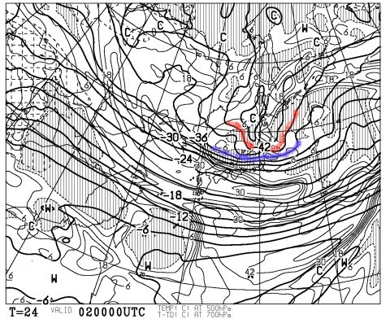
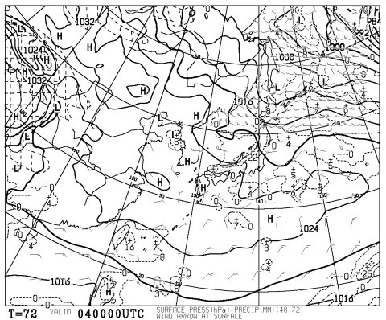
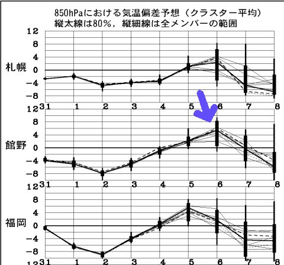
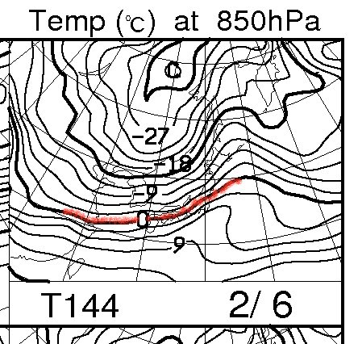
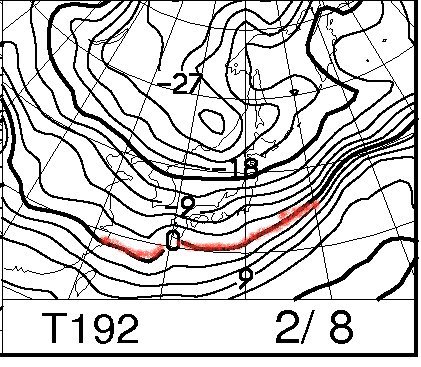
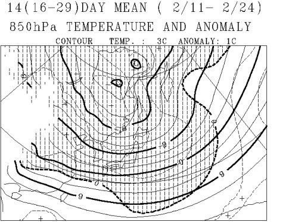

# いつまで続く？この寒気

📅 投稿日時: 2012-02-02 01:06:13

🏷️ カテゴリ: [スキー天気予想](c6554f5c3c106093b511a8daae23757e8.md)

なんだか．

平成18年以来の大雪になっちゃった今日この頃．

もう，スキー場の雪は十分なようですが．

とりあえず，ニュースで「2日が雪のピーク」って言ってますね．

まだまだおなかいっぱい降っちゃいそうですね．

2日の朝9時の500hpa気温予想図を見ると…

あー．

赤線のマイナス42度の寒気が東北まで降りてきてますね．

この赤線．

ちょーーー大雪の目安．

で．青線のマイナス36度の寒気．

これは大雪の目安で…

北陸から信州までかかってますね．

ということで，2日朝は超大雪の新雪ぱふぱふでしょう．

ニュースでは，2日がピークって言ってますが．

新潟の海沿いは…4日まで降りますね．

4日朝9時の天気図で，日本海側に降水域がかかってます．

日本海側，まだまだ2日間は降り続けそうです．

この週末も，新潟のスキー場はもふもふです．

…あー．

信州の内陸は，4日，土曜日の朝は新雪は狙えないかな．

日本海に近いところだけかな．新雪は．

で．そのあと．

久しぶりに，5，6日は平年より高い気温にあがりそうですね～．

5日の日曜日は，日本海側も久しぶりに晴れて，絶好のスキー日和でしょう．

＃あくまで現時点の予想では…

例年より気温が上がるって言っても，

こんな感じで，850hpaの0度線は信州のあたりを横切っているので．

気温があがる6日も，そんなに雪がひどくどろどろになっちゃうほど

まではあがらないでしょう．

で．

そのあと．

…

また，冷えます．

こんな感じで，2月8日は，また日本の南まですっぽり

850hpaの0度線が下がります．

で，冬型になって，また雪が積もります．

…日本海側の人は，もういい加減にして～，って感じでしょうが…

でも．

でも．FCVX12を見ると．

こんな感じで，2月11～24日までの平均気温は．

本州中部では，例年より3-6度低くなってますので．

…2月8日以降，2月の下旬までは，またかなり寒い日々が続きそう…

＃しかし，こんな大雪の年にもかかわらず，私は

＃今シーズンまだ一度も腰パフの深いパウダーに当たっていないんだなぁ…

＃日ごろの行いが悪いのかっ？？

## 💬 コメント一覧

### 💬 コメント by (ひまわり)
**タイトル**: 〓〓〓
**投稿日**: 2012-02-03 08:34:48

おはよ～ございますっ

Sさま、、(=_=;)。。

（求め過ぎのようなっ。でも、Sさまのブログ拝見してると、、運頼みじゃなくご自分で運を引き寄せてる感じがすごくしちゃうっから。。きっと。。）

私は昔、、よくボードに行ってました。

フカフカの新雪って楽しいですよねっ。

私は余り滑りは上手くないんですが、、それでもフカフカ・パフパフのゲレンデ見ると、、テンション自然とあがっちゃいますよね

ついでに、、わざと転んじゃう

近々で、念願の腰までフカフカ・パフパフの新雪に会えるとよいですねっ

### 💬 コメント by (Skier_S)
**タイトル**: 欲深ですから…
**投稿日**: 2012-02-04 00:36:20

休みでたまたまスキーに行かない日があって，その日が最高だったら後悔する…

って思って，どうしても休みは必ずスキーに行っちゃいます．

というわけで，パウダーに出会うのは単なる運頼みじゃなく

最大限の努力をしてる，とも言えます…．

でも，今年は運が悪い…(涙)

明日はパフパフになりそうなのに，明日に限っていけないんだよな…

