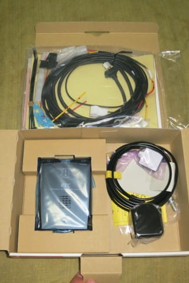
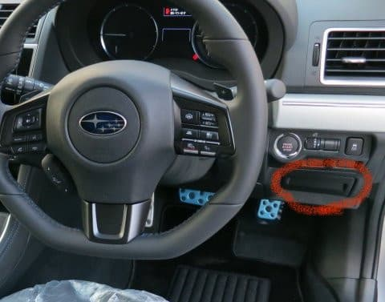
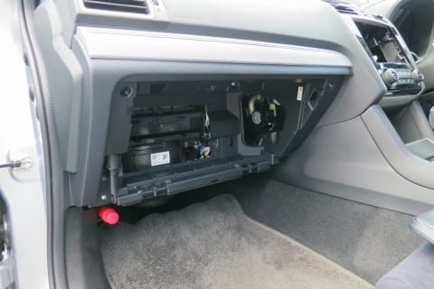
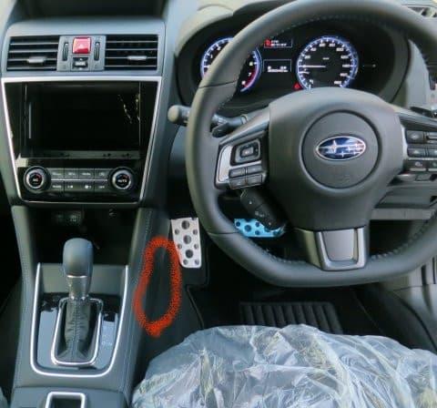
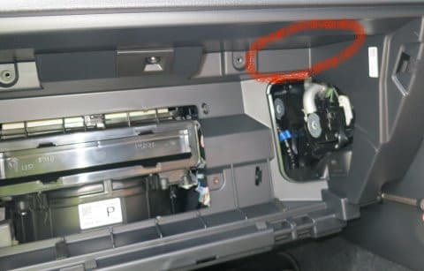

# プロジェクトX2第2章…LEVORG E型にKENWOODナビ連動ETCを取り付ける！車載器をどこに着けようか？？？

📅 投稿日時: 2018-08-01 02:32:43

🏷️ カテゴリ: [車](cba0e8330b3f2ded7c1addfacc75d4547.md)

本日，LEVORGを購入後，ようやっと400kmほど走ったので．

ガソリンを給油してみましたが…

なんと．

満タン法で計算した燃費が．

リッター8.7km！！

…想像より悪い…（涙）．

生涯燃費が14km/Lを超えた前のBRレガシィでは，

ほとんど見ることがなかったレベルの燃費だったので，

ちょいと驚きました…

うーむ．

まだ慣らし期間なので，かなりおとなしめの運転で．

結構エコラン気味に走っていたのですが…

まぁ，今回は遠出をしていないため，燃費が伸びる高速道路

の走行はほとんどしておらず．

通勤路のゴーストップが多いところが走行距離の

ほとんどで，さらに結構渋滞もあったので．

BRレガシィでも，リッター10km前後くらいの

燃費になるだろうなぁ…という状況ですから．

まずはこんなところでしょうか．

とりあえず，アイドリングストップがない

この車．

Go-Stopが多い街中で燃費が悪いのは，

ある程度想定の範囲内．

高速走行でどれだけ伸びるかが

ちょっと楽しみです…

ってなわけで．

本日はレヴォーグへETC取り付けの記事です．

では，どうぞ～！

---

ってな感じで．

波乱に満ちたリアカメラ取り付けがひと段落着いたので．

…次はETCの取り付けに移りましょうか．

とりあえず．

ETCを取り付ける際に悩むのが．

ETC車載器をどこに着けるか

ですよね…

レヴォーグの純正オプションだと．

運転席右膝のあたりにある，小物入れ．

ここにETC車載器をつけるのですが…

ここにETC車載器をつけちゃうと．

使い勝手のいいここの小物入れが

使えなくなっちゃいます．

前のBRレガシィでは，グローブボックス内に

ちょうどいいスペースがあったので，

そこにETC車載器を隠していたのですが…

（純正AVナビのB-CASカード差し込み機器用スペースが，

　ETCをつけるためにあるんじゃないか？というほどの

　絶妙な位置とスペースだった…）

今回のLEVORGを見てみると．

グローブボックス内に，そんな都合のいいスペースは

無いですねぇ…（涙）．

（いきなりグローブボックスを外している）

かといって．

このETC車載器の取り付けマニュアルで，

取付推奨位置となっているこのあたり．

このあたりに両面テープで貼り付けるのも，

美しさに欠けるので，個人的にちょっと

好きではないのだ…

こういうものは，なるべく隠したいのだ．

で．

LEVORGにETCをつけた先人の記録を見ていくと．

グローブボックスの天井にあたる，

この位置．

グローブボックスの開閉に邪魔にならないような

ここにピッタリETCをくっつけて．

上手くETC車載器を隠している例があったので．

ここは先人の知恵に学ぶのだ！

うーむ．

ネットで調べれば素晴らしい先人の知恵を得られるとは．

いい時代になったものだ…

ということで．

グローブボックス内部にETC車載器貼り付け大作戦，

いざ決行！！

明日朝5時起きなので，今日はここまでで…（ごめんなさい）

## 💬 コメント一覧

### 💬 コメント by (おおすぎ)
**タイトル**: ご納車おめでとうございます♪
**投稿日**: 2018-08-01 17:59:36

一通り記事読みました。

毎回納車の儀式には頭が下がります・・・

（私なんて、もう面倒くさがりで、殆どＤオプでセットしちゃいました！）

Ｓ様の人柱？！で、これからＥ型乗りになる方に朗報になったのでは？と思います。

燃費計測は、このクソ暑い時期のものでしょうか？うちの車も同僚のも、全く同じ現象です。先々月にくらべ軒並み3割ダウンです。

クーラーやら冷却周りやらエンジン保護やらで、燃費が悪化するのでしょうかね（通常でしたら、夏場の方が冬季に比べ燃費が良くなる傾向があるんですがね！！）

### 💬 コメント by (Skier_S)
**タイトル**: おおすぎさま
**投稿日**: 2018-08-01 23:37:21

納車の儀式ですが，ナビやバックカメラにお金をかけたくないという

私の貧乏精神の表れで，専門業者にやってもらった方が

時間もかからないし，常識的な人はそうする方がよいかと…(笑)．

いやー．

しかし，今回のD型以降の仕様変更は参りました．

で，

LEVORG，夏に燃費が悪化するんですか！

これまでの我が家の車は，軒並み冬に

寒冷地始動の影響で燃費が悪化するんですが…

それも3割って，すごいですね！

アイドリングストップ車だと，夏の気温が

高い時期にエアコン動作のためにストップ時間が

短くなって，燃費が悪化することがあるのですが…

うちの車，アイドルストップ車じゃないし…

冬になったら，燃費が良くなることに期待です…

### 💬 コメント by (ノムノム)
**タイトル**: 酷暑が続きますね
**投稿日**: 2018-08-04 18:29:48

Sさんこんにちは。

レヴォーグライフ楽しまれているようですね。DIYは時間はかかりますが、色々と考えながらやるのも楽しいものです。

燃費の件ですが、気温も影響あるかもしれませんが、市街地走行であれば平均8～9km/Lくらいは普通ですよ。冬場でもそんなもんです。高速では平均13～14km/Lくらい伸びますけどね。

300PSの車ですし、一昔前と比べればこれでも大分いいように感じます。

### 💬 コメント by (Skier_S)
**タイトル**: ノムノムさま
**投稿日**: 2018-08-05 15:03:33

300馬力の車に燃費を求めてはいけないのは

覚悟して選んだ車だったので，普通の燃費は

町中で10km/Lは超えないかな…と思っていた

のですが…

気合のエコランしたら，もう少し伸びるかな，と思っていたら．

意外と伸びなかったのにちょっと驚いた感じです…

まぁ，昔のターボ車に比べれば，結構燃費が良くなったと

思っています．

しかし．

今のところ300馬力を生かせるシチュエーションに

出会うことはなく．

まだこのエンジンの底力は発揮されていないのが

もったいないところかも…

