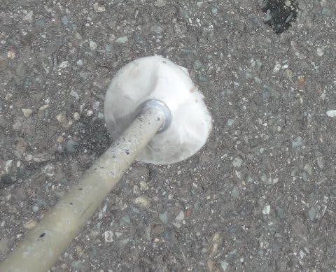

# そしてシーズン終了…今シーズンお亡くなりになったアイテムたち

📅 投稿日時: 2014-06-26 02:17:16

ということで．

私のスキーシーズンも無事終了したわけですが．

スキーに行き過ぎて，貧乏金なしの我が家．

基本的に，スキー道具は

「ダメになるまで（ダメになってもごまかして）使い続けるっ！！」

という強い信念のもと．

もう，ボロボロになるまでひたすら酷使するわけですが．

今シーズン，死んでいったアイテムを振り返ってみると…

まずは，スキーパンツ．

…こんな感じで．

すその部分が雪で擦れて，すり切れて破れる…

といういつものパターンで死亡．

8000円の激安パンツだったからか，2シーズン

もたずして昇天です…（しくしく）．

そして．

グローブ．

Skiline様の仰せによると．

1シーズンで700回ほどゴンドラに乗るらしい私．

ゴンドラ乗り降りの際に，板のエッジでグローブが擦れて，

あっという間に穴が開くので．

テーピングテープでその穴をふさいで延命処置を

図るわけですが．

例年，シーズン終わりには，片手で3-4本の指に

テープが巻かれていることを考えると．

まぁ，今シーズンはまだ穴が少なかった方かな．

…でも，さすがにもう終了でしょう…．

このグローブもわずか1シーズンの命でした（涙）．

で…．

ストックですね．

普通は折ったりしない限り，ストックが消耗するってのは

ない気がするんですが．

ええっ！？？？

石突の先端が…

あまりの酷使に，先端が割れて，

金属が取れてる！

ってことで．

こいつも今シーズンにて終了．

…まさか，ストックが3シーズンしか

持たないでご臨終とは…（泣）．

大体，私は「ストックのリングが擦り減る」という，

不思議な現象を引き起こすので．

いつもはリングを数回換えるものなのですが．

今回のストックは一度も交換せず，寿命を

迎えてしまいましたね…

さらに．

SALOMONブーツ．

…こいつは，まだ履こうと思えば履けるんですが．

さすがに200日近く滑ったインナーがヘタリまくって，

そこらじゅう当たって痛くなったので．

残念ながら，4シーズン目で終了ということに…

そして．

SALOMONの24hours LMの板．

これは，もう昨シーズンにエッジが剥離しはじめていたものを，

シーズン初めのイエティ用として最後の

ご奉公をしてもらいましたが．

さすがに4シーズン目の今シーズン，

ご引退です．

で…

…

…こいつは．

かなり激しいありえないほどのマイルド化が進んでる

気がするのですが．

…気がするのですが．

気のせいってことで，もうしばらく

働いてもらいましょう！

そのほか．ゴーグルのスポンジがもうボロボロで，

使った後，顔にいっぱいスポンジの屑がつくし（涙）．

…って感じで．

もう，寿命が尽きるまで使い尽くすのがポリシーの

私でも．

これだけのアイテムが死亡宣告となると…

うーん．

スキー用品って．

こんなに消耗するもんなんだっけ？？

という疑問を呈したくなる今日この頃なのだった．

## 💬 コメント一覧

### 💬 コメント by (ひろちゃん)
**タイトル**: 凄いグッズあり
**投稿日**: 2014-06-26 15:12:58

エス様お疲れ様です。先週、石井スポーツフェアで、ゴーグル付きヘルメットに、大感動、値段少しはり、進化途中らしいが、使いやすさなどなど考えると、良かったですよ（≧∇≦）

### 💬 コメント by (Skier_S)
**タイトル**: ひろちゃんさま
**投稿日**: 2014-06-26 23:47:39

ゴーグル付きヘルメット，

焼額でも何回か見たことがあり，

便利そうかな～，とは思ってましたが…

お気楽レジャースキーヤーなので，

ヘルメットはちょっと敷居が高くて…

### 💬 コメント by (いか)
**タイトル**: Unknown
**投稿日**: 2014-06-28 02:27:06

ヘルメットはあったかくていいですよー

今シーズンは…TC-SEがマイルド化で隠居しました。

日数では50日ほどですが、コブに入りすぎたようです(--;)

### 💬 コメント by (Skier_S)
**タイトル**: いかさま
**投稿日**: 2014-06-28 22:34:31

コブに入りまくると，

板の消耗が激しいですよね～

せめて100日くらいはもってほしいんですが…

次の板は何を買うんですか？

### 💬 コメント by (いか)
**タイトル**: Unknown
**投稿日**: 2014-06-29 00:30:20

すでに13ー14のatomic sxを投入済みです(￣ー￣)

### 💬 コメント by (Skier_S)
**タイトル**: いかさま
**投稿日**: 2014-06-29 00:42:22

おっと．

もう1セット追加で購入するのではないのですか…？（悪魔の誘い）

### 💬 コメント by (いか)
**タイトル**: Unknown
**投稿日**: 2014-06-29 09:55:19

ロング、ショート、ファットと13ー14シーズン用に3セットも買ってしまったので…(((・・;)

### 💬 コメント by (Skier_S)
**タイトル**: いかさま
**投稿日**: 2014-06-29 12:52:13

なんですと～！！

私も1シーズンに3セット買ったことないのに…

すごい…

