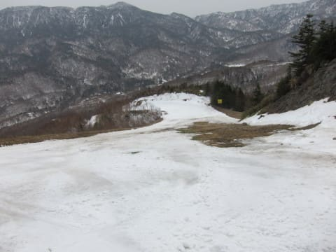
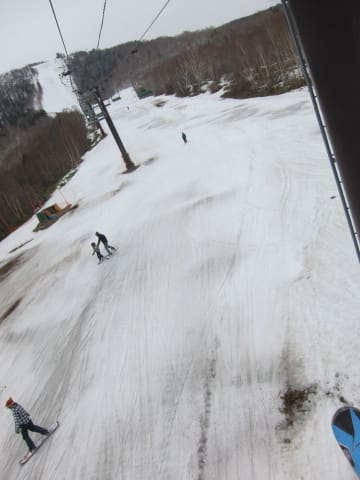

# 昨日，4月5日(水)の奥志賀高原ダウンヒルコースの動画！…4月上旬にコース上に土が出てるよ（涙）

📅 投稿日時: 2023-04-06 13:09:39

えー．

昨日はあまりの眠さに，23時半に仕事途中で寝てしまい．

今朝泣きながら仕事をしていたSkier_Sです…

とりあえず，昼までに何とか午前中締め切りの

仕事を終えて，今日は久しぶりに昼休みが取れたので，

昨日更新できなかった分，お昼に手短に更新！！

昨日，いつものおこみん特派員より，奥志賀高原スキー場

ダウンヒルコースの動画が送られてきました…！！

しかし，2壁の部分，コースの真ん中に土が出てきて

るんですけど…（涙）

でも，史上最悪の雪不足だった2016シーズンでは，

4月9，10日の段階で奥志賀はこんな状況だったので．

それに比べればまだマシみたいです…

（2016シーズンの写真）

でも．

2016シーズンは4月16日の週末がまともに

滑れた最後で．

4月23日の週末は，一の瀬も熊の湯も下半分の

廊下状態という，最悪のシーズンだったので…

そこまでひどくならないことを願うばかり…

とりあえず，皆さんは

寒いギャグでも冷え冷え踊りでも何でもいいので，

全力でGWまで営業が続くように祈りましょう！！
