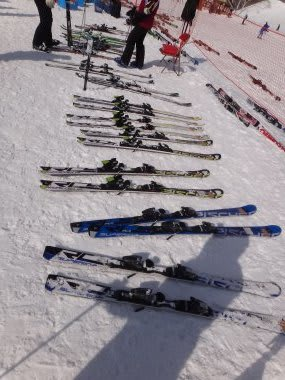
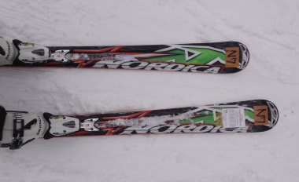
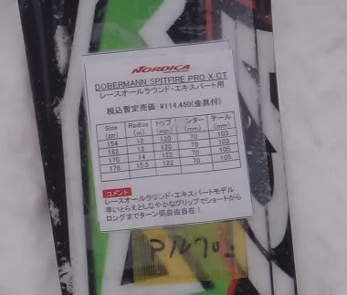
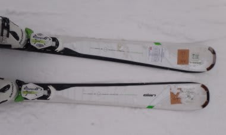
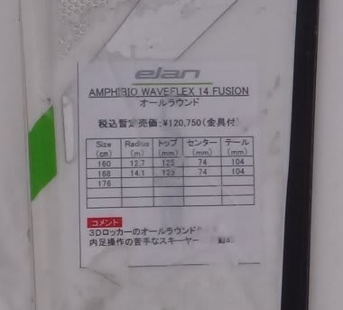

# さらに追加！2012/2013シーズンモデルのスキー試乗レポート　Nordica＆ELAN編

📅 投稿日時: 2012-04-11 00:43:23

というわけで．

この週末．

志賀高原の，一の瀬ダイヤモンドスキー場でやっていた試乗会に

参加してきたので．

またまた試乗インプレッションを追加していきます．

今回乗ったのは11機種，うち2機種は前回乗ったものとかぶっていますが…

で．今回の試乗を行った状況ですが．

バーンコンディションは4月としては最高．

雪質はトップシーズン並みの軽い雪質が前日から20～30cmつもり，

それが圧雪されたバーン．

ただ，雪が軽かったので，荒れるのが早く，試乗開始後1時間も経つと，

結構バンピーな感じになってしまい，大回りはつらい感じになってきましたね．

さらにダイヤモンドのコースが短かったってのもあり，

小回り系の板の評価が高くなっちゃう感じですね．

大回り板は正当に評価できなかったかな～．

で．

試乗しているスキーヤーのスペックは．

…テククラも指導員資格ももっていない，素のレジャースキーヤーです．

単なるレジャースキーヤーが，自分に合う板かどうかを勝手に

述べているだけですので．

そのあたりご理解ください…

あ，

どうやら私は滑走スピードの平均レンジが高いので．

どちらかというと張りが強めのしっかりとした板を

好む傾向があるようですので，そのあたりもご参考に…

ということで．

今回はNordica&ELAN編をお送りします…

----

○Nordica

DOBERMANN　SPITFIRE PRO XBI CT　162cm

小回り系基礎板．

エッジグリップは結構しっかりしていますね～．

ずらしではなくエッジグリップで回る板で，サイドカーブよりも

板のたわみで回転弧を作っていくタイプですね．

私が今乗っているSalomon 24 LMに近い感覚ですか．

張りは結構強めの，しっかりした感じの板です．

ポジションはセンターキープ．

トップからセンターが食いつく感じ．

操作性は，ロッカーではない正統派小回り板の感覚です．

ただ，162cmと短いのもありますが，かなりの小回りスペシャル．

ある程度ロングっぽいターンまで引っ張れるLMとは異なり，

トップが食いついて，板がぐぐっとたわんで曲がって

行ってしまうので，ちょっと大回りはきつい感じ．

試乗会にはこの長さしかなかったんだけど…170cmや178cmもあるらしいので，

もう少し長い板を試乗した方が良かったのかな？

でも，ロッカーの乗り味ではない正統派小回り板としては，

攻撃的な滑りができる良い板だと思います．

○ELAN

Amphibio　Waveflex 14 fusion　168cm

オールラウンド板．

左右非対称で，アウトサイドがロッカー，インサイドがキャンバーという，

[微妙にねじれた不思議な板](e5be2080b24fa9ab10470f95067659cdf.md)です．

履いた感じは軽快．

フレックスは柔らかいけどトーションは強めの感じ．

わずかに傾けたところからスッとターンが始動し，そこから

粘るようなフレックスで，ねっとりした感じで板がたわんでいきます．

トップを押さえる必要はなく，単純にわずかに傾けるだけでターン始動します．

前後動は全く不要．

…インサイドはキャンバーらしいけど，乗り味はロッカー板ですね．

スピードを出していくとしっかりトップからテールまで均一にエッジで

とらえ，しっかりとしたエッジグリップできれいに回っていきます．

張りはそれほど強いわけでないけど，スピードを出しても

安定感があり，板が負けてグリップを失うことは無かったです．

フレックスが柔らかいわりにはコシがある感じで，

予想以上のスピード耐性があります．

アシンメトリック構造の効果か，あるいはプラシーボ効果かも知れませんが(笑)

内足が邪魔にならず，外足と内足の同調がしやすい感じ．

かなり軽快で，低速のズラシもいけます．

スピードを出した際のエッジグリップはしっかりしているけど，

低速でのずらしやすさや「ビンビン」した感じではない「ねっとり」と

したフレックスのおかげで，全体的にマイルドな感じがする板ですね～．

あー．

でも．

この板も小回りスペシャルでした．

フォールラインに絡める間もなく切れ上がっていきます．

R=14らしいけど，R=12くらいの感じでした…

## 💬 コメント一覧

### 💬 コメント by (雪上の翁)
**タイトル**: 適確ですね～
**投稿日**: 2012-04-11 19:47:31

Sさんのレポート、読んでいるだけで自分も履いた気になっちゃいます（笑）ちなみにこの2本は試乗しませんでした。

エランって良い板つくりますよね。

### 💬 コメント by (Skier_S)
**タイトル**: まだまだ続きます
**投稿日**: 2012-04-11 23:34:41

試乗レポート，残り9機種．

まだまだ続きます…

おそらく同じ板を試乗しているものもあるかと．

そのときに，私のレポートが的確かどうか

分かるかと思います(汗)．

