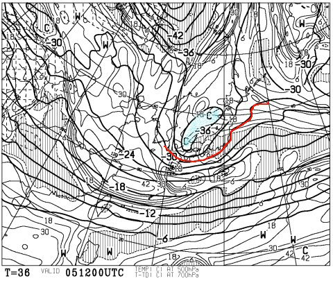
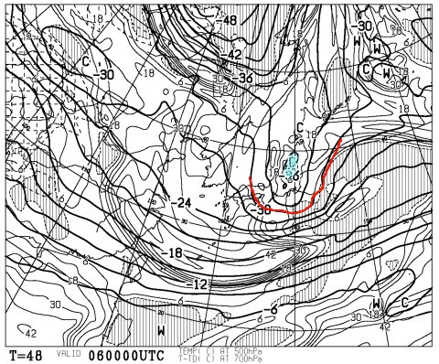
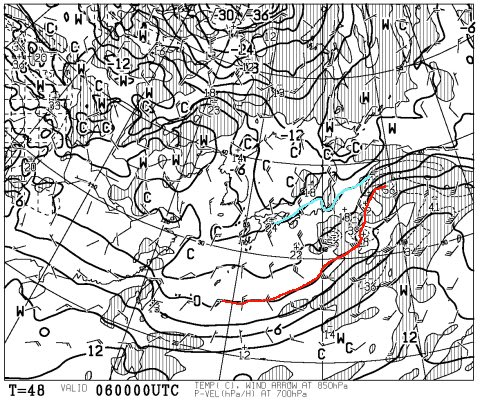
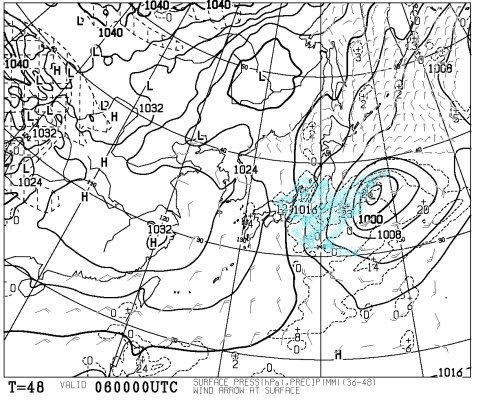
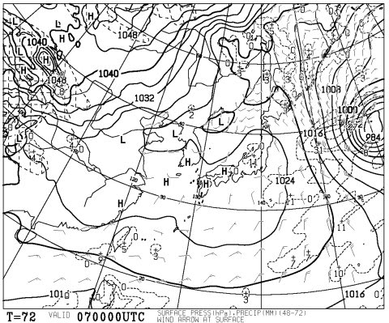
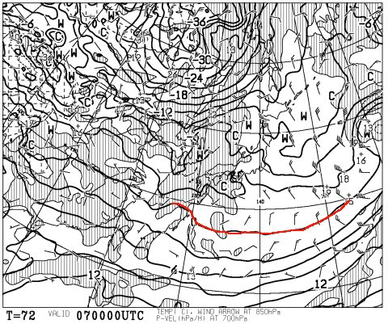
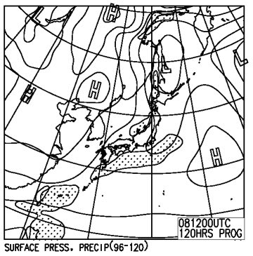
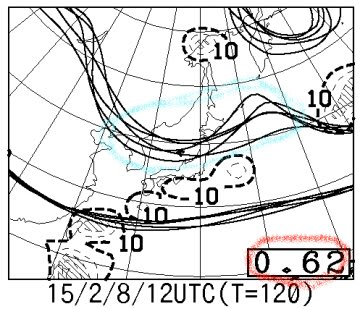

# 定例！この週末の志賀高原の天気は…

📅 投稿日時: 2015-02-05 00:37:17

🏷️ カテゴリ: [スキー天気予想](c6554f5c3c106093b511a8daae23757e8.md)

えーっとですね．

この週末の天気予想の前に，ですね．

関東でも大雪になるかも，と言っている，5日，木曜日．

この日の天気図をみてると…

をををっ！

なんだ，これはっ！

そこそこの雪の目安である，500hpaのマイナス30度の線が．

なんと．

太平洋側にまで南下してるよ！

…専門天気図を読むようになってから10年たつけど．

ここまで-30℃の寒気が南下したのを，

ほとんど見たことないよ…！！

これは，すごいよ…！

そして，金曜6日朝9時の500hpa図も，

赤く印したマイナス30℃線は，関東より南部にあるどころか．

青くマークしたすごい大雪の目安，マイナス36℃のエリアが．

北関東まで下がってきてるよっ！

で，今度は850hpa図を見てみると，

0℃線ははるかに南どころか…

関東にマイナス6℃線が！

マイナス3℃線がかかれば，平地でも間違いなく雪．

ってことで．

マイナス6℃線がかかっているんだから…

そう．木曜から金曜の朝まで．

関東の平地でも，降れば雪が確実…

で，この日の地上天気図は，というと．

こんな感じで．

水色で塗った降水域は関東エリアにもかかってますね…

…確かに．ニュースでやっているように．

これは，首都圏でも，かなりの雪が積もるかも…！

…なんだか．

これは．

[過去の忌まわしい記憶](e9f83615a49245623d0b12c8ac5ba6af4.md)がよみがえってくるのですが．

うーむ．

雪が積もりすぎてスキーに行けないという，ありえない事態が

起きないように．

首都圏の交通がマヒするほどに積もらないよう，祈るばかり…

で．

肝心な週末の天気ですが．

…

…うーん．

土曜の地上天気図はこんな感じで，

高気圧に覆われるので…

朝のうちは雪が残るかもしれないけど．

土曜は晴れの一日になるかな～．

850hpa図の0℃線もかなり南なので…

晴れても冷え冷えの，いい雪質で．

絶好のスキー日和になるかな～．

んで．

日曜ですが…

なんだか，微妙な地上天気図．

低気圧のしっぽが長野上空を通過しそうで，

雪もちらつくかな～，って感じ．

まぁ，この予想図が正しければ，そこそこ冷えた雪が

チラチラと舞ったり，曇ったり晴れたりと目まぐるしく

移り変わる一日になりそうだけど．

この日の予想ばらつきを見ると…

水色の線で囲った領域．

予想線のばらつきが大きいことが見て取れますね～．

んで．

赤字で囲った，ばらつき度合いを表すスプレッド．

このスプレッドが0.62と，かなり大きい数値になってます…

この数値だと，この日の予想の信頼度はまだ全然低く．

今後，大きく変化する可能性が高いことを示してます…

ってことなので．

今日の段階では，まだ正確な予想が難しい状態なんですが．

でも．

とりあえず，現時点での予想を書いておくと．

土曜：朝は雪が残るものの，昼前から晴れて，そこそこ冷えた一日．

日曜：晴れたり曇ったり，時折雪が降ったり…と目まぐるしく天気が

　　　変わる一日．気温は平年並み．

…って感じになりそうだけど．

現時点で，週末の予想精度はまだまだ低いです．

ってことなので．

また明日以降，予想の精度が上がったところで，

改めて週末の天気予想をします…
