# 4月1，2日の週末の志賀高原スキー場の天気は土日とも晴れ~曇りで気温は上がりそう．そして志賀高原の雪は今日も強烈に減った（涙）

📅 投稿日時: 2023-03-30 03:18:33

🏷️ カテゴリ: [スキー天気予想](c6554f5c3c106093b511a8daae23757e8.md)

えー．

今日もいつも通り，特派員の写真を

お送りしますが…

今日の29日水曜の志賀高原は，

曇り~晴れの天気．

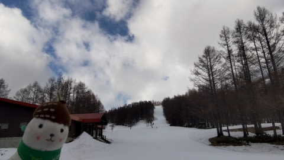

あさイチから気温はプラスで…（涙）

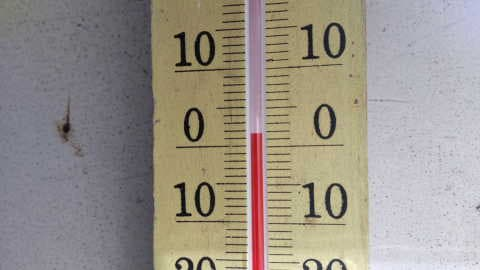

朝から雪は緩めのシマシマだったようで．

すぐに荒れて行っちゃったみたいです…（涙）

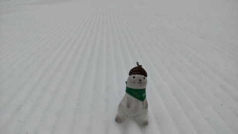

そして，今日は某特派員が寺小屋に行っていた

ようなのですが．

寺小屋の例年雪が薄くなるところ．

今シーズンは早くも土が出てきたみたい

です…！！（激泣）

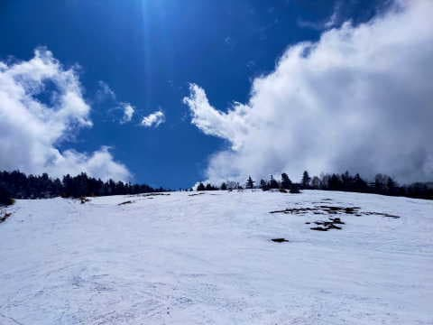

ちょっとこれは，早すぎやしませんか？？？

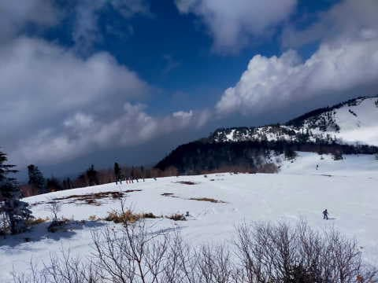

それも，コース脇じゃなく，コース上の雪が

かなり薄くなっているらしく…

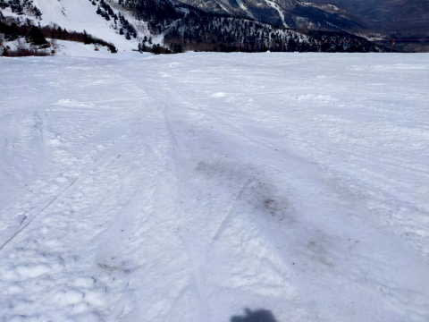

これ，もうひと雨きたら終わりそうな

薄さですね（涙）

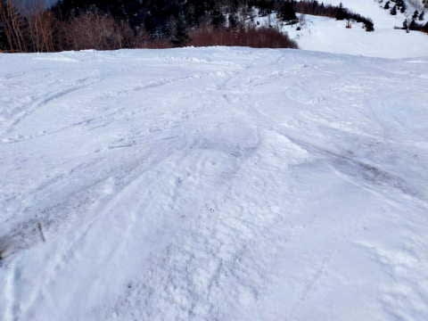

…あぁ．

とても3月の志賀高原の景色とは思えない…（止まらぬ涙）

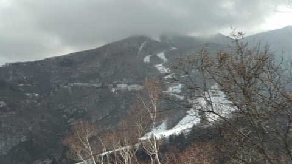

ってなことで．

GWまでの営業はとても望めそうにない，

かなり壊滅的な状況になってきた感じの

志賀高原．

早くもGW直前あたりの，シーズン終盤の

雪の量になってきた感がありますが…

果たして，この週末の志賀高原の天気やいかに？？

週末までに，パウダーが3mくらい積もる日が

あるのか？？←ないから

とりあえず，天気図を見てみましょうか…

ちょっと時間がないので，30，31日の

天気図の解説は省きますが．

この2日間とも，朝からプラス気温で

最高気温は+10℃近くまで上がりそう（泣）

天気は，30日は晴れ，31日は晴れ⇒曇りかな…

2日間とも，雨は降らなさそうだけど．

30日は高温＆日差しで，雪が解けそう…（泣）

そして，土曜日の4/1の850hpa天気図を見ると．

うーん．志賀は水色の+3℃線より南なので．

気温はかなり上がりそうな予感…

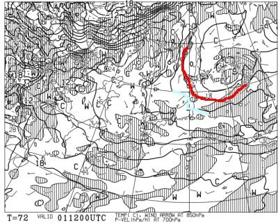

そして，地上天気図は，降水域が

志賀にかかってないので，晴れそうな感じ…！

…でも．

気温が上がるので，晴れない方が雪が

滑っていいんだけどな…

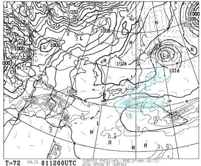

で，4/2の日曜の850hpa気温図は…

この日も，志賀に一番近いのは+3℃線．

昼間の気温は上がりそうですね…

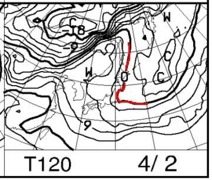

そして，この日の地上天気図は，降水域が

志賀にはかかってないので，雨にはなら

なさそうですが．

うーん．晴れ，午後に雲が増えていくかな…

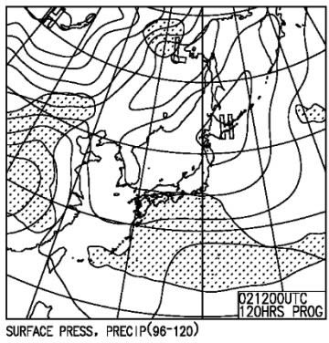

ってなことで．

まとめると．

30日(木)：朝から気温はプラス．

　昼間はプラス7~8℃くらいまで上がる．

　朝から晴れて，雪は緩い．

　昼間は日差しで雪はザブザブ．

　一部では滑りが悪い雪になり，

　午後は雪が荒れていく

31日(金)：この日も朝から気温はプラス．

　昼間は6-7℃くらいまで上がるか…

　この日も朝から雪は緩め．

　日が射すとザブザブになり，

　滑りの悪い雪になっていく．

　ちょっと雲が多く，日が陰って

　くれれば雪は滑りそうだけど…

　この日も午後はバーンは荒れるかな．

4/1(土)：終日晴れ！…晴れても嬉しくないけど．

　朝は気温は0℃程度で，バーンは

　ちょいと固めでスタート．

　硬いのが好きなら早朝ねらい目．

　南・東斜面は朝のうちに緩むけど，

　西斜面はしばらく締まったバーンが

　滑れるか…？

　でも，昼前には全部緩む．

　完全に緩んで滑りの悪い雪になっていく．

　夕方は凸凹荒れ荒れバーンに．

4/2(日)：この日も朝は晴れ．

　気温は朝は0℃を上回り，

　バーンは表面がちょっと固まった

　感じの雪になり，コロコロが出るかも…？

　でも，コロコロはすぐつぶれ，バーンは

　ザブザブ雪になって，あれていく(涙)

　午後は雲が増えて，板の滑りが

　よくなっていくかも…

という感じで．

今週も，週末に向けての雪の積み増しは

なさそうです(泣)

あぁ…

このままシーズンが終わってしまうのか…

今シーズン，太板の出番がほとんどなかったので，

もう一度奇跡のパウダーが一晩で3m位

積もってくれないかな…←それは積もりすぎだから．

逆に志賀高原ではリフトが埋もれて

営業できなくなるから

　

．

## 💬 コメント一覧

### 💬 コメント by (レインボー75)
**タイトル**: Unknown
**投稿日**: 2023-03-30 13:35:30

木曜日の志賀高原情報

昨日より少し暖かめ。朝の蓮池は4℃。

ニゴンから白樺へ。結構硬い。サウスはベスト。二本目になると白樺もベストに近い。次はパノラマの壁。完璧です。楽しい。唐松はまだ硬め。

晴れてるけど視界がクリアでないせいか、予想外に雪が長持ち。２時間以上も気持ちよく滑れました。

私は明日で最終日。帰宅したあとはポツンと一軒家以上の生活がまた待ってます。隣人？は熊、猿、鹿、カモシカなど。今年は滑り足りないけど、無事に過ごせたからまずまず満足です。

### 💬 コメント by (Skier_S)
**タイトル**: ＞レインボー75さま
**投稿日**: 2023-03-31 03:54:33

朝は結構良かったんですね…

雪がすぐに緩まなかったのは良かったですね！！

あと1日，ケガしないように注意して楽しんでください！！

