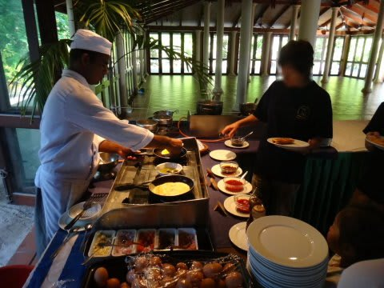

# 2012年　子連れモルジブ　ダイビング旅行記　その6

📅 投稿日時: 2012-10-15 00:41:28

さてさて．

明けて，モルジブ滞在2日目です．

この時期．モルジブは雨季ですけど．

今日もいい天気ですね～． 

昨日の夕食と同じレストランで，朝食タイム．

結構パンがおいしかったかな．

モルジブの朝ごはんでは定番の，作りたてオムレツがありますね～

で．朝ごはんは7時半から．

でも．ダイビングが8時20分から…と，ちと時間に余裕がない．

30分くらいで急いで食べて．部屋へ戻ってダイビング準備．

ご存知の人はご存知ですが．

モルジブは，ひとつの島がひとつのリゾートになっており．

このロイヤルアイランドも，ひとつの島全体がひとつのリゾートホテルになっています．

島一周，歩いて30分ってところですかね～．

で，この地図にあるように．

島の外周，海沿いに沿ってコテージが並んでます．

緑矢印が我々の部屋．

赤矢印がレストランですが．

部屋からレストランまで，徒歩5分くらいかかります…

あ，黄色矢印のところがダイビングショップ．

ダイビングショップは近いですが，それでも2－3分はかかります．

んだもんで．

部屋に戻ってダイビングショップへ移動する時間も考えると，

ダイビング開始50分前にならないとレストランが開かない，ってのは

ちとつらい．

で．レストランから部屋に帰って…

(途中でヤシの実を拾った娘)

私はダイビングの準備．妻と娘は着替えて，プールの準備． 

…今日は，午前中は私が潜りに行く番です． 

で．

準備が終わったら，半分駆け足でダイビングショップへ．

ダイビングショップには，今日潜るポイントがこんな感じで掲示されてましたね～．

んで．

全員そろったところでブリーフィング．

今日一本目に潜るポイントは，「ネリバル・ベル」．

どーやらマンタポイントらしいです．

ブリーフィングが終わったら，桟橋の先に止めてあるドーニへ．

器材は，スタッフがみんな運んでくれるので，楽ちん…

ドーニに乗り込んで．

出港！

…娘は「プール！プール！」

ってことで一足先にプールへ行ってしまい，見送ってもらえず(悲）．

あー．

このドーニ．

結構広いです．

器材セットもらくらく．

そしてドーニに揺られること30分ほどで．

ダイビングポイントへ到着しました．

