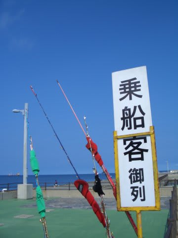
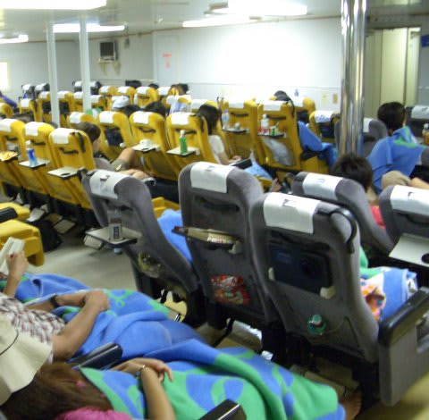
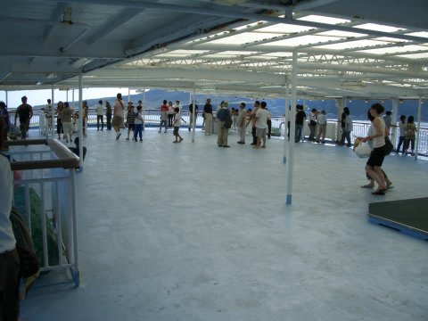
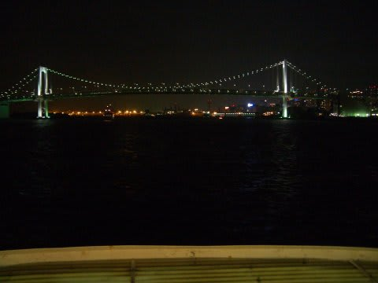

# 2007年8月　三宅島ドルフィンスイム＆ダイビング旅行記　ラスト

📅 投稿日時: 2013-09-26 02:31:13

🏷️ カテゴリ: [ダイビング日記](ce3a7a8d424d112fce83ee85c81a0e344.md)

って感じで．

三宅島でのラストダイブを終えて，ショップに戻ると12時前．

船が出発する2時半まで，シャワーを浴びて，器材を洗って，

ショップでお弁当を食べて，のんびり過ごします．

午前中半日でも，2本潜ったので結構たっぷり楽しんだ感じ．

ショップには，今日の午前中にドルフィンスイムに行った人も

戻ってきました，今日は朝6時半くらいから出かけたけど，

朝早くは10頭くらいのイルカが遊んでくれたそうな…．

うーむ．

ドルフィンスイム，午後より午前中の方がいいのかな？？

のんびりした後は，港へ向かい乗船です．

帰りは2等座席にしたのですが…

結構深い角度でリクライニングするので，結構寝れそうな座席ですね～．

でも，ほとんど席に座らずデッキでのんびり．

島で仲良くなった人とダベって過ごしていると，

6時間の航海なんてあっという間．

夜9時には竹芝桟橋に到着しました．

…って感じで，かなり濃密な時間が過ごせた，1泊2日＋船中1泊の

三宅島への旅でしたが．

いやー．

思い立ったらすぐ行けるし，離島らしい味わいもあるし，

なんてったって100％の確率でイルカと泳げるドルフィンスイム！

土日だけでダイビング＆ドルフィンスイムをやって帰ってこれるなんて…．

三宅島，いいぞ．

また，機会があったらドルフィンスイムに行こう！

(と言ってからかれこれ6年…いまだにその機会は訪れていない…)
