# 子連れで座間味に行ってみた　その11

📅 投稿日時: 2011-08-22 00:42:23

さてさて．

慶良間レポート続きです．

コモドレポートは執筆開始しましたが．

写真が多くて，これまでみたい毎日の更新は無理そうな気配…

--------------

という感じで．

きれいな海を堪能して．

お昼を食べてのんびりした後は…

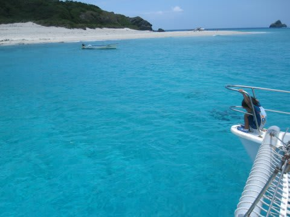

午後のダイビングです．

ちょっとボートで移動して…

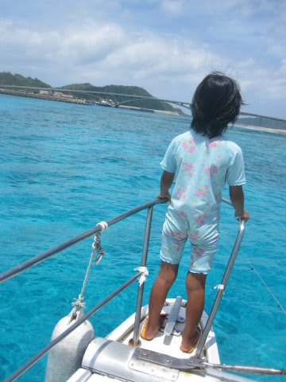

本来潜ろうと思った，阿嘉島南側のポイントは，台風のうねりが

入っていてちょっと難しそうだったので．

さらに30分ほど移動．

…移動中に，寝ちゃったよ．娘は．また．

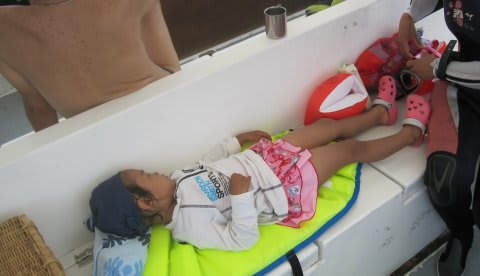

で，やってきたのは，

「シルキンメの根」

というポイント．

無人島の安室島横にあるポイントです．

私「娘～，ママと一緒に潜りに行ってくるけど，船の上で

　おねーさん達と遊んで待ってられる？」

娘(おねーさんと遊びながら)「うん」

…よしよし．

留守番しててくれるというので，夫婦揃って潜りにGo!

で，エントリー後，

ハダカハオコゼなんかを見ながら…

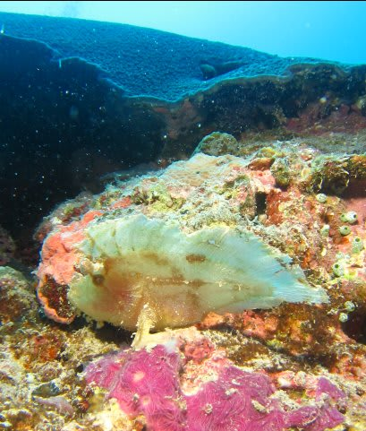

潜っていくと，キンメモドキがびっしり着いた，1ｍほどのハマサンゴが

砂地の上にぽつんとたたずんでいます．

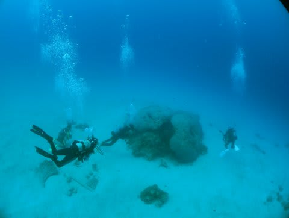

こいつの周りでしばらく過ごして…

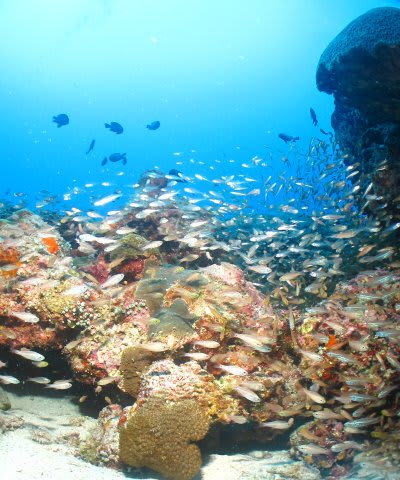

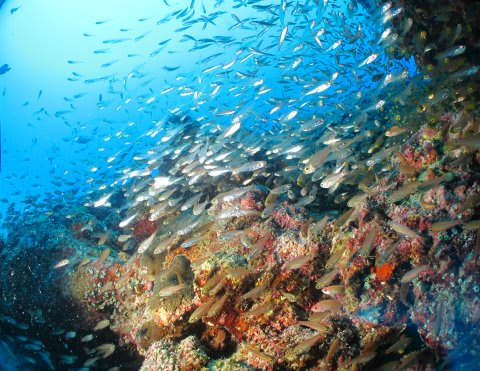

また浅瀬に戻って，きれいな砂地の上を漂います．

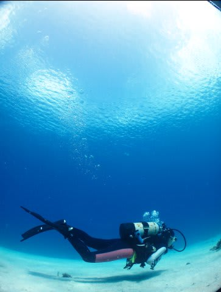

あー．

深度10ｍ近いのに，空が見える！！！

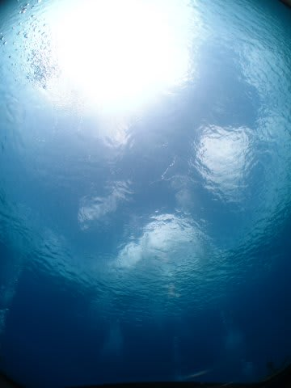

ここのポイントも，ところどころ，ミスジリュウキュスズメと

デバスズメがいっぱいついたエダサンゴが．

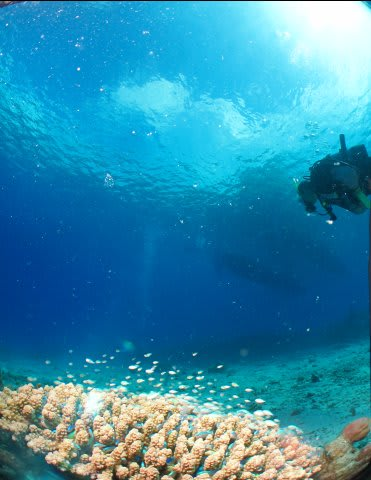

なんにしろ，雲と空を眺めながら，サンゴに群れる

魚を愛でるダイビング．

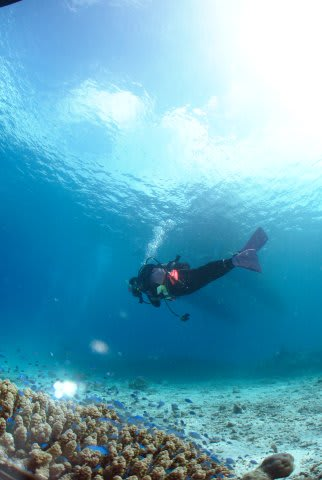

癒されますの～．

最後に，セジロと普通のクマノミが着いているイソギンチャクを眺め…

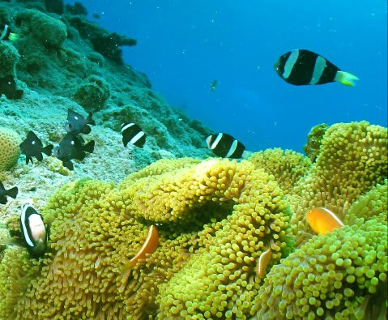

エグジット．

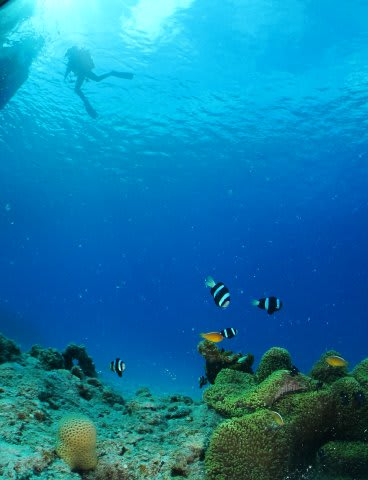

いやいやいや．

慶良間の最終ダイビングも，満足であったぞよ． 

娘は，両親がダイビングに行っている間に，ボートスタッフの人に

無人島に連れて行ってもらって，他の子供たちと一緒に上陸して

サンゴのかけらや貝殻拾いをしてきたらしく，娘も超ゴキゲンの大満足状態．

しかし今回．

娘も成長したんでしょう．

両親がいなくてもスタッフのおねーさんと遊んでくれるようになり．

7本中，夫婦揃って潜れたのが4本．

両親が揃って潜りにいっても，何回かはちゃんと

留守番していてくれるようになりました．

育ったなぁ～．

今回乗った船は，

船の上に飲み水やお湯，お茶がすべて準備されており，

トイレもついていて．

子供用のライフジャケットやらベッドみたいなフロートやらも

準備されているし．

船には天幕が張ってあって，ちゃんと日陰になっているので．

子供には普通の海水浴の格好をさせて．

あとはお昼ごはんとタオルだけ持っていけばOK.

基本的に，複数の島に囲われた海なので，船もそれほど揺れません．

スタッフもしっかり子供の面倒を見てくれます

…ただし子供一人一日あたり5000円のシュノーケル代がかかりますが…

とりあえず．

海もよし，夫婦で潜ることもでき，子供も楽しめたという．

満足の慶良間ダイブでした．
