# 2021/4/30(金)の志賀高原スキー場は…意外と朝から晴天！でも雪がすごい解けたよ(涙)

📅 投稿日時: 2021-04-30 23:30:56

🏷️ カテゴリ: [2021スキー滑走日記](c2b0fc073d6357d3b786f6ca655147f7d.md)

ということで．

GWの谷間の本日．

なんと．仕事が強制的に休みの日なので．

本日も，志賀高原滞在です～！！

でも．

土曜は，日付変更線で寝て3時間睡眠で3時起き，

そして一日滑ったあと長岡まで移動，

エキップさんでブーツ調整に夜までかかり，

長岡泊まりで寝たのは日付変更線後(涙)

そして本日も，朝6時前に長岡を出て

志賀高原に向かったわけで

起きた時に雨が降っていたのを見て．

昨日は睡眠3時間．今日も睡眠5時間で

出発はきついから，

ゆっくり寝て遅めに出ようか…という

かなり強い誘惑にかられたものの．

ちゃんと朝起きて，朝8時半には焼額に到着！

もう，志賀高原の登り坂は．

全く積雪もないし．

バイクもいっぱい登ってきてるくらいなので，

今日は夏タイヤで全然大丈夫です！

…でも，まだ朝早くは冷えて路面が

凍る可能性もあるのでご注意を…

ってなことで．焼額の朝は…

早朝は雨が残っていたのに．

通常営業開始時にはすっきり晴天！！

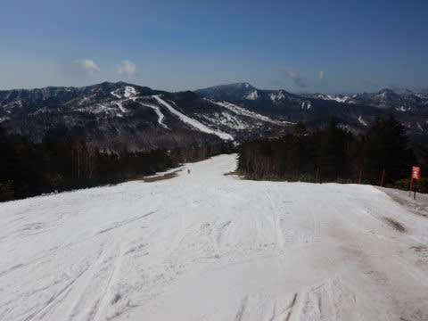

…って．

雪が解けるので，この時期は晴れなくて

いいんですが…

そして，朝の気温は+６℃と高め（泣）

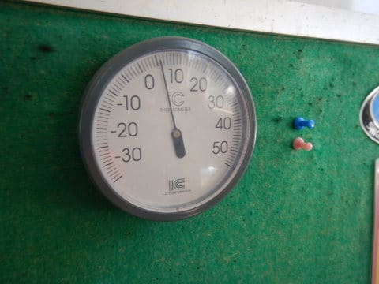

もう，朝イチから雪はかなりしっとり

柔らかい感じです（涙）

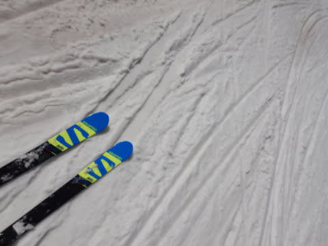

今日は曇り予想だったんだけどなぁ…

朝から晴れていて，日差しが当たるバーンは

もうかなりゆるゆるになっていて．

…そして，ゲレンデに朝から穴が(泣）

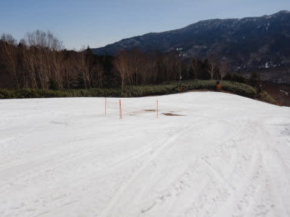

で．

強い日差しで雪は重くなり，

緩斜面はあまり滑らない感じの，

悲しい雪質になっていきましたが…

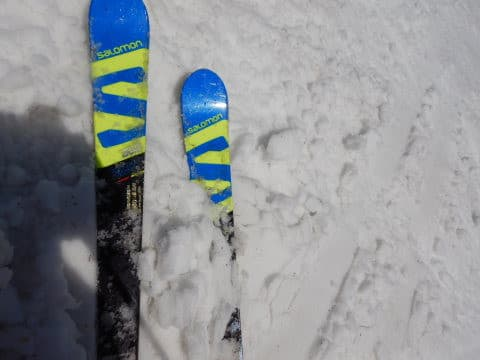

でも，人がいないので．

コースが全く荒れず．

また，ゴンドラのコースの下半分は

「すごい滑る雪」ってわけではないけど．

ちょっと滑りが悪い程度で，ストップ雪に

ならなかったのが救いかな…

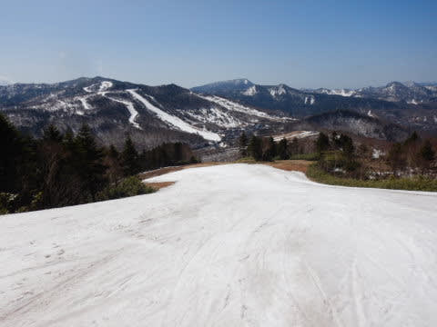

で．

今日も昼過ぎまでかなりの日差しが照り付けた

ので…

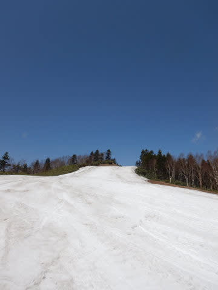

あさイチに穴が開き始めていた

パノラマコース上部の廊下の終わり

部分．

(朝の写真)

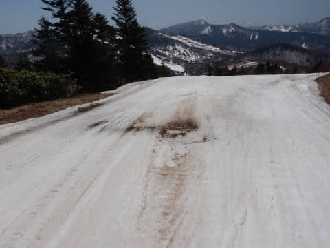

昼頃には穴がかなり拡大して…

(昼の写真)

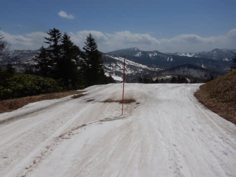

そして，営業終了時には…

うぎゃーーーー！！

なんだか，コースが切れかけてます！！

(営業終了時の写真)

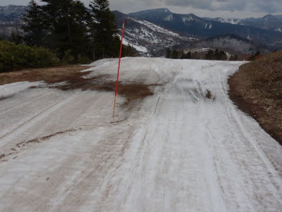

夕方には，滑れるのはわずかこのくらいの

幅になっちゃってて．

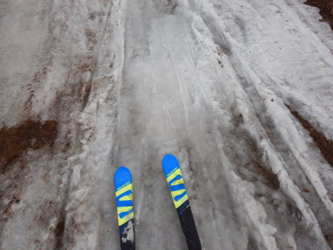

今日一日で，わずかな穴だった部分，

一気にコースが切れるかというほどまでに…(泣）

この部分は，一応よそから雪をもってきて

復旧して，明日はまた滑れるようにする，

とのことですが…

このほかにも，ゴンドラ乗り場近辺も，

朝はこんな感じで，穴が開いた

程度だったのが…

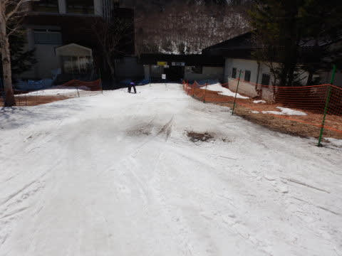

夕方にはもうほとんど雪が途切れかけて

ます(涙）

そして．

朝はこんなだったサウスコースの穴も．．

夕方には，穴の数が増えて…

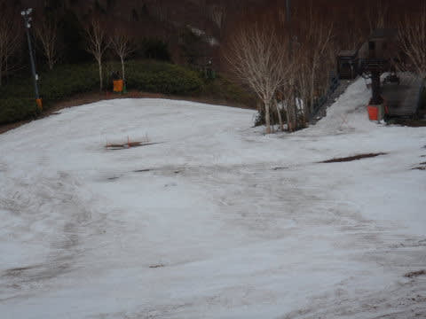

近づいてみると…

うげげげ！！

これは…ヤバそう(涙)

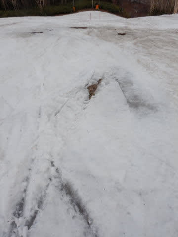

なんということか…

今日は最高気温が10℃近くまで上がり．

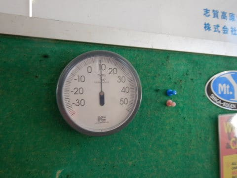

そして，日差しも強かったので…

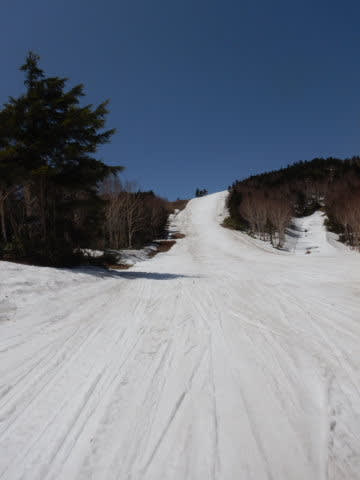

小雨の昨日より，今日の方が雪のダメージが

多い気が！？？

コース全体，かなり雪が薄くてヤバい

ところが増えてきた感じ（激涙）

と，思っていたら．

なぜか午後2時ごろからにわかに

曇りだしたかと思うと．

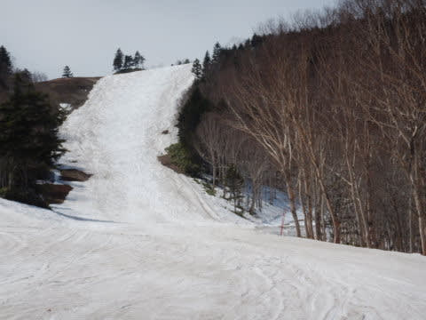

午後3時近くに，ぽつ，ぽつと

わずかに雨が落ち始めて来ました…

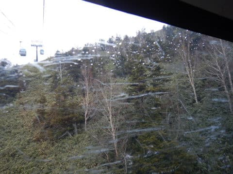

これは，二日連続の雨の中の

滑走になるのか？？

…と，いやな思いが頭を横切り

ましたが．

数回ぽつぽつ落ちてきた程度で，

無事15:30の営業終了まで乗り切りました…

(午後4時半過ぎから豪雨になったけど)

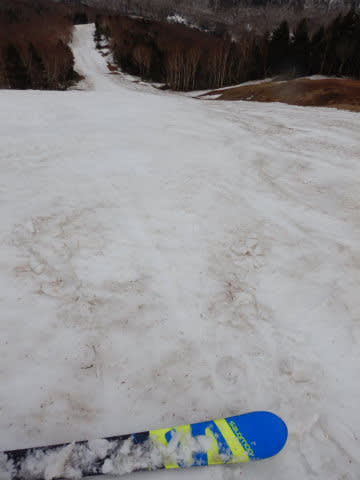

とりあえず．

数か所穴が開いている以外は，まだ

雪がありそうに見える焼額ですが．

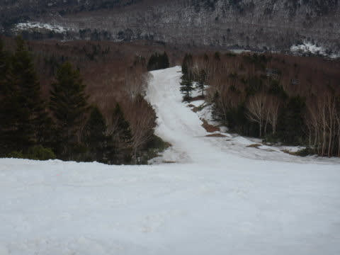

雪が薄いところが結構出てきたので．

GW最終日までもつかどうか…

もつように祈り，踊ってはいるものの．

最終日まで行けるかは，明日，明後日の

天気にかかってそう．

運が良ければ，明後日日曜は雪も

降りそうなんだけどな～．

あ，明日土曜は，午後ににわか雨が

来るかも…

明後日日曜は，気温が冷えるので．

雪になる可能性もあるんだけど，

雪になってくれるといいな…

## 💬 コメント一覧

### 💬 コメント by (大阪のK)
**タイトル**: Unknown
**投稿日**: 2021-05-01 06:01:08

昨日、2ゴン乗り場横にS様の板を見かけましたが、お会いすることができませんでした。

ゲレンデの雪解けは加速度的に進んでいますね。

また、夕方の黄砂混じりの雪がそれを助長したんじゃないでしょうか。

更にその黄砂が滑りを悪くする気がします😅

### 💬 コメント by (うえいと)
**タイトル**: Unknown
**投稿日**: 2021-05-01 07:36:41

流石です(^o^)

あの雪質の変化でも最後まで滑られたんですね〜

感服いたしました。

私なんかめげて昼前に撤退してしまいました。

夜雪になり各所1900から上には雪が入りましたね〜

これで少しは安心ですね

### 💬 コメント by (ikkun)
**タイトル**: Unknown
**投稿日**: 2021-05-01 09:27:52

ぇ～～スキーヤーの鏡( *´艸｀)すごいなあ昨日は雨が夕方から上手くいかないものですね再

今日は朝に仕事……今終わりましたがあめが(泣) もはや今シーズンは止めろと言われているのかも？本日も？ ご報告お待ちして滑ったつもりになります(泣)

### 💬 コメント by (Skier_S)
**タイトル**: 明日は微妙な天気…
**投稿日**: 2021-05-02 00:31:43

＞大阪のKさま

あら．板は見かけてたんですね…

ゲレンデの雪はかなり解けましたが，今日は信じられないリカバリー

っぷりで，全然気になりませんでした…

後は板の滑りさえ良ければ…

＞うえいとさま

もう，リフトが動いていると帰れないので，最後まで滑っちゃいました（笑）

昼前に撤収されてたんですね．

でも，夜は雪になってよかったです…

＞iikkunさま

今日も仕事，お疲れさまです．

取りあえず今日のレポート見て，滑った気分になってください（笑）

