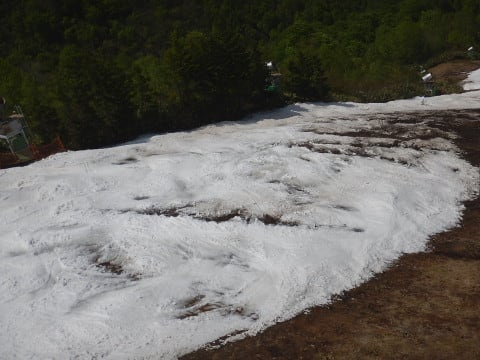

# 5月26日（日）ファイナルかぐら詳細レポート続編…すごいゲレンデの写真集（笑）

📅 投稿日時: 2018-05-30 01:38:17

ということで．

今回，ゲレンデ状況の写真をたっぷり載せたかったので，

2日に分けての記事となった，かぐらファイナルレポート．

本日は2回目．

昨日の続編です～！

ってなわけで．

[前回のレポート](e83f78766511694431425d19e194b8f2b.md)の朝のうちは，

まだゲレンデ状況はマシだったのですが．

気温もグングン上がり．

太陽もサンサンと照り付けるこの日．

人も増えてきたので，雪が緩んだゲレンデは，

だんだん凸凹になり始めてきて…

そして．

早くも10時前には…

ヤバい…

かなり雪が薄ーーーいゲレンデ．

わずかの凸凹で，穴が開き始めてきましたよ…（泣）

そして．

和田小屋からリフト乗り場の廊下も，

なんだか危険な感じに…

いや．

まだ10時になってないんですが！？？

営業開始1時間たたないうちにこれって…

ヤバくないですか！？？（涙）

…で．

ゲレンデに穴が開き始めると．

後は一気にデンジャラスエリアが広がっていきます…

さっきの写真から1時間後．

10時半にはもうこんな感じで．

もうかなりヤバ気な感じに…（泣）

ってか．

ダメですね，もう（涙）

11時になると…

一番ヤバい部分．

左側3m程度が，がかろうじてつながっている

ような状況に…（ちーん）

滑れるのは，向こう側のわずかだけ

なので，ここに人が止まるとつらい…

もう，このあたり．

滑れる

というより，

左側のわずかな部分が，かろうじて

何とか板を履いて降りられる…

という感じ．

だのに，人が結構いますね…

ここ以外も，数か所大穴が開いてる場所があり．

一見まともに見えるこういう場所も，

コブ溝は結構抜けてきてます…（涙）

リフト乗り場へ向かう道も…

これ，滑れるの，左端1mだけですね．

この部分を遠くから見ると，こんな感じです．

いや…

よく今日までもたせたもんだ…

リフト乗り場は，溜めてあった雪を運んで，

切れないように涙ぐましい努力がなされていますし．

切れかけているゲレンデ中間部のヤバいところも．

かなりの人海戦術で穴埋めをがんばってますが…

そもそも持ってくる雪が無いので，

埋められるのもごくわずか．

当然，その程度の穴埋めでは全く

状況は改善せず…

もう，茶色いエリアがコース幅いっぱいに

広がってきてます…

午後1時になると．

こんな感じで．

かろうじて，ゲレンデがつながっているか？

という状況…（泣）

でも．

そのせいか，人は結構減りましたね～…

最後のパーク．

もうキッカーは全部なくなり，

ボックスとレールだけになってますが．

まだ結構人がいますね…

とりあえず．

1時半近くまで頑張りましたが．

もう，気持ちよく滑れる部分は全く無くなり．

スキーで滑る…というより，

リフトを降りたあと，何とかリフト乗り場まで移動する

という行為をひたすら繰り返す状況になったので．

さすがの私も．

リフト営業終了をまたずして，ゴンドラにて下山…

いや．

だって．

もう楽しくないんだもん．

石ころを踏まないように，ソロソロと

注意をしながらゲレンデ上を移動するだけですもん（涙）

ってな感じで．

2週間前まで滑れたとはとても思えない

ゴンドラコースを眺めつつ，ゴンドラを降りて…

ゴンドラ山麓駅で，靴を履き替えて．

またトラックに板とブーツを預けて…

リフトに乗って，下山します．

Pislabマットを滑って降りる人は，

かなり少なかったですね…

で．

ロープウェーで駐車場まで下りてきますが．

まぁ，さすがに今日は駐車場の車も少ないようで…

そして．

ロープウェーを降りたところでは．

ファイナルデー恒例の抽選会と…

無料の豚汁の振る舞いがありました～！

…例年，ファイナルデーもラストまで滑ることが多く．

下山するころにはすでに抽選とか

振る舞いが終わってるので．

豚汁は初めてありついた気がするなぁ…

結構おいしかったよ！

と，ちょっと嬉しい気分ではあったけど．

最後に，スキーの裏を見た時に…

うぎゃぎゃぎゃぎゃ～っ！！！

今日一日で，こんなに滑走面が傷ついたのかっ！！！

…これを見て．

かなり落ち込んだSkier_Sなのでした…

いや．

もう，来シーズンのYetiで引退させる予定の板だから，

いいんですけどね．

でも，やっぱり履いている板が傷つくと

精神衛生上良くないなぁ…

まぁ，でも．

滑れただけ，良かった…

雪不足の今年，5月最終週まで，

クワッドリフトが滑れたということに，

感謝！

## 💬 コメント一覧

### 💬 コメント by (しんちゃん)
**タイトル**: 傷だらけの･･･
**投稿日**: 2018-05-30 23:07:21

傷だらけの板を見ると、滑ってもいないのに見てるだけで心が痛みます。

深い傷が痛々しいですね(^^;

今後、板の救急救命（ﾁｭｰﾝﾅｯﾌﾟに出すのか？それとも自力で補修したのか？）はどうされたのか、教えていただけたらと思います(笑)

### 💬 コメント by (Skier_S)
**タイトル**: しんちゃんさま
**投稿日**: 2018-05-31 02:11:45

板が傷つくと，精神衛生上よろしくないです…（涙）

でも．

この次郎君．

もう剥離がかなり進行して，板の滑走面は

触って分かるほど波打っているという，

ほぼ終わっている板です．

昨シーズン3月から1シーズン以上使っているので，

私のメイン板としては長寿な方．

来シーズンスタート時のYetiで履いたら終わりの板です．

完全石ころ踏み用の板として割り切って，

もう修理はしません．

来シーズンが始まって，石を踏む心配が

無くなってきたら，三郎君にご出動

願う予定です…

