# 2025/3/20(木・祝)の志賀高原スキー場は…晴れのち曇り，朝のゲレンデはトップシーズンの柔らか圧雪！昼は緩み気味で夕方は硬めバーン

📅 投稿日時: 2025-03-21 01:30:56

🏷️ カテゴリ: [2025スキー滑走日記](cacd3fbf84d4a679ee61a5894c3f95e14.md)

えー．

行ってきました．

行ってきましたよ，本日…

日帰り志賀高原へ！！

そして，に帰りはかなり眠く，

途中で1時間ほど仮眠して帰ってきたので，

さっき帰宅しました…

ってなことで，本日の志賀高原で鵜が．

いやーーーー！！

無理して日帰りで行くだけの価値はあった！！

良かった…

最高でした！！！

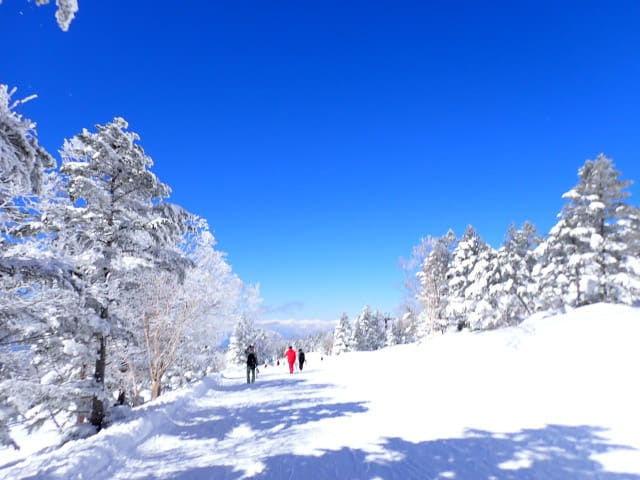

たぶん，これ，今日スキーに行かないで

家で仕事してる時に，ゲレンデがこんな

だったのを見せつけられたら…

暴れて転げまわって悶絶死するところでした．

いやーー．かなり無理したけど，

滑りに行って良かった…！！！

まず．

今日の志賀高原．朝イチから晴天で．

上り坂も道路がかなり積雪していて…

すでに，雪がたっぷり積もった後の

晴天という，最高のコンディションの

予感があふれてます…！！

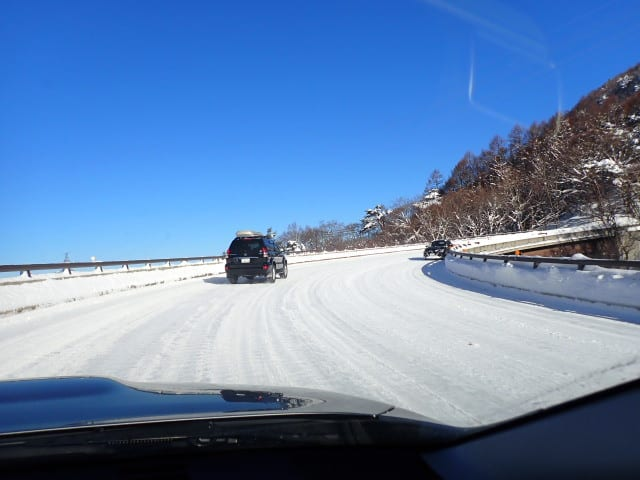

ただ．

ゲレンデに着くと，みんな同じことを

考えているのか．

平日の谷間の休みの割には，ゴンドラの

列が長くて…

これ，正月休みよりも列が長いかも？？

今シーズン最高レベルなんですけど！？？

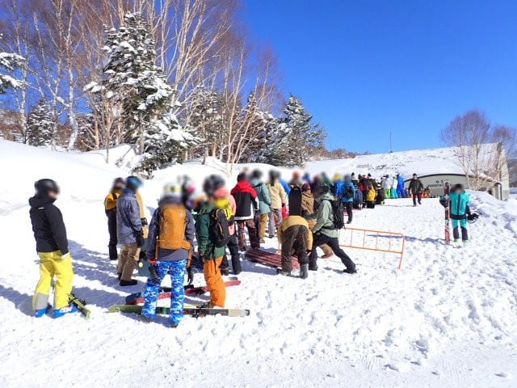

とりあえず．

かなりの列に並び，8:30営業開始の

ゴンドラで山頂へ上がりますが…

山頂の気温は-8℃！！

予想の-9℃から1℃ズレたけど，

ほぼ予想通りでいい感じに冷えてます！！

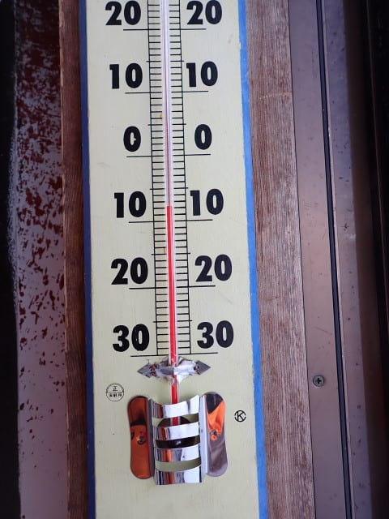

で，山頂は…

見事な晴天っ！！！

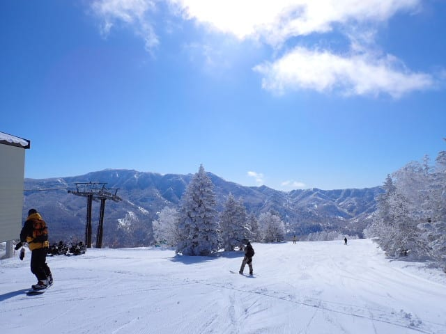

そして，雪は積もりたての冷え冷え雪が

圧雪された，トップシーズンの柔らか

圧雪バーン！！

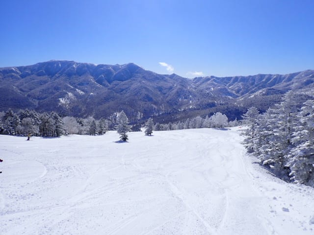

で．

土日ではない本日はファーストトラックを

やっていないので．

ファーストトラックで荒らされてない，

柔らかシマシマバーン！！！

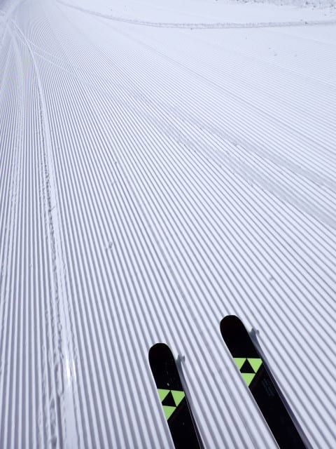

もう，言葉はいらない…

3月下旬で，これだけ天気のいい日に，

こんな冷え冷え柔らかシマシマが滑れる

ことはめったにないよ！！！！

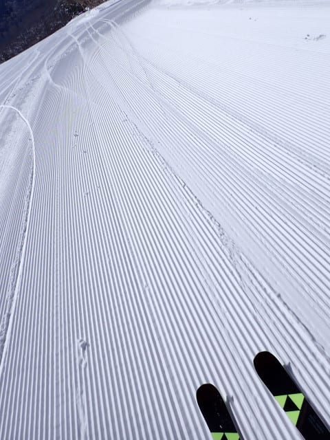

このあさイチバーン，今シーズン中でも

ベスト3に入る良さかも…！！！

あぁ…

無理してでも滑りに来てよかった…

今日滑りに来なかったら，今頃全力で

志賀高原にみそ汁が降る呪いを送り続け

てるところだった…

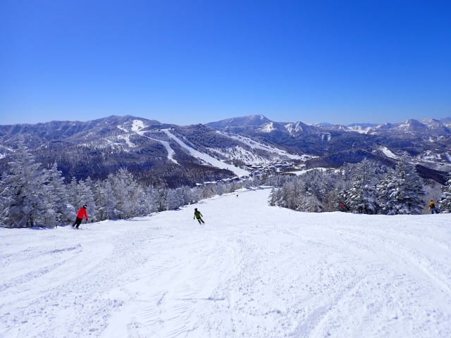

ってなことで．

本日は天気も最高だし．

雪質も最高だし．

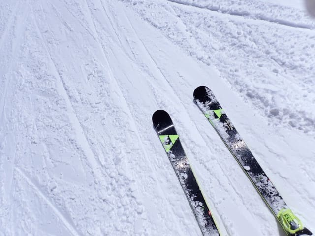

…そして．

朝はかなりゴンドラが混んでいたのに．

なぜかリフトもガラガラで…

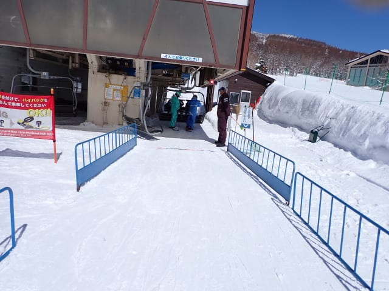

ゴンドラも終日混雑することなく

すいてたし…

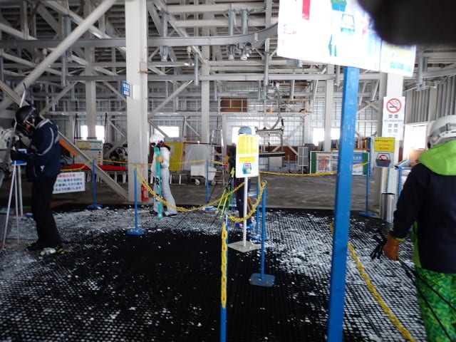

コースも人が少なくて．

…朝ゴンドラに並んでいた，あの長い

列は何だったんだ？？？

という，ガラガラ具合！！

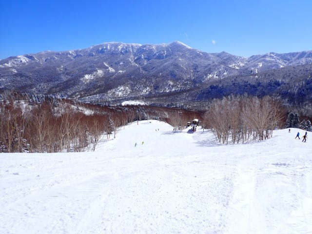

いや…

めっちゃ恵まれてるよ！！！

…と，幸せをかみしめていると．

昼を過ぎると，予想外に気温がプラスまで

上がってしまい…

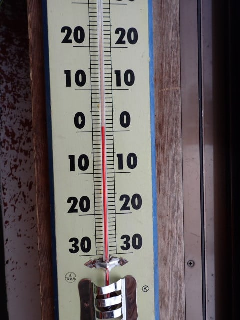

3月の強烈な日差しと相まって，

日差しが強いバーンは雪がちょっと

しっとりして，日差しが強くないところも

ちょっと雪がダマダマになってきちゃい

ました（涙）

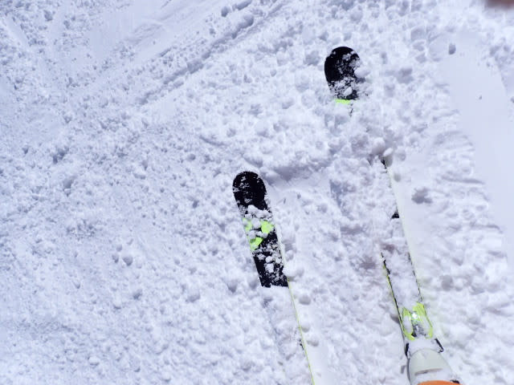

午後は多少雪がもそもそした感じに

なってきて，GSコースやオリンピック

コース，ブナコースは荒れたけど…

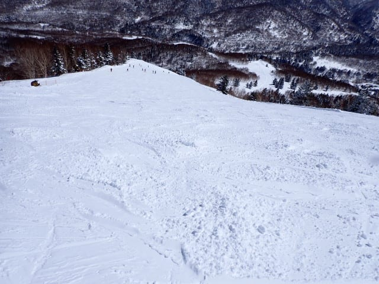

パノラマコースやサウスコースは最後まで

比較的荒れずに滑り良かったです！！

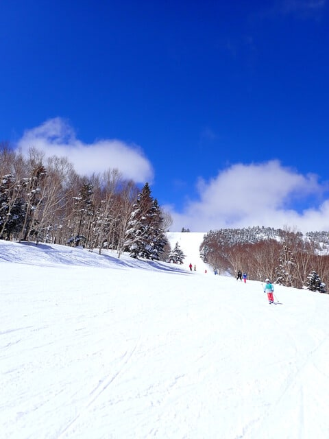

で．

午後2時近くになると，予想外に曇り空に

なってしまいました…

今日は一日晴れると思ったんだけどなぁ…

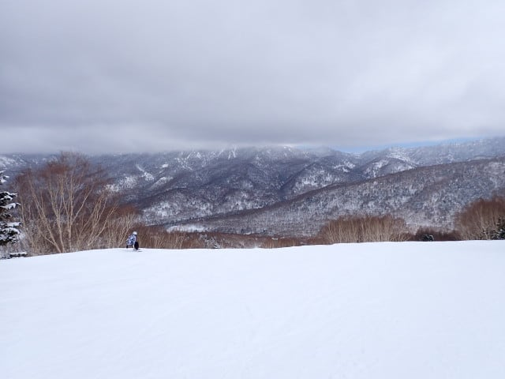

でも．

逆に曇ってくれたおかげで，雪の緩みは

ストップしてくれて．

むしろこっちの方が滑り良くていいかも！！

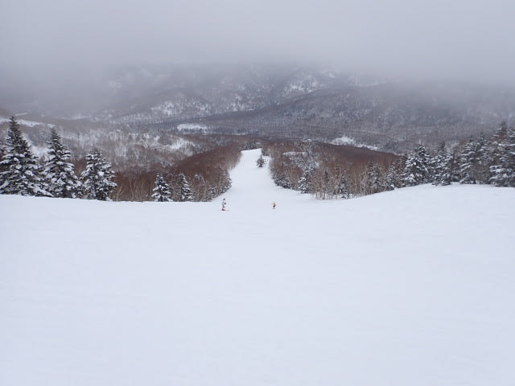

最後，夕方になると．

昼間にちょっと緩んだバーンが硬くなり，

コロコロが固まった状態で一部滑りにくく

なったところもあったけど…

でも，3月下旬と考えれば．

朝イチは最高に良かったし．

昼もそこまでひどいザブザブボコボコに

ならなかったし．

天気も午後は曇り～薄曇りだったけど，

むしろそっちの方が雪質が悪くならず

良かったし．

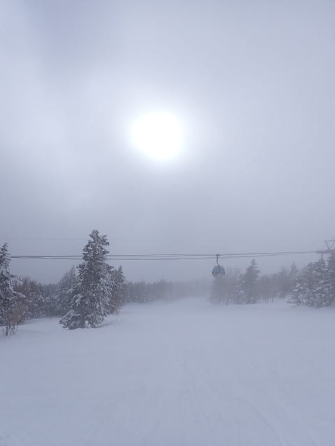

いやーーー．

今日はいい一日だった…

と．

いつも通り，昼休みも取らず，朝から

営業終了までひたすら滑り続けたのでした…

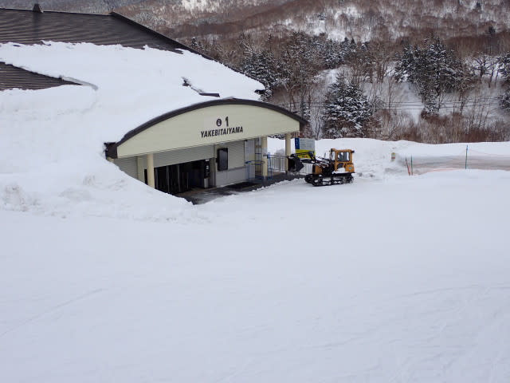

…しかし．

この後，車に戻ってから．

朝3時半に起きて，ラストまで休まず滑った

というのに．

…これからまだ300km車を運転して

帰るのか…

と，厳しい現実に引き戻されたSkier_Sだったのでした…

…そして，また明日朝から仕事だよ…

## 💬 コメント一覧

### 💬 コメント by (hapi44)
**タイトル**: Unknown
**投稿日**: 2025-03-21 06:20:04

素晴らしすぎます！

最高のご褒美でしたね

お疲れ様でした😊

### 💬 コメント by (777lucky)
**タイトル**: Unknown
**投稿日**: 2025-03-21 07:30:44

羨ましいです。

日帰りで行ける体力と精神力、尊敬です。

まだまだ今シーズン行けそうですね。レポ楽しみにしてます。

### 💬 コメント by (まっt)
**タイトル**: Unknown
**投稿日**: 2025-03-21 08:13:55

👍

### 💬 コメント by (レインボー77)
**タイトル**: Unknown
**投稿日**: 2025-03-21 15:06:49

エス様不在日の志賀高原情報

朝の蓮池-3℃、昨日より5℃アップ。晴れて絶好の仕事じゃなくスキー日和。ダイヤは圧雪やや悪く硬め4点。唐松はなんと一番乗りだけどやや硬4点。白樺は広々快適5点。GSは快適やや硬4点。奥志賀第三老人バーンはしっかり保養できて5点。エキスパは人口密度過多で3点。そのあと漕いで漕いで大勝軒まで25分。美味しゅうございました。

明日は更に5℃アップ予報。どうなりますかね？でも、この2日間はしっかり楽しませて頂きました。

### 💬 コメント by (Skier_S)
**タイトル**: 中1日で志賀高原へ
**投稿日**: 2025-03-21 22:21:35

＞hapi44さま

いやーーー．ホントに良かったですよ！！

日帰りの価値はあった…

その代わり，今日は仕事で死んでましたが

＞777luckyさま

日帰りで行って中1日仕事して，また明日志賀高原へ舞い戻ります～！

＞まっtさま

(^^)v

＞レインボー77さま

明日はすごい気温が上がりますよ…

朝イチは硬めのフラットバーンだと思いますが，午後は重い雪になっていきそう…

### 💬 コメント by (アツシ)
**タイトル**: Unknown
**投稿日**: 2025-03-22 00:15:35

私も金曜日が仕事だったため、日帰りでした。志賀高原は遠いので諦めて、片道320kmの開田高原マイアに行きました。マイアも深い深い青空に、前日までの雪が圧雪された極上シマシマで、日曜日の午後3時のヤケビ並みのガラガラ具合、人口密度の低さで、この世の楽園の様相を呈していました。

やはり、片道300kmちょいなら日帰りも楽勝ですね。高速の出口からスキー場まで約90kmと志賀高原の３倍で、下道だけで１時間半以上かかりますが、高速が230kmしかないので、家からスキー場までわずか４時間で到着です。毎週志賀高原まで500km、6時間の道のりを休憩なしで運転しているのと比べると、前夜の睡眠が2時間弱でも問題なく走れました。

今週末は仕事のためスキーはお休みです。また来週末の土日にお会いしましょう♪

### 💬 コメント by (Skier_S)
**タイトル**: ＞アツシさま
**投稿日**: 2025-03-22 21:13:25

日帰りお疲れさまでした…

マイア，昔行ったことがありますが．…結構楽しめたのですね．

木曜はどこにいても良かったんですね…！！

我が家は遠いといっても志賀高原まで300㎞だから，実は近いのかも(笑)

