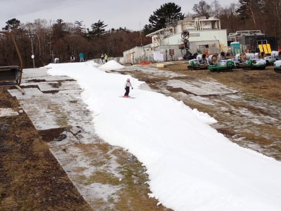
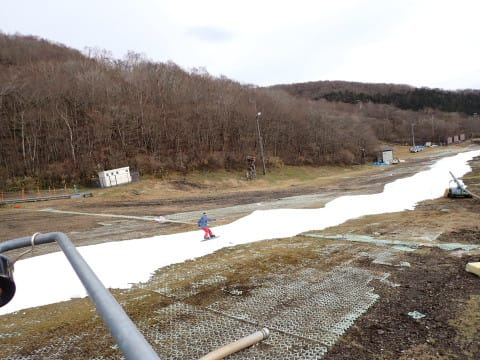
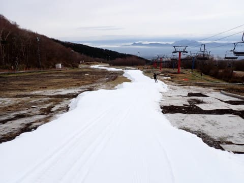
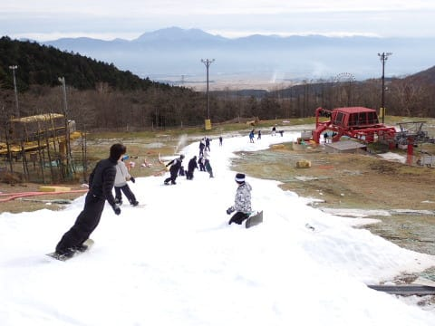
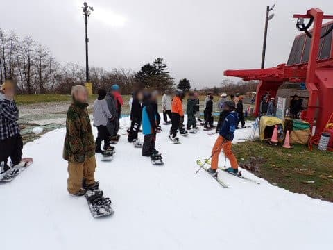
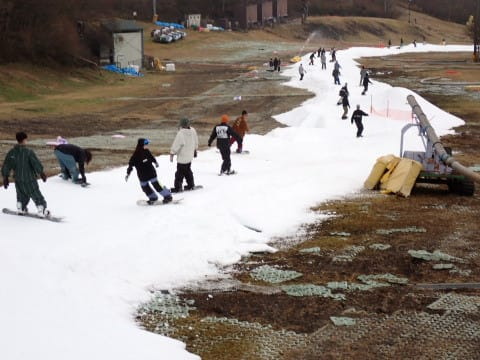

# 2023/11/12(日)のイエティコース状況＆動画…11/7に雪解け営業中止以降の再オープン日，コース幅はかなり狭いよ

📅 投稿日時: 2023-11-13 00:25:59

[この記事](e83e81374a9349a70d8a034286fe537c8.md)では，

18日に冷え込んで雪になりそう…

18，19の週末は横手，上手くいけば

熊の湯も19日にオープンできるかも…？

と書いたけど．

どうやら，やっぱりFEASxxシリーズの

天気図は予想精度が低いという，いやな

予感が当たった感じで…

冷えて雪になりそうと言っていた18日が，

それほど冷えなさそうな予報になってきて…

さらに17日は気温が上がって，雪

どころか気温が高い雨になりそうな

予報になってきてしまったので…

次の週末，横手も熊の湯もオープンは

無理っぽく思えてきた，Skier_Sです（涙）

うーん．

11日からの1週間，結構冷えそうな

予想だったんだけどなぁ…

イエティも残念な状況だし，菅平も厳しくて，

横手も熊の湯もオープンしないとなると…

今シーズンも，本格シーズンインは

遅れそうな予感（泣）

とりあえず．

今日は予告通りイエティで滑ってきたので．

本日のイエティがどうだったか，速報モードで

レポートします…！

…が．

いや．

予想していたけど…

すごかった．

何がって…

コース幅が．

狭いんですよ．

すっごい狭かったです…

これまでのイエティ史上最高級の狭さ．

例年のオープン日より，ずっと狭い感じ…

なんてったって．

7日にほぼ壊滅的に雪が融けたゲレンデを，

わずか4日間の造雪量で何とかコースを

つなげたわけですから…

なんとかぎりぎりつながっているレベル．

…そして．

つながった雪山を，今朝つぶしてコースに

したばかりなので…

あさイチからコースはフラットじゃなく，

雪山の形の名残がある凸凹状．

…それもガンガン硫安を効かせた，かなり

硬い凸凹で，朝イチスピードを出すと

ちょいと怖かった…

でも，雪の厚さは十分あって，

さらに硫安をたっぷりコース前面に撒いて

あったので．

コースは最後まで比較的固めで，

ボコボコに荒れて穴が開くような

ことはなく．

最後の急斜面が，ちょっと軽いコブ状に

なった程度で済んでました…

天気は終日曇り空で肌寒く，

板の滑りはすごい良かったけど…

でも，そのぶん硫安で固まったバーンが

緩まずスピードが出るので…

この激烈に狭いコースでは逆にちょいと

怖さを誘った感じ．

で．

これだけコース状況が良くなかったからか…

リフトは結構ガラガラでした．

せいぜい待って1～2分，

タイミングによってはほぼ飛び乗り

だったのがせめてもの救いで．

これでリフトが混んでたら，間違いなく

速攻で帰ってました．

ええ．帰ってました．

（最大リフト待ちでこんな感じ）

でも．

これだけリフト待ちの人が少なくても．

コースが狭いので，コース上の人口密度は

高め…

というか．

狭すぎて，コース上で人を抜くのは難しく．

カルガモの子供みたいに，前の親ガモに

ひたすらついていく感じで．

そして，前の人が転んだりすると結構

怖いです…（涙）

かなりエキサイティングなコースを

堪能できました…（泣）

…とりあえず．

激烈に狭いコースがどのくらい

エキサイティングだったか，

この動画を見れば，わかってもらえるかと．

## 💬 コメント一覧

### 💬 コメント by (1kamakura)
**タイトル**: Unknown
**投稿日**: 2023-11-13 07:59:00

江戸の秋

わー！狭いですね。

スピード出てコースアウトしそう。

しかしスノーボーダーって転んでばかりいて、ちと嫌ですね。

（ボーダーさんごめん🙏）

スキーヤーはあんなに雪上に座り込む人はあまりいない。

昔はスキーヤーしかいなかったし良かったな。

### 💬 コメント by (Skier_S)
**タイトル**: ＞江戸の秋さま
**投稿日**: 2023-11-13 22:45:56

スピードをうかつに出すと簡単にコースアウトしますよ～！！

いっぱいコースアウトしている人がいました…

イエティはボーダーの方が8～9割でスキーヤーがマイノリティなので，

ボーダーの中にスキーヤーを混ぜてもらってる感じです．

ボーダーの常識が優先の中，マイナーなスキーヤーがあんまり

ボーダーを邪魔しないように滑らせてもらわないと…(笑)

