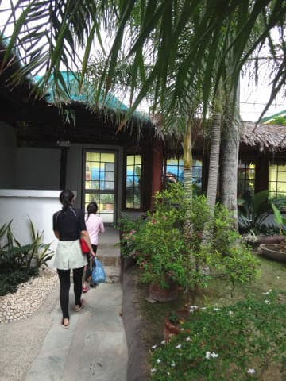
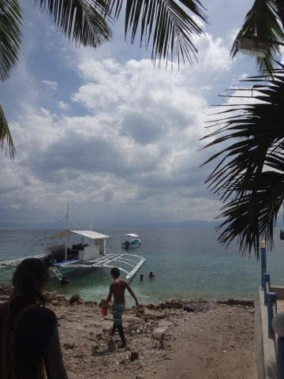
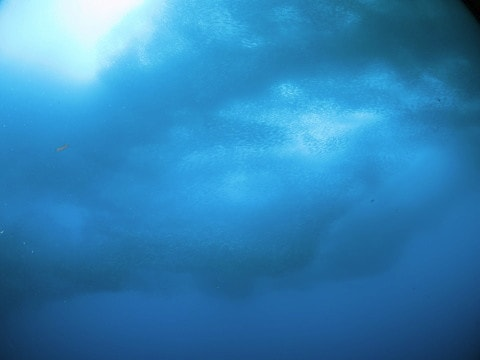

# 2016年8月　子連れで再訪！モアルボアル旅行記その15…2日目の午後は，またイワシダイブ！

📅 投稿日時: 2017-09-17 03:07:27

ってなわけで．

ここ数日間，スキーネタが続きましたが．

今日は，この時期本来の，

ダイビングネタです！←いや…このBlogは本来スキーBlogだから

---

ってな感じで．

娘がさんざん遊んでいた昼休みも終わり．

午後1時半，午後のダイビングの開始時間が

やってきました…

娘，仲良くなったお友達たちと遊びたがって，

ダイビングに行きたくないってゴネるかもっ…？？

だとすると，夫婦どちらかはホテルに残って

娘の面倒を見ることになってしまう…！（涙）

…と，心配でしたが．

お友達たちも，お昼ご飯を食べに行くのか，

ちょうど帰って行ってしまったので．

時間どおりに，ホテルからダイビングショップへ

向かいます…

で，ショップでウェットを着こんで，

ボートに乗りこみますが．

ボートは，ショップ前から出発したら，

すぐ目の前に止まりましたね…

…はい．

そうです．

今日の3本目も，イワシポイントです…！

プールでさんざん遊んだ娘は，ちょっと遊び疲れた

らしく．殊勝にも

「海で泳がなくてもいい．ボートの上でお絵かきしてる」

と言ってくれて．

「お絵かきして待ってるから，二人で潜りに行ってきていいよ」

ををを！今日も二人で行かせてくれるのね！

ありがたや～！！

ってなわけなので．

午後3本目のダイビング，わが夫婦で

貸し切りだったので．

二人そろってイワシポイントをリクエストして．

3本目もイワシポイントになったのでした…

ってことで．

イワシポイントへエントリー！

すると…いきなりのイワシの群れのお出迎え！

うほー！

相変わらずの迫力っ！

まるで，雲のよう…

頭上いっぱい，見渡す限り広がるイワシの群れを

眺めていると

時々，カスミアジやカイワリの類が

群れにアタックをかけて…

群れがダイナミックに動くのが面白いっ！

もう，あとは説明は不要．

イワシの群れの動きを，ひたすら楽しむのみ…

しかし．

この群れ，ホントに巨大で．

見ごたえありまくり…

ダイバーなら，ぜひ一度見に行くことを

おススメ！！

で．

イワシの群れを満喫したころに．

最後にちょっと口直し（？）のミナミギンポちゃんを

眺めて…

そして，エグジット．

いや．

満足．

やっぱりここのイワシダイブ．

満足度高いよ…！

## 💬 コメント一覧

### 💬 コメント by (マルハバ)
**タイトル**: ここなら・・
**投稿日**: 2017-09-17 09:43:59

ハウスリーフのバディダイブも可能なんじゃ・・

と思いますがどうなんでしょう？

### 💬 コメント by (Skier_S)
**タイトル**: マルハバさま
**投稿日**: 2017-09-18 04:02:53

いや，まさにその通りだと思います…

セルフダイブで潜りたいところですが．

ここをセルフダイブで潜らせてくれる

ショップはなさそうです．

残念…

でも，シュノーケリングでたっぷり

イワシを眺められます…

