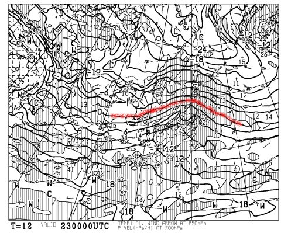
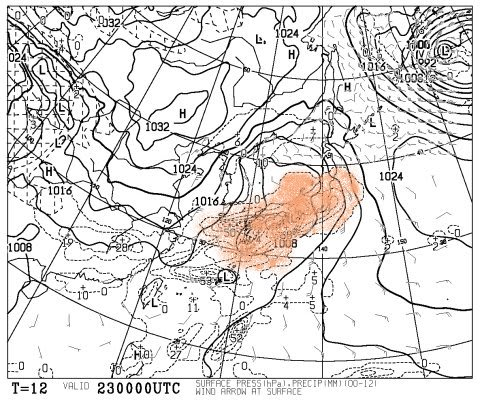
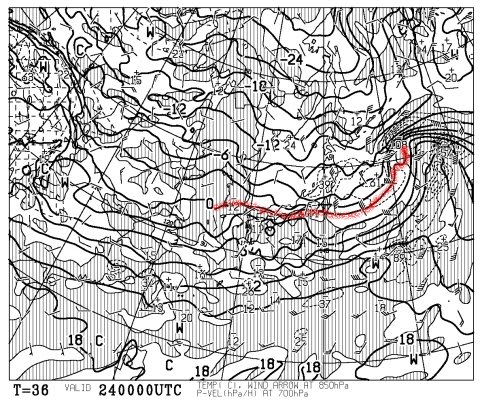
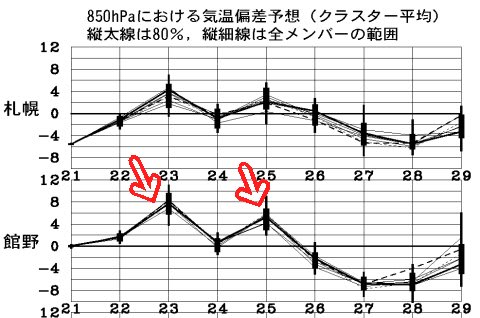

# 恒例っ！！　この週末の志賀高原の天気は？？

📅 投稿日時: 2012-02-23 00:46:01

あー．

これまでの経験を元に「志賀高原補正」をかけて天気図を読んでるわけですが．

ここ数週間は，かなり正確に天気が予想できてるなぁ…と．

自負している今日この頃．

さて．

というところで．

この週末の天気の予想です．

…が．

その前に．

23日木曜日．

本日．

…午前中は，雨ですね（涙)．

朝のうちは気温が冷えているので雪かもしれませんが．

日が昇ると雨です．

23日朝9時の850hpa気温を見ると…

0度線が東北北部まで上がっちゃってます．

というところで，標高2000mクラスでも降れば雨になっちゃう…

で，23日の降水域を見てみると…

オレンジで塗った降水域．

本州全域を覆ってますね．

…ということで．

残念ながら，23日は午前は雨です．

ただ．

23日の午後になると，低気圧背面に寒気が入り込み，雪になります．

24日午前9時には，850hpaの0度線は日本南岸まで下がってますね～．

23日夜～24日午前中くらいまで，信州まで雪雲が入ってくれそうなので，

アイスバーンがちょっとは隠れてくれるといいなぁ…

で．

肝心の週末の天気ですけど．

25日土曜は…

この矢印で示したように．

平年より気温が上がります…

現時点では，昼間は曇り．午後から雪がちらつく感じですが．

気温が高めなので，もう少し，わずかに低気圧が予想より北にずれると…

雨になる可能性もあります…（涙)

まぁ，雪になるとしても，ベットリとした重い雪ですね．

26日の日曜は…冬型になりますね．

志賀高原は曇り～小雪って感じですかねえ．

現時点での風向きでは曇りの可能性が高いですが，

もう一日待って精度の高い風向きが分かれば，

もしかすると晴れ，って予想になるかも．

という感じで．

土曜はイマイチ．

日曜は前日解けた雪が固まった固いバーンになりそう．

うーーーむ…

で．来週は．月，火あたりは冷え込むけど．

また木曜くらいからちょっと温まって，また雨の可能性があります…

あー．

寒暖を繰り返す，春の気配が天気図から感じられる時期に

なってきましたなぁ…
