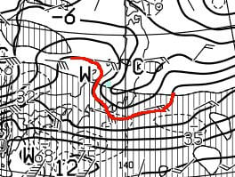

# なんと．21日祭日じゃないか…ってことで，緊急天気予想！果たして今週の志賀高原，どんな天気なのか…

📅 投稿日時: 2018-03-20 04:07:33

えー．

本日，月曜の詳細レポートをやろうと思っていたところ．

なんと！

21日の水曜日，祭日じゃないですか！！！

忘れてた…！！

ってことで．

水曜にスキーに行く方も多いと思うので←いないわけじゃないと思うけど…そんなに多くないのでは？？

本日は急遽，水曜を含む今週の天気予想を

やることにしました…

ってことで．

本日．

…というか，月曜19日．

昼間は曇り～小雪だったようですが．

夜に気温が上がって，どしゃ降りになったようですね…（涙）．

また，雪が解けちゃったんだろうなぁ…

ただ，深夜2時には，雪に変わりつつあるようですが．

…この雪，積もってくれるのかな？？

で．

まず，祭日の前日．

火曜20日の天気図を見てみるわけで．

地上天気図では，水色の降水域が志賀高原にかかってますね…

どうでもいいのですが．

この，FXFEの500hpa気温＋700hpa湿数図．

この図面の網掛け部分が，湿数ゼロ，

すなわち湿った空気のエリアなのですが．

この図の網掛けエリアと，地上天気図の

降水域の形がほぼ同じ形になってます…

冬の天気図だと，大陸から吹き込む冷たい乾いた風…

すなわち，湿数が大きいエリア（網掛けじゃないところ）が

日本海に流れ込むと雪になり．

網掛けじゃないエリアが雪になるのですが．

…湿数0のエリアと降水域がぴったり重なるように

なると．

「あぁ…冬が終わったなぁ…」

という気分になりますねぇ…←同意を求めても，これに同感できる人は極めて少数だと思う

ちなみに，水色で塗ったあたりに，心眼で見ると

ジェット軸が見えるのですが．

大体ジェット軸より北が冬の空気．

…ジェット軸も北海道まで北上してしまったか…（涙）．

あぁ…春だねぇ…

…余談はさておき．

20日の火曜，志賀高原には何か降るわけだ．

果たして，雨か，雪か？？？

…火曜20日の850hpa図を見てみると．

うーむ，きわどいっ！

きわどいながらも赤い0℃線は志賀より南．

これは…

おそらく21日は湿った雪ながらも．

志賀高原は雪になってくれそう！

…ちょっとでも予想がずれると雨になりそうな，

危険な状態ではありますが…

雪になったとしても，それほどドサドサ

積もらなさそうですけど．

この日は午後まで，チラチラ雪が降り続けるかな…．

夕方にはやみそうです．

で．

肝心な祭日．

21日朝9時の地上天気図を見てみると．

降水域はぎりぎり志賀に掛かってないので，

この日は朝は曇り空でスタートですかね．

21日朝9時の850hpa図を見てみると…

うむ？？

なんだ，この微妙な形は…？？

志賀近辺を拡大してみると．

うーーーむ．

微妙っ！！

赤く印した0℃線．

微妙な形をしているなぁ…

でも，水色で記した志賀近辺は，-3度線が

かかってるから．

朝は-5℃程度と，そこそこ冷えるのかな？？？

…予想がちょっとでもずれると，ガラッと

気温が変わっちゃいそうなので…

これは，明日の予想図を見ないと，

ホントに冷えるのか，確信が持てない感じ…

そして．

祭日21日の夜9時の地上天気図を見ると．

今度は結構な降水域が志賀高原にかかってますよ…？

朝9時から夜9時までの12時間に，20mm程度の

降水がありそう…

これ，雨になったら結構どしゃ降りレベル．

雨になるのか，雪になるのか？？？

21日夜9時の850hpa気温を見てみると…

…なんじゃこりゃ！！？？？

これもまた微妙な形！！

0℃線がこんな入りくんだ形になるの，

初めて見たぞ…

もしここにプチ擾乱があってこんな形に

なるのなら，もしかしたら風が強くなるかも？？

拡大してみると…

うーむ．

水色で示した志賀高原には，-3℃線が

かかっているように見えるので．

この日は雨にならず，雪になってくれそうな

感じですが…

でも，ホントにこんな変な形になるのかな？？？

微妙．

この天気図を信じてよいものやら…？？

ちなみに．

祭日の翌日，木曜22日はこんな感じで．

0℃線は志賀より北．

志賀高原は，水色の+3度線がかかるくらいで．

そして，降水域が志賀に掛かってるので．

…残念ながら，21日深夜から22日朝にかけては，

雨になりそうです（泣）．

ただ，22日の午後には．

をを！

赤い0℃線は志賀より南まで下がってるよ！

そして，降水域も志賀にまだかかってるので…

うむ．

22日の昼ごろには雨は雪になってくれそう…

ちなみに，23日以降は24，25日の週末も含めて

晴れそうな感じ．

今のところ，週末晴れパターンは続きそう．

気温は17日の土曜程度の，ギリギリ0℃を超える程度．

18日の日曜みたいな高温にはならないかな．

って感じで．

まとめると．

火曜20日：昼過ぎ～夕方まで湿った雪ながらも，雪が降り続ける．

　気温は終日ぎりぎりマイナスをキープしてくれそうで，

　積雪は10cm～20cmかな？夕方にはやむ．

水曜祭日21日：朝は曇り空．今の天気図のままなら，朝の気温は-5℃程度．

　昼頃，どこかの段階で雪がちらつき始める．

　夕方は雪が強くなり，風が強いかも？

木曜22日：雪は明け方から雨に変わり，午前中は雨か？

　昼には雪に変わりそうな予感…

　

金曜～日曜：晴れ．最高気温は0℃をちょいと超えるくらいで

　18日の日曜ほどは気温は上がらなさそう．

　積雪がないから，土日の朝は雪は固めかな…

って感じで．

月曜から木曜まで．

雨と雪の境目の，微妙な天気が続きます…

今のところ21日は雪になりそうですが．

うーむ．

明日の天気図を見ないと，ホントに雪になるかどうか

確信が持てない…

…ちなみに．

21日が雨になるようなら．

スキーに行かないでおこう

という，

大変珍しい心境になっている，Skier_Sなのでした…

さすがの私も，すごい交通費と往復運転9時間という

コストをかけてまで，雨の中を滑る根性は無い…

## 💬 コメント一覧

### 💬 コメント by (横須賀のウルトラセブン)
**タイトル**: 徒然さんらしくない？
**投稿日**: 2018-03-20 06:08:45

おはようございます、17日の一の瀬ダイヤモンドナイターでは、徒然さんを追っかけて楽しかったです。どんなお天気でも冬の休日はヤケビに現れるのが徒然さんなのでは？雨だとスキーは良く滑るしゲレンデは空いてますよ～

（笑）僕は21日雨でも行きます！ヤケビで待ってます！！（あっ21日は仕事だった～スキー行けません（泣）徒然さんもゆっくり休養してくださいね）

### 💬 コメント by (かず)
**タイトル**: Unknown
**投稿日**: 2018-03-20 06:51:29

いやーこのパターンはヤケビに来ているではないかって感じだと思いますよ　笑　交通費同じ感じですもんね　僕はなるべくまとめて行きたい派なのでトップシーズンなら得意の水木金土日パターンなんですが　この時期ですとパウダーも当たらないしいいとこ金土日です

### 💬 コメント by (さち)
**タイトル**: Unknown
**投稿日**: 2018-03-20 16:24:53

今日は朝から降ってましたよ、ぎりぎり雪でした。

夕方は晴れました！

きれいな雲海でした。

休みだったのでSさんを見習って朝から頑張りましたがこの時間にｷﾞﾌﾞｱｯﾌﾟです…無理……

### 💬 コメント by (ホンダです。)
**タイトル**: 明日は参加しない？
**投稿日**: 2018-03-20 17:00:12

今日のヤケビはギリギリ雪でしたが気温が高めだったので水分多めでウェアがぬれてゴーグルがぬれて悲しくなりました。明日は雪予想になってますがもう少し寒くなってほしいです。明日お待ちしてますよ。参加ですよね。なかなかお話しできず残念です❗

### 💬 コメント by (michi)
**タイトル**: あら❓
**投稿日**: 2018-03-20 17:21:44

どうしたんですか⁉️

明日は雪になりそうですよー。

逆にSさんが行かないから珍しくて雪になるのかもしれないですね（爆）

そういえば、明日で3高の営業も終了みたいですね。なんか淋しいです。

### 💬 コメント by (なるなる)
**タイトル**: Unknown
**投稿日**: 2018-03-20 17:35:16

本日、車には10cm弱の雪が積もってました。

木には雪が付いていてハイシーズンの雰囲気でした。

朝は良かったのですが、昼前には春雪というかザクザクになっちゃいました。

まぁ板がピッタっと止まる雪ではなかったので良かったのかな。

雪が降ったりガスったりでしたが、液体は落ちてきませんでした。

14時頃からはご褒美かと思えるような、晴れて景色が楽しめる状況になりました。

明日も滑ってますので、お見かけしたら声かけさせていただきます。

### 💬 コメント by (Skier_S)
**タイトル**: 明日滑りに行くかどうか，まだ決めてないです…
**投稿日**: 2018-03-20 23:10:00

＞横須賀のウルトラセブンさま

ナイターはちょっと雪が良くなくて残念でしたね…

明日は雪になりそうですが，そろそろ体がヤバいかも…

睡眠不足がかなり蓄積している感じなので，死ぬほど

寝てるかもしれません…

＞かずさま

明日は一緒に行ってくれる人がいれば考えたのですが，

どうやら一人になりそうなので，全額自分持ちで払ってまで

天気のそれほど良くない志賀に日帰りで行くかとなると…

微妙な感じです．

雨じゃないだけマシですけどね（笑）．

＞さちさま

今日は雪になってくれたようで，良かったです…

朝から滑ったのですか！

当然朝イチリフトに並んだんですよね．

そしてちゃんとラストリフトまで滑らないと，

勿体ないですよ～（笑）

＞ホンダさま

やはり予想通り，かなり湿った雪だったのですね．

しかし，今日も滑って水曜もいらっしゃるとは…

土曜から水曜まで連続滞在ですか？

うらやましい限りです…

明日行くかどうかは，30％くらいの確率です．

週末は行きますので，その際にまたお話ししましょう！

＞michiさま

そうなんですよ…

水曜は無事，雨にならずに済みそうなんですが．

午後の天気は荒れそうだし．

帰り道の上信越道も雪になりそうだし，

行き帰りの同乗者がおらず，交通費全額自腹の上

一人で運転して日帰りとなると…

ここ一週間の平均睡眠時間が4時間を切っている

私としては，ちょっと考えます…

＞なるなるさま

午後は晴れたのですね！

しかし，雨にならなかっただけ良かったです…

明日は残念ながら，志賀に行かない可能性が高いです…

また来週以降も志賀にいらっしゃるのでしょうか？？

その際は，また次の機会にお会いできれば…

＃運よく明日朝睡眠4時間で無事起きられたら

＃志賀に行くかもしれませんが…でも眠いので無理かな（涙）

