# 3シーズン，52000km走ったスタッドレス…YOKOHAMA IG5 Plusはどのくらい減ったのか…？

📅 投稿日時: 2018-05-19 03:15:57

🏷️ カテゴリ: [車](cba0e8330b3f2ded7c1addfacc75d4547.md)

ってなわけで．

土曜は順調に（？）雨が降りそうなので．

健全に日曜の日帰りで滑りに行こうと思っている，

Skier_Sです．

えー，本日の話題は，ちょっと古い話になりますけど．

そう，GWの谷間の，志賀高原から戻った日．

[車のタイヤをスタッドレスから履き替えさせた](ed11e03570b22c900f44f0ef7e9790796.md)わけで．

スタッドレスタイヤで一冬17000km以上走る

私の場合．だいたい2シーズンでスタッドレスタイヤが

ダメになってしまうのですが．

…今回のYokohama iG5plus．

どうやら，かなり耐久性があるようで．

2シーズン，トータル35000km走行した後でも，

思いのほか減っておらず，

「[まだ行けるじゃないか](e055b5b744b654941d93c40de1fad1b0b.md)」と，

私の歴史に残る，3シーズン目に突入した

わけなのですが…

今シーズン17000km走って，総走行距離52000kmになった

このスタッドレスタイヤ．

果たしてどのくらい減ったのか，見てみましょうか…

まず，リヤタイヤですが．

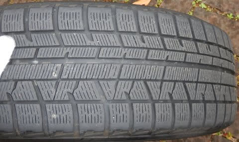

うむ？

これは…

まだ，プラットフォームが露出してないように

見えますね…

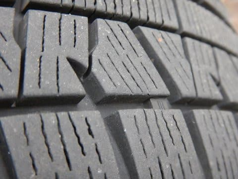

拡大すると．

まだあと少し，使えそうに見えますよ…！

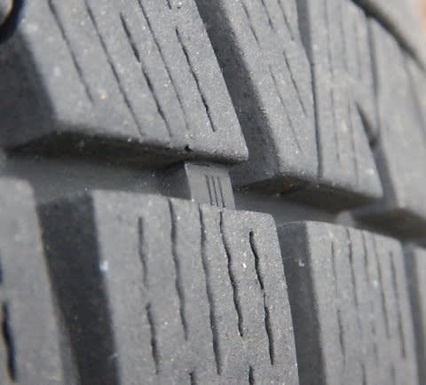

これは，奇跡の4シーズン目に突入か？？

…と．フロントタイヤを見てみると．

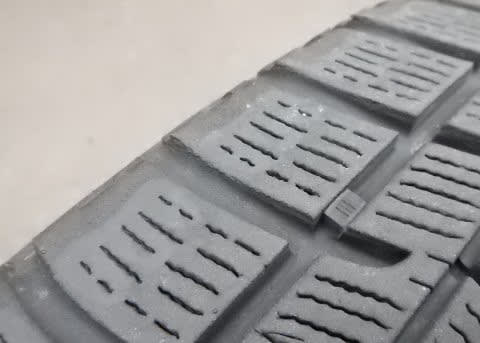

一見，プラットフォームがまだ完全に出てないので，

まだ大丈夫か？？

と思いましたが…

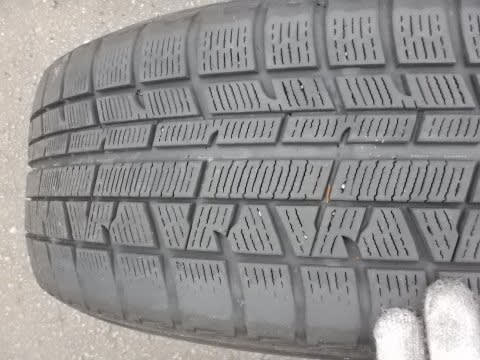

うげげ．

インサイド側，すごい片減りしてて，

発泡ゴムが完全に擦り減って，

下地のゴムが出ちゃってます…（涙）

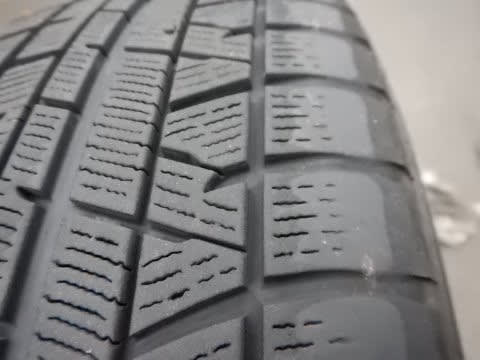

これは…

もう終わってますね…（泣）．

アウトサイドも，よ～く見ると

発泡ゴムが完全に擦り減ってしまって，

下地のツルツルゴムが出てきてます．

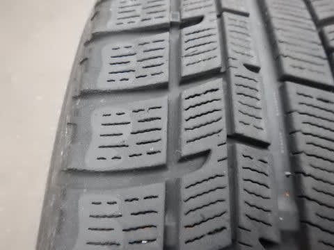

うーむ．

BRレガシィ．

フロントタイヤインサイドの摩耗が

凄すぎ…

シーズンに1.7万kmも走る私の場合．

シーズン途中でフロントとリヤタイヤの

ローテーションをしておいた方が無難

だったかも…

普段は2シーズンしか持たないので．

1シーズン目にフロントだったタイヤは

2シーズン目にリアに回って，

負荷が高いフロントを担うのは1シーズン

のみで終わっちゃうので．

ローテーションを気にせず済んでたんですけどね…

でも．

ローテーションに注意していれば．

この，YOKOHAMA IG5Plus．

5万kmは使えますね～！

かなりロングライフなスタッドレスでした．

とりあえず．

いつも通り，タイヤ交換と同時に．

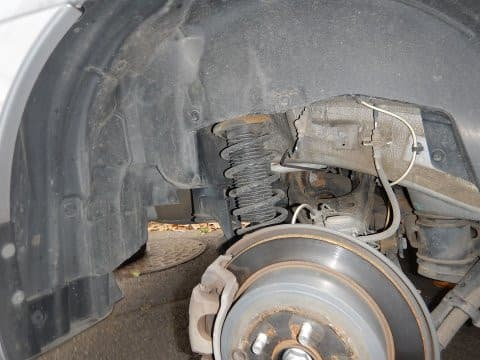

下周りをピカピカに磨き上げるわけですが．

プラスチック部分は，クレポリメイトを使って．

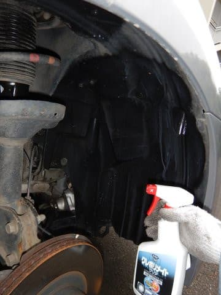

こんな感じにプラ部分だけを磨いて…

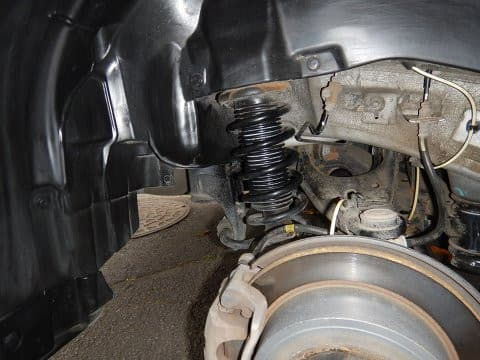

その後，金属部分を5-56を使いながら磨き上げて．

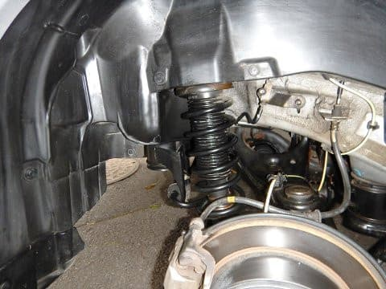

15万km以上走っている車には見えないレベルに

仕上げました．

そして，

まだスキーシーズンは続いてますけど．

…重要な所なので，繰り返して言いますが．

まだスキーシーズンは1か月以上続きますが．

この時期になると，ロング・ショート・太板と

3セットのスキー板をもっていくようなことは無いし．

さらに，4人以上で乗りあってスキーに行くこともないので．

板は中積で行けるよね…と．

ルーフボックスも外して．

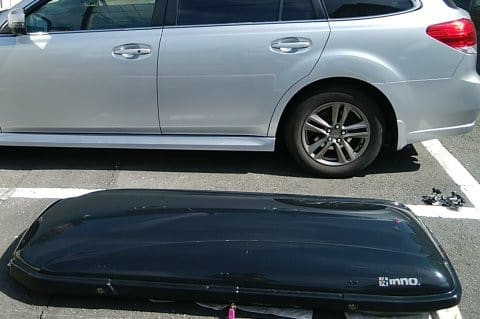

外したルーフボックスもクレポリメイトで

磨き上げると同時に，金属部分のグリスアップやら，

錆止め加工などをやって…

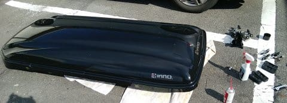

我がBRレガシィ君の，完全夏仕様化が完了しました～！

うーむ．

しかし，そろそろ車検なんだけど．

まだまだ走れそうなこのBRレガシィ君．

どうしようかなぁ…

走行距離16万kmとはいえ．

燃費もいいし，まだどこも故障してないし…

でも．プロジェクトX2をそろそろ考えないと

いけないのかも…？？

## 💬 コメント一覧

### 💬 コメント by (michi)
**タイトル**: Unknown
**投稿日**: 2018-05-19 18:56:03

私も同じくIG50plusですが、そんなに持ちがいいとは思ってませんでした。一冬で4000キロくらいしか走ってないので相当持ちそうですね(^^)

ルーフボックス、毎年外してるんですね。

自分は一昨年にルーフボックスを付けましたが夏もキャンプ道具とか載せているので夏もつけっぱなしでした。保管場所にも困るので今年の夏もそのままかも⁉︎燃費とか考えれば外した方がいいんでしょうけどね。一人で積み下ろしも苦労しそうで、、、

### 💬 コメント by (ほっぽ)
**タイトル**: Unknown
**投稿日**: 2018-05-19 23:45:13

私、ＢＧ、ＢＨ、ＢＰとレガシィ３台乗り継いでいますが、スタッドレスは持っても２万ｋｍでした。

勿論当時とはタイヤの性能が違いますが、レガシィで５万ｋｍオーバーまでスタッドレスが使えるのは驚異的です。

確かに今シーズン途中で前後ローテーションすれば、もう１シーズン使えたかもしれませんね。

レガシィがフロントイン側の減りが多いのは歴代モデルから変わっていない気がします。

私は調整式ピロアッパーなのでスタッドレスに

変える時にキャンバーを起こしていますが、通常だとストラット下部の長欠ボルトで若干の調整する程度しか出来ないので、アライメント調整で敢えて純正値から外してキャンバーを０付近まで調整するのも手かもしれません。

しかし、ＢＲレガシィ手入れしっかりされていますし、車検通してあと２年は余裕で乗れる気がします。

私も次回はＩＧ５０プラスの型落ち新品を探してみようと思います。

### 💬 コメント by (Skier_S)
**タイトル**: そろそろBRレガシィ君車検なんだけど…
**投稿日**: 2018-05-19 23:59:49

＞michiさま

いや，私も引っ越すまではルーフボックス

年中つけっぱなしでした．

今住んでいるところは，物置があってルーフボックスを

置いておけるので，外すことにしました…

夏もキャンプとかするなら，付け外しもめんどくさいですから，

つけておいた方がいいかと思います…

燃費は思ったほど変わりませんよ．

高速で飛ばすとちょっと差が出ますが…

意外と違わないです．

むしろ，スキーキャリアの方がルーフボックスより

高速での燃費悪化が激しかった思い出があります．

まぁ，スキーキャリアってまるでエアブレーキみたいな形ですから（笑）．

＞ほっぽさま

え！！

スタッドレス2万kmは，寿命短いですね…

でも，私も昔のスタッドレスはもって

3万kmちょいでした．

今回のiG5plusが異常に長持ちだったんです…

しかし，レガシィのフロントインの片減りは宿命なんですね．

直進時のネガティブキャンバーがそんなにあるように

見えないので，キングピン角度に由来する，

操舵時のキャンバー変化が効いてるのかと

思っているのですが…

だもんで，直進時キャンバー0にしても片減り

しそうな気がします（^^;

どうなんでしょうか…？？

BRレガシィ，おそらくもうしばらくは大丈夫かと

思っています．

でも，そろそろ乗り換えたいという物欲も…

### 💬 コメント by (ほっぽ)
**タイトル**: Unknown
**投稿日**: 2018-05-21 00:25:43

Ｓさん

私の乗り方が悪いのか、一般道（ワインディング多い）で飛ばし過ぎなのか、私はレガシィでもアルファードでもスタッドレスは２万ｋｍがプラットホームギリギリです。

以前から感心していましたが、Ｓさん車のメカニズムや試乗インプレッション、詳しいですね。

私は足回りのこと、そこまで考察できないのですが、キャンバーを中立付近にすると内減りは少なくなります。ただ、今度は外側の減りが激しくなり、丁度良いポイントを見つけるのが難しいです。

最近はレガシィのフロントも割と内外均等に減ってくれています。

フロントタイヤの内減りは歴代レガシィの持病みたいなものと割り切るしかないかもしれません。

確かに新車は魅力的ですが、大きなレガシィが好きな人には、ＢＲレガシィは良い車だと思います。

最近、フト４００万円までの四駆の新古車を検索するのですが、

ＢＭＷミニ、クロスオーバーのＰＨＶ

ＢＭＷミニ、クロスオーバーのディーゼル

アウトランダーＰＨＥＶ

が気になってます。(^^;

２人までならＢＭＷミニでも十分かなと思ったりしています。

### 💬 コメント by (Skier_S)
**タイトル**: ほっぽさま
**投稿日**: 2018-05-21 03:43:51

えええ～！

スタッドレスが2万kmしかもたないと，

私の場合は1シーズンで履き替えになり，

大変です…

うーむ．

私の場合は，ほとんど直進の高速道路しか走らず，

ワインディングは志賀高原の上り下りだけってのが

長持ちの理由でしょうか？？

で．

レガシィの片減りがステアリング操舵時の

対地キャンバー変化によるものかな…

と思ったのは．

レガシィは，大きく横Gをかけて結構ロールしている領域から，

ステアリングを切り足すとクッと頭が内に入っていく

感覚があり．

操舵に対するアウト側タイヤのネガティブ側への

キャンバー変化が大きそうだな…と思わせます．

じっくり見てませんが．

レガシィのフロントサス．

かなりキャスター角を大きめにとってるんじゃないでしょうか？

フロントロワアームも十分長めで，リアサスのロアアームに

比べると下反角も小さいため，

フロントのバンプ・リバウンドストローク時の

キャンバー変化はそれほど大きくなさそうなので．

ロールでのアウト側タイヤのキャンバー変化は，

ロールした分のポジティブキャンバーになりますし．

さらにスクラブ半径を小さくするために，

キングピン角度も結構大きいので，その効果も足されると，

アウト側タイヤがかなりポジティブキャンバーに

なっちゃいます．

だもんで．

BRレガシィは，

そのポジティブキャンバーを打ち消すために，

かなりキャスターを大きく取ってるんじゃないか…

というのが私の勝手な推測です．

キャスターが大きいと，ステアリングを切ると

かなり大きくキャンバーがつくので．

それが片減りの原因かな～，

と勝手に思ってました…

いや，あくまで確証の無い，ぼんやりと

考えていた推測です．

余談ですが．

ストローク時のキャンバー変化と，

キングピン角度，キャスター角を独立して

自由に設計できるのは，昔の日産の

フロントマルチリンクサスが完璧で．

初めてP10プリメーラを運転した時，対地キャンバー変化の

完璧さに，衝撃を受けた思い出があります…

…おっと．すいません．

### 💬 コメント by (ほっぽ)
**タイトル**: Unknown
**投稿日**: 2018-05-21 07:06:17

Ｓさん

横幅の広いフラット４エンジンと、車幅の制限と、ストラット形式のサスペンション、そのあたりの制限から内側に片減りしやすいセッティングなのかもしれませんね。

それでも、ＢＲレガシィになって車幅に余裕が出来たので多少は改善されているのかもしれません。

ＨＰ１０プリメーラ、懐かしいですね。私もＢＧレガシィの前に所有していました。ＦＦの２．０Ｔｅの５ＭＴでした。

ＦＦハンドリングマシンと言われ、やや硬めの載り心地でしたが楽しい車でした。

ＦＦに限界を感じてレガシィに乗り換えるまでの４年間、スキーの足にも使っていました。４ＷＤにしていたら、もう少し長く所有していたかもしれません。

あの車、少ない弱点の一つはハンドルの切れ角が少なくて小回りが利かないことでした。

それと、煩い、振動が多い割に気持ちよくないＳＲ２０エンジンですかね。(^^;

ＢＭＷミニクロスオーバー、ディーゼルをスキーの知り合いが所有していますが、滅茶苦茶満足度が高いようです。Ｓさんと同じく、車に詳しく、特に足回りのセッティングには拘りのある方が吊るしのノーマル状態で満足されているので、きっと良い車なんだろうなと思っています。

ただ、全長が短いのでスキー板の車内積みが可能なのかは気になります。

それと、仰る通りあれを「ミニ」と呼ぶにはムリがありますよね。(^^;

### 💬 コメント by (Skier_S)
**タイトル**: ほっぽさま
**投稿日**: 2018-05-22 06:18:26

HPを読み直してみましたが…

そうですか！S13シルビアのあと，

P10プリメーラに乗ってらっしゃるんですね！

R35GT-Rを造った水野さんの手による，

FF車の完成形かと…

あの車に初めて乗って，山道を攻めた時の

衝撃は忘れません．

でも，最小旋回半径大きかったんですね（笑）

### 💬 コメント by (ほっぽ)
**タイトル**: Unknown
**投稿日**: 2018-05-22 23:32:53

Ｓさん

ＨＰ１０プリメーラ、ハンドリングは良かったんですけどね。小回りが利かなくて町中での使い勝手はイマイチでした。

当時、初代レガシィＲＳ、ブルーバードアテーサ、そしてＦＦでしたがプリメーラと迷ってプリメーラにしたのは、若かったのだと思います。まだ車はＭＴでしょ！って思っていた時期でもあります。

本格的にスキーに行き始めると、ＦＦの限界を感じてレガシィに乗り換えましたが、それ以降は４ＷＤ以外考えられなくなりました。

しかし、私のスタッドレスの寿命が短いことは、今後ドライビングスタイルを考え直さないといけないと思っています。

### 💬 コメント by (Skier_S)
**タイトル**: ほっぽさま
**投稿日**: 2018-05-23 01:04:19

プリメーラが新車で売っていた頃は，まだ私も

免許も持っていないころでしたが，欲しい車の

ひとつでした．

実際は，街中の使い勝手が厳しかったんですね…

あと，やっぱりスキーヤーは4WD縛りがありますよね（笑）．

あと，最近はタイヤも値上がりが激しいので，

なるべくスタッドレスは長持ちさせたいものです…

でも，私も結構志賀の山道は攻めて走るんですけどね（笑）

### 💬 コメント by (まうちゅう)
**タイトル**: Unknown
**投稿日**: 2019-08-03 14:21:04

古い記事への質問で失礼します。

私もinnoのルーフボックスを買おうか検討中ですが、

BR55って重さ15kgだと思いますが一人で車への積み下ろしはできますか？

筋力次第かもしれませんが、しんどさ加減を教えて頂ければ助かります。

### 💬 コメント by (Skier_S)
**タイトル**: ＞まうちゅうさま
**投稿日**: 2019-08-03 22:33:19

innoのBR55ですが，バーをつけたままだと厳しいですが，

バーを外したルーフボックス単体なら一人で屋根の上に

つけ外し可能です．

いつも，一人でつけ外ししています．

他の20㎏級の商品に比べれば，軽い部類に入ると思います…

ただ，屋根が高い車だと，ちょっと苦労するかもしれませんが．．．

### 💬 コメント by (まうちゅう)
**タイトル**: ＞Skier_Sさん
**投稿日**: 2019-08-03 23:15:17

ありがとうございます。参考になりました。

20kg級は本当に「無理！」って感じでした。

BRQ55も生産終了のようなので早めに買おうかと思います。

後は購入に備えて腕立て伏せして腕力を鍛えます！

### 💬 コメント by (Skier_S)
**タイトル**: ＞まうちゅうさま
**投稿日**: 2019-08-06 00:07:05

25kgくらいのやつを一人で持ち上げるのは無理ですよね（笑）．

15kgなら何とかなりますが…きわどい感じです．

外したあと，とりあえず車のすぐ横に一旦おけるスペースが

あればいいですが，狭い車庫など，苦しい体制のまま

車の前や後ろにもっていかなくてはならないとかだと

きついかと思います．

とりあえず，筋力トレーニングをして，購入に備えてください！（笑）

