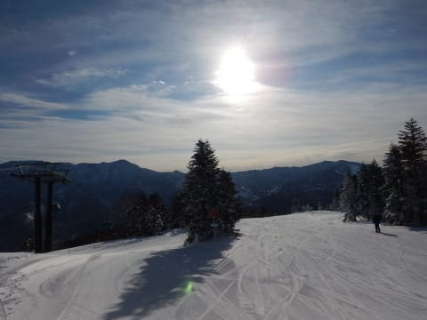
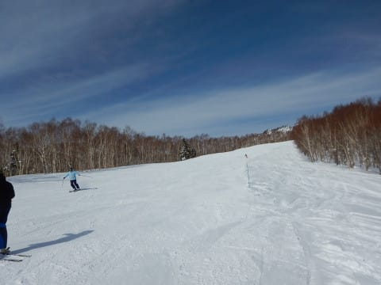
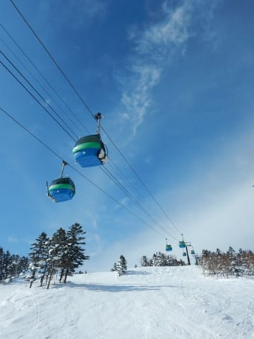

# 2019/1/12(土）3連休初日の志賀高原，焼額山スキー場は…晴天最高の朝！おおむね晴れで寒くなく，穏やかな最高スキー日和！

📅 投稿日時: 2019-01-12 20:37:13

ってなわけで．

3連休ですよ．3連休．

…9日中8日スキーをした正月休みが

終わったばかりというのに．

また，3日連続で志賀高原に舞い戻って

来ています～！

いやーー．

3連休の初日は．

私の日頃の行いの良さをたたえるかのような，

絶好のスキー日和でした…（感激）←あなたが志賀にいた正月は，ずっと天気が悪かったけど？あなたの日頃の行いのおかげなの？

まず，志賀高原へ上ってくる朝の道は．

ちょっとツルツル気味で，かなりの

のろのろ運転（涙）

だもんで．

1ゴンに乗ったのは，ゴンドラ営業開始から10分以上

遅れ…（泣）

悔しい…

ってなわけで．

ちょいと遅刻の1ゴンに乗って，

「早く山頂に連れていけ～」

と，はやる気持ちを抑えつつ，

山頂にに到着すると．

いやーーー！

ピカピカ太陽が差し込む，晴天！

そして．

出遅れたものの．

ゲレンデはシマシマっ！！

思ったより柔らかめだけど，エッジがしっかり

雪面に噛みこんでいく，マイルド目ながら

トップグレードのシマシマ圧雪バーン！

朝イチは人も少なく．

日差しでバーンがきれいに見えるので…

シマシマ最高！

圧雪最高！

今日は，3連休というので混雑を覚悟したのに．

全然人がいないんですけど？

GSコースも，正月休みに比べれば

ガラガラなんですけど！？？

オリンピックコースも，柔らかめの

フラットバーンで，快適に飛ばせるんです

けど！！！？？

いや…

最高．

最高の朝イチだよ…！

午前10時ごろになると．

さすがにちょっと人が増えてきたけど…

でも．最も混雑するサウスコースが，

タイミングによって最大この程度混む…

って感じで．

GSコースはせいぜいこの程度の人口密度．

ゴンドラ待ちも，最高でこんな感じで，

ゲートから外に人が並んだのが1回あったかな…

という程度の混雑．

リフトも当然，飛び乗りに近い程度の

ガラガラさ！

予想通り，昼頃から雲が増えてきて，

太陽がうっすら隠れてしまうことも

あったけど．

午後2時ごろまでは，太陽がさしたり…

うっすら曇ったり．

終日雪質も最高をキープして．

だというのに…

こんなに空いていていいんだろうか？？

こんなに人がいなくて飛ばし放題で

いいんだろうか！！？？

昼になるとゴンドラもほぼ飛び乗りで．

いいんだろうか！！？？

気温も寒すぎず．

天気も穏やかで．

…最高…

最高だよ…

午後遅くになってくると．

朝の雪が柔らかめだったこともあり．

さすがにちょっと荒れ始めてきたけど…

でも，人が少ないので．

急なところにちょっとした凸凹が

ある程度で，ほぼフラット！

いいんですか～！

こんな気持ちいい天気で．

ガラガラで．

最高雪質のゲレンデを滑れて，

いいんですか～！？？

夕方近くになると，予想通り，

ちょいと雲が厚めになって来たけど…

でも，雪面の凸凹が見えないほどの

暗い曇り空にはならず．

とても3連休と思えない，ガラガラゲレンデを．

夕日が暮れ始める，リフトストップの時間まで…

気持ちよく滑り続けたのでした．

いやー．

良かった．

今日は良かった．

天気，混雑，雪質と3拍子揃った，

いい一日でした～！

…このままの天気図だと．

明日も朝から晴れそうで．

今日みたいな，晴れ時々薄く雲がかかる，

という天気になりそうな予感…

明日は3連休の中日だから，混むかなぁ．

混まなきゃいいなぁ…

PS.

今日もナイターに行っているとお思いでしょうが．

…私もナイターに行きたくて仕方がなかったのですが．

風邪がまだ治っておらず，体調が万全でないので．

泣く泣くナイターをあきらめました…←いや，それなら昼間滑ってるっておかしいから

あぁ…気分はナイターに行きたいんだけど．

体調を考えるとちょっと…

でも，行きたい．

あぁ，行けない．

体調が悪く．ナイターに行けなくて泣いた～（涙）←あまりにもギャグのレベルが寒すぎて，神の怒りに触れて明日吹雪になるんじゃなかろうか…？？

## 💬 コメント一覧

### 💬 コメント by (ほっぽ)
**タイトル**: 今日から志賀高原
**投稿日**: 2019-01-12 22:25:37

Ｓさん

無事志賀高原にたどり着きました。

３連休ですが今日明日と滑ります。

今日は一の瀬からヤケビに向かいましたが、

一度もＳさんを見かけませんでした。

友人連れなのでペースが遅くて合わなかったのかもしれません。

天気が良いのでサンバレーまで旅に出てきました。

明日は午前中ヤケビ＆奥志賀メインで滑る予定です。

http://www2.tokai.or.jp/nana_hoppo/

### 💬 コメント by (しんちゃん)
**タイトル**: 雪質最高
**投稿日**: 2019-01-12 23:09:17

今日は皆さんのグッズがいろいろ変更されていて、一瞬誰かわからなかったです。

しかし、ゴンドラストップまで雪質最高でしたね😉👍

明日は朝一から参戦予定です。よろしくお願い致します。

### 💬 コメント by (なるなる)
**タイトル**: 良かったですね
**投稿日**: 2019-01-12 23:41:47

私も、志賀高原滞在中なのですが、志賀高原登りは結構な車がいたので、

どうなるのかと思いましたが、予想外に空いてましたね。

連休なのに最後まで、こんな雪質で良いのかと思うほど快適に滑れました。

今日は、高天ヶ原のラスト搬器をGET出来て満足です。

ラストスパートで、もう１本乗るにはどうするかと、Blog参考にさていただきました…w

### 💬 コメント by (もりや)
**タイトル**: スキーに行きたい
**投稿日**: 2019-01-13 00:57:30

穏やかな天気で最高のスキー日和だったんですね！行きたい！スキーに行きたい！あまりの苦痛に悶絶しそうです(笑)なんとかせねば・・・

### 💬 コメント by (かず)
**タイトル**: Unknown
**投稿日**: 2019-01-13 19:05:55

意外と空いてますね　僕はこの連休仕事して木金土日予定してますが　天気予報が結構まちまちで判断が難しいです　水曜どうですかね？

### 💬 コメント by (Skier_S)
**タイトル**: 風邪が治りません
**投稿日**: 2019-01-13 20:55:50

＞ほっぽさま

今日はお会いできませんでしたね…

一日ヤケビをグルグルしていたのですが．

また次の機会にお会いしましょう！

＞しんちゃんさま

今日はあさイチ参戦お疲れさまでした．

明日もあさイチ参戦ですので（強制）ご覚悟のほどを…

＞なるなるさま

3連休初日は混まず，雪も良く最高でしたが．

今日はちょっと混みましたね～．

西館は混まないで良かったようですが．

また明日も滞在ですか？

焼額でお会いできたらいいですね…

（私は明日，焼額以外にも遠征するかもしれませんが）

＞もりやさま

あぁ…

禁断症状を起こしていらっしゃるようですね．

これは，焼額にいらっしゃらないと治癒しません(笑)．

お待ちしています…

＞かずさま

15日はほとんど降らず．

16日の朝から，結構降りそうですが…

完全西風なので，志賀はそれ程積もらないかも．

16日朝までに，10cm，運が良ければ20㎝…

16日は終日降り続けます．

17日，18日は雪がぱらつく程度で積もらない感じですね～．

