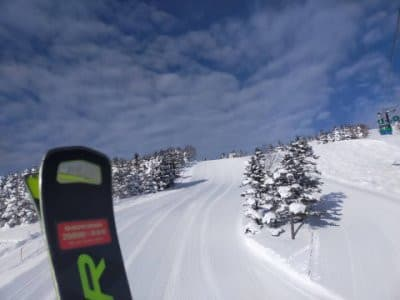
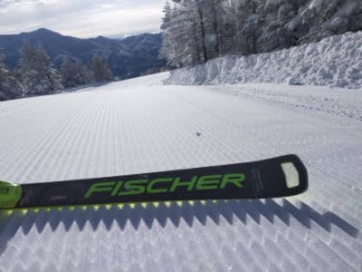
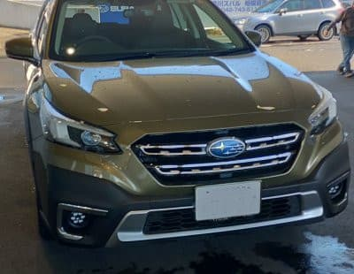
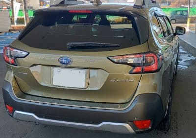
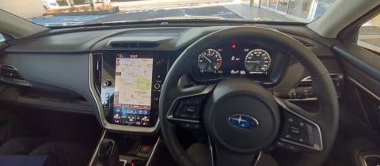

# SUBARU 新型LEGACY OUTBACKに試乗してきたよ！

📅 投稿日時: 2022-02-09 00:36:50

🏷️ カテゴリ: [車試乗](c07dec5709d34bd74e1f6cb9c8291061b.md)

えー．

本日の志賀高原特派員からの写真を見ると…

昨日の記事の最後に予想した通りに，

晴れベースの天気だったようですね…！

うぎゃーー！！

シマシマ！！

見事にいい感じのシマシマ！！

これは目に毒っ！！

あぁ…仕事してる場合じゃない…

滑りたい…

今日の志賀高原は楽しかったん

だろうなぁ…

とりあえず，今のところ．

今週末も天気は良さそうです！！

…でも，13日はちょっと気温が上がりそうだけど…

ってなことで，本題へ．

先日，車のエンジンオイルと，F&Rのデフオイル

交換にディーラーに行ってきたのですが．

ついでに，新型が出たアウトバックの試乗車が

出ていたので．

これ幸いと試乗して来ました～！

このアウトバック．

前回のBS型アウトバックが生産中止になり，

その後アメリカで販売開始した後継モデルが

日本には入らなかったので，

「アウトバックはアメリカ専売で，

　日本ではもう売らないのかな？？」

…と，思ったところ．

アメリカのNA2.5L＆2.4Lターボの組み合わせと

異なる，1.8Lターボとなって日本へ導入されました！

…それも，BS型は単なる「アウトバック」だったのが，

今回のBT型では「レガシィ　アウトバック」と，

久しぶりにレガシィの名前がついて復活です！

ってなことで．

実車を始めてみてみると…

LEVORGを見慣れた目には，かなり

デカく見えます…

幅，長さ，高さともに10cmほど

デカいのですが．

やはり高さがあるので，デカく見える

のかな…？

写真で見るとそれほどデカく見えませんが．

実物はかなり大きく感じます…

ってなことで，乗り込むと．

運転席のアイポイントもやはり

レヴォーグよりかなり高め．

でも，スバル車統一感のある内装で，

まぁ見慣れた感じ．

激烈な高級感があるわけではないけど，

安っぽくは無く，落ち着いた感じの

インテリアですね．

早速走り出すと…

おっと．

意外とマイルド目な足．

LEVORGよりバネレートは低いので，

段差はマイルドに乗り越えるけど，

ダンパーはしっかり効いてるし，

車高が高めのSUVスタイルとしては

ロールも少なく，ブレーキ時のダイブ

などの姿勢変化が少ない感じ．

「柔らかめだけど引き締まった」

とでも言う感覚でしょうか…

で，静粛性も高い．

ロードノイズは多少入りますが，

エンジン音がしっかり遮音されていて，

エンジンは新型LEVORGと同じなのに，

LEVORGよりかなり静かですね！

で．

LEVORGと同じ1.8Lエンジンだから，

走りは似た感じかな…？

と思ったら，かなり味付けが違います！

パワーより静粛性，

ダッシュよりジェントルさ…

という味付けがされている感じ．

グッとアクセルを踏めばそこそこ加速しますが，

アクセルを踏んだ時のレスポンスは，

LEVORGよりアクセルの非線形性が

抑えられているようで，踏み始めにガツンと

来るのではなく，割と穏やかに加速するよう

調整されているように感じます．

ただし，これはIモードの時．

スポーツモードにすると，アクセルを

踏んだ瞬間からかなりのトルク感を

感じられ，ガツンと加速するので．

…このボディに対して1.8Lエンジンの

パワーが足りないのではなく，

アウトバックという車の性格を考えて，

iモードではわざと穏やかに加速するよう

調整されているんだと思います…

とりあえず，LEVORGより100kg重い車重で

LEVORGと同じエンジンってのは

大丈夫かな？と思ったけど．

Sモードにすれば，アンダーパワー感は

無いですね…！！

iモードの時は，リニアトロニックの変速も

LEVORGより低回転をキープするように

なっているのか．

回転数をぐっと上げてパワーを出すのではなく，

静粛性を保ったまま，低回転トルクで

行けるところまで引っ張ろう…

という感じのプログラム．

うーむ．

LEVORGと同じ1.8Lターボなのに，

エンジンが頑張った感を出さずに

どちらかというと高級車っぽく，

上品に低回転で車を引っ張っていく

感じ．

同じエンジンなのに，味付けをここまで

LEVORGと変えてくるとは！

ただ，やはり1.8Lなので．

3Lや4LのNAの高級車のように，

怒涛のトルクがあるわけではないです…

でも，登り坂でもブーストを高めることで

エンジン回転をそれほど高めることなく

加速していってくれるので，トルク感も

感じるし．

普通に走るのに全く不足は感じない

パワー．

そしてSモードにすれば，少なくとも

これで足りないと感じるシーンは

無いんじゃないかな…？

で．足回りを試そうと，いろいろ車を

ゆすってみると…

LEVORGよりはバネレートが低めなので，

高級車っぽく，車の動きが緩やかかと

いうと，そうでもない．

足はある程度しなやかながら，

ステアリングへの反応も早く，

車高の高さから想像するような

ロールも無いです．

車高も高く，ストロークが長いサスの

はずだけど，かなりロールが抑えられて

いる感じ．

少なくとも，BRレガシィの，

左右にステアリングを切り込んだ時の，

大きめのロールが遅れてついてくる

感は全く無いです．

しなやかなのに，応答周波数はかなり

高い感じ．

同時にLEVORGの1.8L STIと乗り比べて

みたけど．

LEVORGの方がしっかりとエンジン音が

聞こえるし．

サスもNORMALでもOUTBACKより

しっかりしてる感じ．

OUTBACKのサスは，LEVORGのコンフォートに

感じが近いかな…

エンジンも，LEVORGの方はNormalモードでも

アクセルを踏むと回転を上げてパワーを

出していくプログラム．

静粛性はOUTBACKより劣るけど，

LEVORGの方が元気に走る感があります…

あ，OUTBACKもSモードにすると

元気になります．

でも，LEVORGもスポーツ＋モードにすると，

「これ，OUTBACKと同じエンジンの車か？？」

と思うほど，回転を高めに引っ張って

アクセルに素早く反応する尖った車に

なります…

とりあえず．

車は大きいけど，それだけ分トランクと

リアシートはLEVORGより広いし．

同じ1.8LエンジンなのにLEVORGとは

違う落ち着き感もあるので．

山道をあんまりガンガン攻めるわけではなく，

車にそこそこの広さが欲しい…

という，落ち着いた方にはいいんじゃない

でしょうか．

しかし，今回，新型LEVORGとOUTBACKを

乗り比べてみたけど．

同じエンジンの車なのに，ここまで味付けを

変えられるとは…

今のエンジン＆トランスミッションって，

コンピュータの調整で全く味付けを

変えられるんだなぁ…

と感動した，今回の試乗だったのでした．

## 💬 コメント一覧

### 💬 コメント by (たぉ)
**タイトル**: Unknown
**投稿日**: 2022-02-09 09:55:49

いつものきめ細やかな感想参考になります。私も年末フォレスター（Advance）購入しました。初のスバル車で正月一の瀬行きましたが、前車のエクストレイルより安定感がありますね。あの積雪でしたしXモードも助かりました。雪と氷ですでに傷が凄いですが（涙）OutbackとLEVORGもう少し金額優しくしてくれたら次回欲しいリストです。

### 💬 コメント by (おおすぎ)
**タイトル**: Unknown
**投稿日**: 2022-02-09 11:05:06

（次期）購入者決定、おめでとうございます！？

わたしには、チョット（だいぶ）大きい車体なので、購入出来ませんが、年取ったら一度くらい、このくらいの車にゆったりと乗車して、オールシーズンタイヤを履いて、スキーでも山でも行ってみたいものです・・・

### 💬 コメント by (レインボー74)
**タイトル**: Unknown
**投稿日**: 2022-02-09 14:14:00

水曜日の志賀高原情報

朝の上林-3℃　蓮池-9℃。車にはうっすらとさらさら雪が。

足に優しい柔らか完璧圧雪。

やけびは木曜までイチゴンと二高しか動かないので、イチゴンが徐々に混んできた。

今日は奥志賀ゴンドラ整備で9時半開始に合わせて、奥志賀を目指します。

圧巻はエキスパート。しっかり踏める。完全に上手くなったと勘違いバーン。気持ちいい。

失敗した一本はコースが混んでいるのにスタートした時。大回りはやっぱり待ってからスタートしないと！

天気もだんだん良くなってきて、最高の一日でしたが、昼終了。

### 💬 コメント by (Skier_S)
**タイトル**: 3連休は良さそう
**投稿日**: 2022-02-10 04:32:28

＞たぉさま

やはり雪道はフルタイム4WDのスバル車が安定です…

でも，LEVORGもOUTBACKもモデルチェンジでお値段上がったのが辛い．

＞おおすぎさま

いや…Outbackは買わないですよ！

ちょっと大きすぎます…

＞レインボー74さま

今日はやっぱり2ゴン，3高動かなかったせいで，1ゴン混んだのですか…

3連休，ちゃんと2ゴンが動いてくれればいいのですが，

もしかすると3連休もヤバいかも…

