# 2019/4/7(日)の志賀高原スキー場は…朝から気温高めで昼間は完全ストップ雪（涙）．雪も黄砂で汚れて，あぁ…春だねぇ…

📅 投稿日時: 2019-04-09 05:37:46

ってなわけで．

いろいろご無体があって，

更新がなぜか朝になってしまいましたが（涙）

月曜深夜の志賀高原，冷えているようですよ～！

そして，雪が降ってるようです！

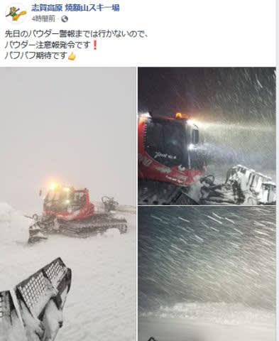

（[焼額山FB](https://www.facebook.com/yakebitaiyama/posts/2118841194877882)より）

本日9日（火）の850hpa気温図を見ても，

赤い0℃線は関東より南まで下がってて，

このまま明日まで，結構冷えるし．

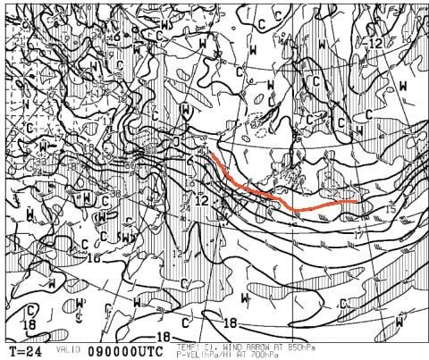

明日は終日氷点下をキープしそうなのに．

朝までには10cm程度の積雪があって．

…そして，午後には晴れてきそうという．

なんだか．

明日はまた4月と思えないコンディションに

なりそうなんですが…！！！

そして，この低温傾向は．

水色の矢印で書いたように．

13日の土曜までは続いてくれそう…

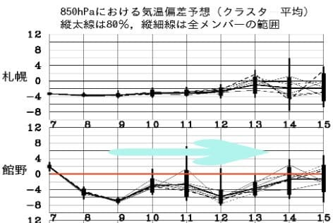

また，11日に冷えて雪が積もって

くれそうなので．

13日の週末まで，いいコンディションで

ゲレンデがもってくれることを期待…！

ってなことで．

昨日速報レポートした，日曜の志賀高原，

詳細レポートへ…

まず．

土曜の日程を考えると．

「日曜，早朝から滑りに行くのはは辛いよね…」

と思いながら．

気が付くと，いつも通り6:30には

早朝営業のゴンドラ待ちに並んでいる

自分がいたわけで…

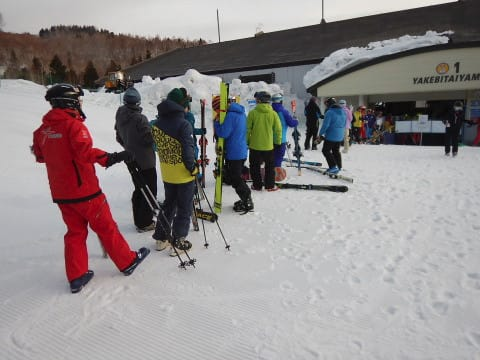

今朝は30人ちょいくらいの待ちですかね．

で．

山頂に出ると…

いや！晴天！！

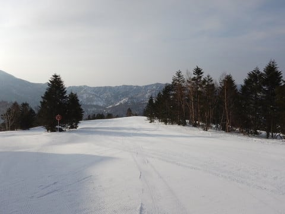

だけど…

気温は早朝から-2度と．

私の予想通りですが．

この時期としては，ちょいと

高めですね…（涙）

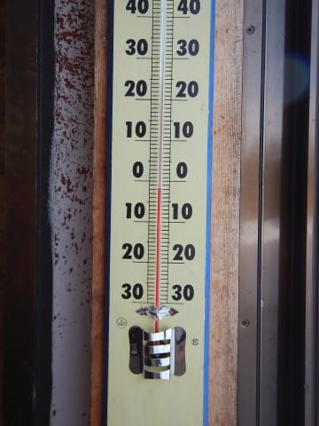

でも．

早朝のゲレンデはシマシマっ！！

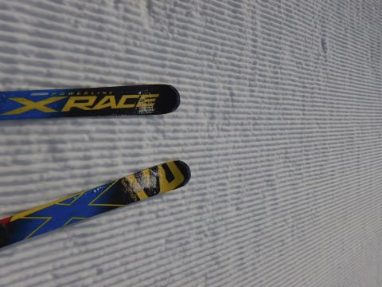

ふははははは！

死ぬほど眠い中早起きして．

このシマシマを味わいに来たのだ！！

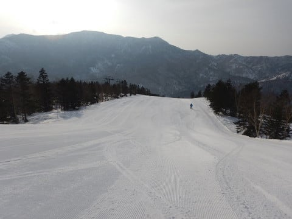

思う存分満喫してやるぜっ！！！

と，シマシマバーンに飛び込んだものの…

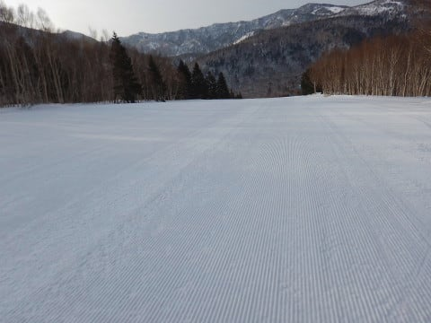

ありゃ？？

なんだか．

下地は硬くなく，緩んだ感じなのに．

表面だけ軽く固まったような微妙な雪で…

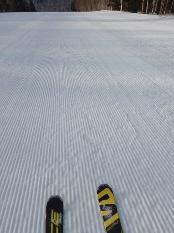

板が…

板が流される…っ！！

板に圧をかけると，足元が

コロコロと崩れていく感じで．

気持ちよく傾けない…っ！！！

日が昇る頃の，まだゲレンデが

それほど緩まないはずの早朝で．

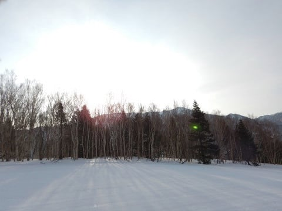

表面の塊が崩れて，コロコロが

発生していく，この残念さ…（涙）

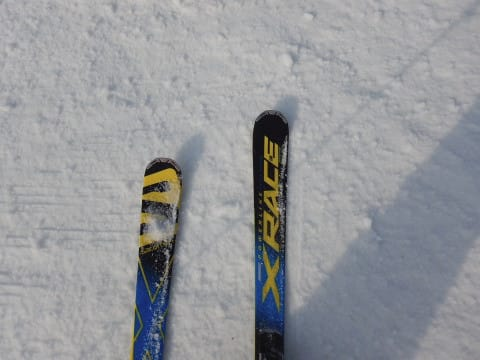

ゲレンデには，いい感じで朝日が

差し込み．

一見気持ちよさそうに見えるだけに

ちょいと残念…

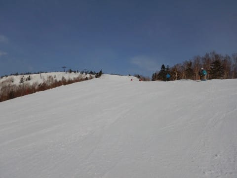

でも．

早朝営業が始まって1時間ほどたつと．

いいことか悪いことか微妙だけど．

表面の固まった部分が緩んできて，

滑りい感じに…！

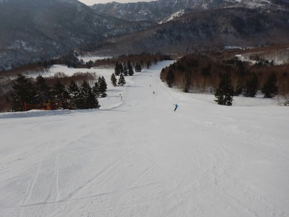

しかし．

うぎゃーー！

通常営業が始まる8:30には，

すでに気温は0度まで上がっちゃったん

ですが…！！！（涙）

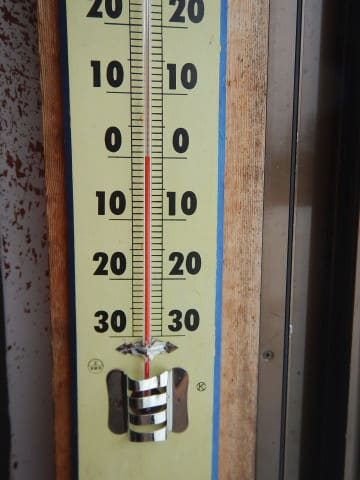

そのせいで，早朝営業が終わるころには．

早くもかなり雪が緩み始めてきました…

でも．

通常営業開始と同時に，

早朝営業ではオープンしていない，

パノラマ-サウスコースへ飛び込む！

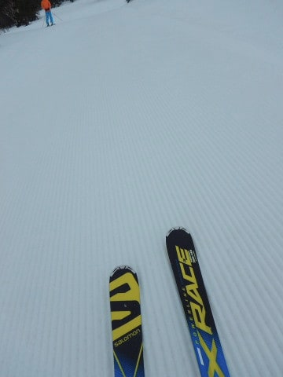

…そうです．

早朝に引き続き，またもやシマシマを

味わいに行くのだ！

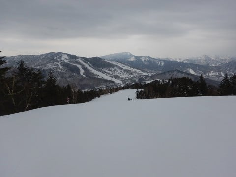

…通常営業のころには，

雲が増えて，空は完全曇り空に

なっちゃってます…

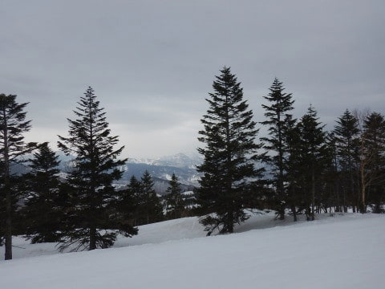

でも．

気温が0℃を超えてしまっていて．

晴れると雪がすごいことになっちゃう

ところなので．

ピカピカ晴天より，曇り空くらいで

ちょうどいいところ…

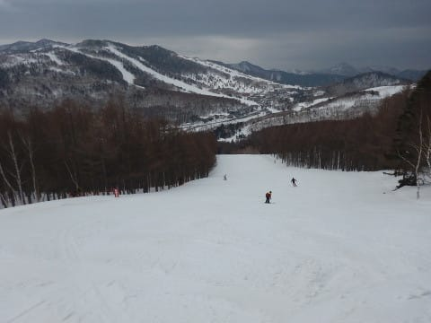

とはいえ．

8時過ぎから日が射さなかったにもかかわらず．

気温が高かったので．

10時にはもうこんな感じになり．

ゲレンデ全域が完全春の雪と化して

しまっちゃってます…（涙）

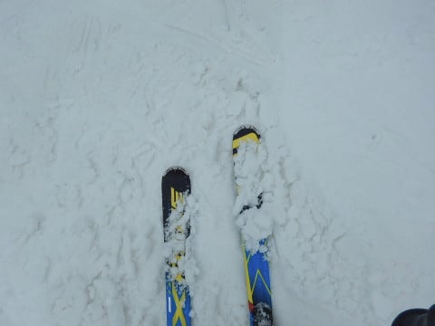

そのせいで．

ゲレンデがちと荒れ始めてきました…（泣）

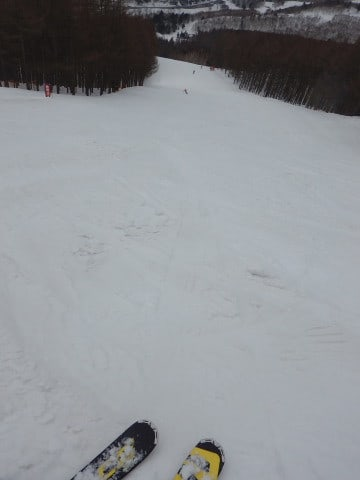

そして．

さらに昼ごろに．

雲が切れて，日が射して来ましたよ！？？

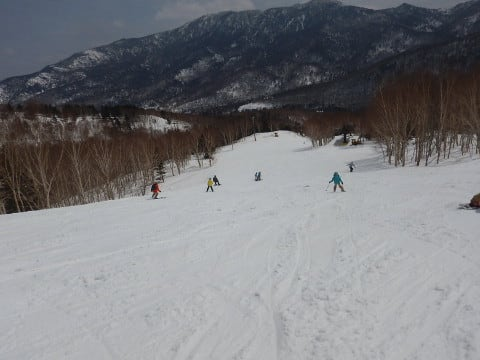

…いや．

普段なら，嬉しい．

普段なら晴れてほしいところだけど．

この気温で日が射すと…

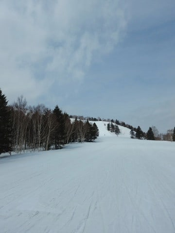

一気に表面の雪が融けて，

板が完全張り付く感じに

なってきちゃうんですけど（激涙）

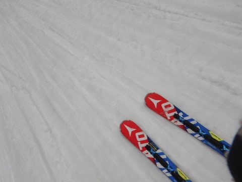

そして，表面が融けてくると．

昨日の黄砂が浮き上がってきて…

滑らない…

板が滑らないよ（涙）

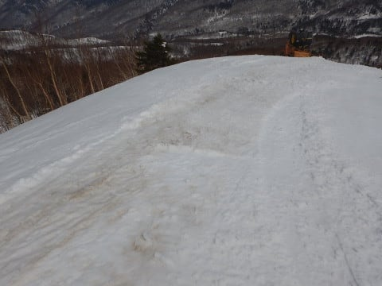

大変残念なことに．

焼額は昼ごろには，ほぼ全域

まったく滑らない雪になって

しまいました…（泣）

だもんで．

焼額の呪いを解いて，

一の瀬方面の様子を覗きに

行ってみましたが…

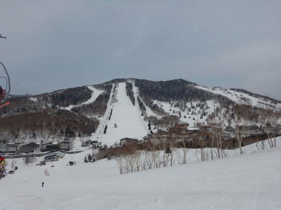

午後には天気も曇り空に戻り．

日差しが弱くなったものの．

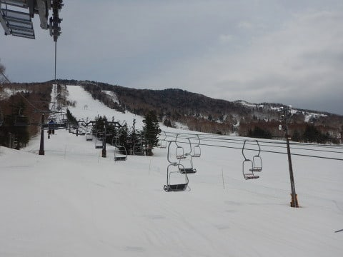

やはり一の瀬方面も，雪は完全に

緩みきっており．

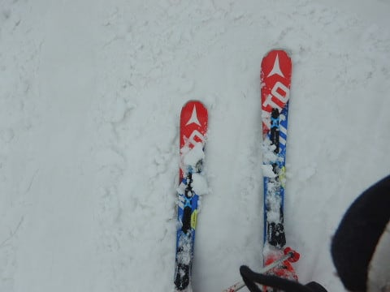

パーフェクターコースの入り口付近

なんかも，黄砂で汚れてるし…

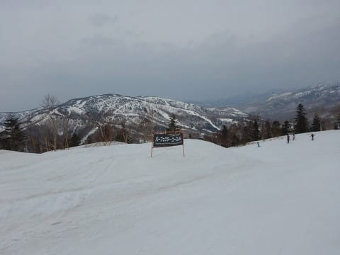

パーフェクターコースは…

うーん．

ダメですね（涙）

やっぱり，あんまり滑らない雪です…

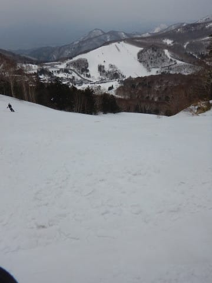

しいて言えば，正面バーンの雪は，

比較的まだ板が滑った方かな～

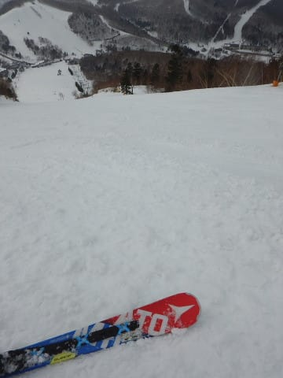

とはいえ，雪は激重＆荒れ荒れ

だったので．

かなり手ごわいバーンで．

…そのせいで，もう誰も滑ってません…

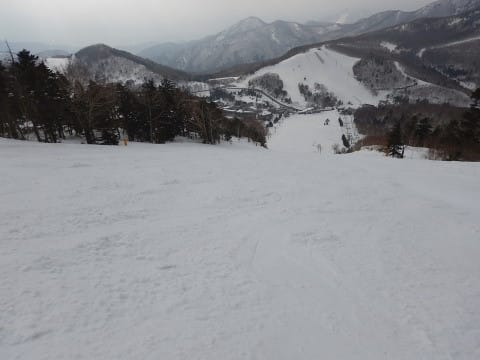

普段は人が多い一の瀬正面バーン．

ここまで誰もいないということが．

どれだけコンディションが悪いか

想像がつこうというもの…

だもんで．

午後3時ごろには，わがホームゲレンデの

焼額に戻りましたが．

…焼額も．

誰も滑ってません．

完全ゴーストタウン化してます．

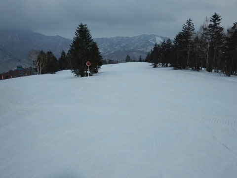

だけども…

うむ？？

午後3時ごろになると．

気温が冷えて，ちょっと板が

滑るようになってきましたよ！？？

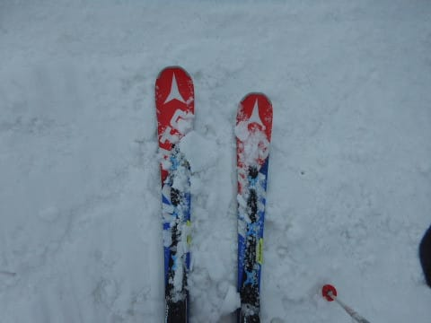

ってなことで．

雪は多少荒れていて．

決して滑りいいコンディションでは

なかったものの．

雪が滑るだけマシ！

滑るようになっただけ，楽しいっ！！

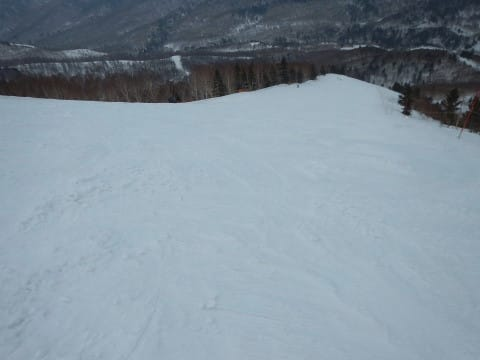

と．

それまでがあまりにもひどすぎただけに．

「板が滑るって素晴らしい…」

と思いながら．

いつも通り，ゴンドラ営業終了まで．

だれもいな荒れ荒れ斜面を

ひたすら滑り続けたのでした…

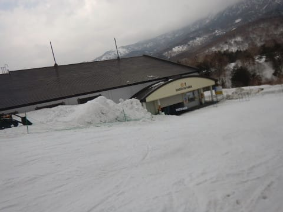

…しかし．

木曜までは最高の雪質だったというのに．

なぜ，週末を狙ったかのように

気温が上がるのか…（泣）

まぁ．

雨になるよりはマシだった

と，自分に言い聞かせた，

Skier_Sだったのでした

ってことで．

本日で，焼額も第2ゴンドラの営業が終了です．

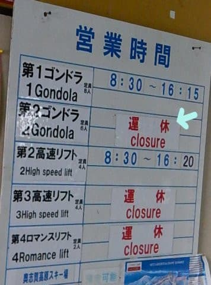

次の週末からは，第1ゴンドラと第2高速のみの

営業となります．

まぁ，第1ゴンドラが動けば，ほぼ全コース

滑れるので，第2ゴンドラが止まる影響は

少ないのですが．

あぁ…

春ですねぇ…（涙）

## 💬 コメント一覧

### 💬 コメント by (地元民)
**タイトル**: Unknown
**投稿日**: 2019-04-09 22:09:52

今朝は標高500mくらいから上は積雪したみたいです。里はみぞれ。里山の中腹から上は白かった。

で、今夜から明日の夜にかけて、大雪の天気予報です・・・・。どうなってんでしょうか、今年の天気・・・。

桜の開花も最初の予想より一週間遅れそうです。まだ未開。週末、かなりゲレンデコンディションよさそうですね。４月半ばとしては、あり得ないくらいに。

### 💬 コメント by (Goku)
**タイトル**: Unknown
**投稿日**: 2019-04-09 22:40:39

どんな雪でもいいから滑りたい・・・(T_T)

### 💬 コメント by (Skier_S)
**タイトル**: まだ志賀高原は冬が続きます
**投稿日**: 2019-04-10 01:23:27

＞地元民さま

明日は終日降りそうですね…

昼間はスキー場の麓に近いところはみぞれっぽい

かもしれませんが．

夕方から冷えて，まだ雪が降り続けるので．

木曜朝がいいコンディションかも…

とりあえず，土曜まで冷えてくれそうなので．

4月としてはいいコンディションで滑れそうです～！

＞Gokuさま

ご愁傷様です…

早く治して，GW明けのかぐらで復活を！

