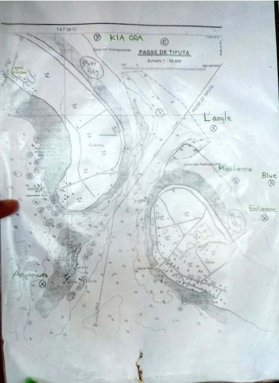
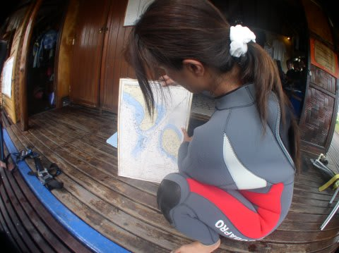
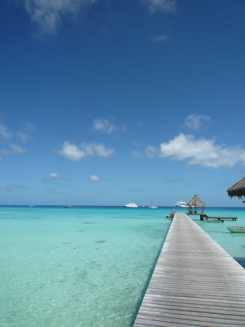
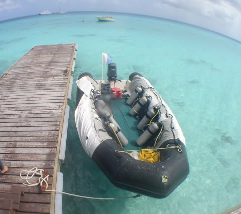
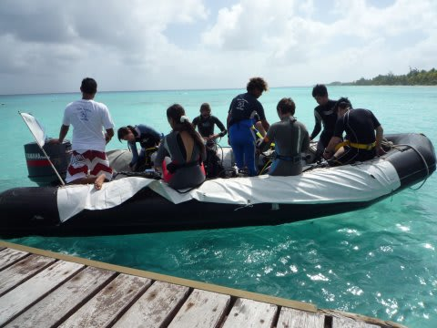
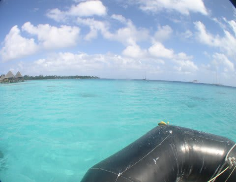
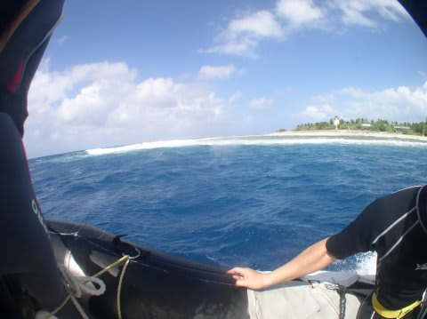

# 2009年　初の海外子連れダイビング旅行記　15　Tipta path

📅 投稿日時: 2012-09-12 00:21:51

🏷️ カテゴリ: [ダイビング日記](ce3a7a8d424d112fce83ee85c81a0e344.md)

あーー．

実は．

今日から．

夏休みPart2をとって．

また，子連れ海外ダイビングへ行ってます…

行く先は，これまで何度か行ったことがある場所ですが．

子連れでは初めてですね～．

予約投稿を活用して，不在中も毎日更新予定．

帰国後レポートします！

＃って，いつこの初子連れ海外レポート終わるんだ？？

-----

で.

ダイビングショップで，まずはブリーフィングを聞くわけですが．

ランギロアのポイントは，「ティプタパス」一箇所です．

ポイントの地図はこれだけ．これ一枚っきり．

このダイブショップのダイビング，すべてがこの地図に書かれているチャネルを

ドリフトするダイビングです．

ただ，パスは1箇所ですが，エントリーポイントが

「エオリエンヌ」「ミリエンヌ」「ル・アングル」「ブルー」などと

複数あり，コース取りも結構あるので，バリエーションは豊富．

サメ狙い，バラクーダ狙い，棚の上の浅瀬狙い…といろいろな楽しみ方ができます．

しかし．

しかし，どのダイビングスタイルも，チャネルぶっ飛びドリフト．

世界で2番目に大きな環礁にぽっこり開いたチャネルですから，

流れはそれはもう．かなりぶっ飛びです．

マクロものなどありません．

…あったとしても，じっくり見て写真を撮っていたら，

おそらく写真を撮り終わったころにはほかの人たちは

視界の彼方に去っていくでしょう…

ブリーフィングでも，

「エントリー後直ちに潜行．水中集合してください」

「ガイドから離れないでください．数mはなれると流れが全く変わります」

「ガイドの周りにまとまってくれればまとまってくれるほど，ガイドが

動ける行動範囲は広がります．バラけると，何かいたとしてもそちらの方向へ

動くことができなくなります」

…などなど，

脅し文句かっ！？って感じの，強烈な海を予感させる言葉が続きます．

んで，ポイントまではゾディアックスタイルのゴムボート．

こーーんなきれいな海の桟橋に止まっている

こんなボートで出発．

このゴムボート．

…Exはラダーが無いので，BCとウェイトを外して

「エイや！」でよじ登らなくてはならないのがちと大変．

水面に漂うと，ゴムボートの縁って頭よりずっと上にあるんですよね…．

ロープにしがみついて，反動をつけてフィンキックで一本釣りされた

カツオよろしくボートに飛び込みます．

今回のチームは2チーム．

こちらのチームは日本人4人+ジュンコさんガイド．

もう1チームは外国人3人+若い女性のモアナさんがガイドです．

いざ出発！

ボートはホテルから3分ほど，ティプタパスへ向かいます．

パスを通って外洋に出るんですが…

昨日まで風が強かったらしく，すごい波．

1m程度ですけど，ゴムボートなので

いい感じに翻弄されます…

10分ほどかけてチャネルを抜けて，チャネルから100mほどはなれた

ところでエントリー！

いざ，ランギロアの海へ…

（続く）
