# 今年はGWまで雪はもつのか？…ここ3シーズンの同じ時期と積雪を比較してみる

📅 投稿日時: 2021-04-20 01:58:47

🏷️ カテゴリ: [日記](cc4b5682fb7b8b144980957a978653fb0.md)

えー．

何と本日．

一体いつ以来だろう…

という．

志賀高原に誰も特派員がいない

って状況になったわけで．

（厳密には1名滑っていますが，スマホ死亡で写真が撮れない）

残念ながら本日，志賀高原特派員レポートは

無しです…（涙）

明日，明後日もたぶん特派員レポートは無く．

特派員の次の復活は木曜日の模様です…

ってな寂しい状況ですが．

毎週末雨が降るダメダメ3月と，

連日20度を超える高温に襲われた

最悪4月上旬が続いた今シーズン．

ものすごい勢いで雪が解けて．

高天ヶ原の中央バーンはもうそろそろ

土が見え始めていて…

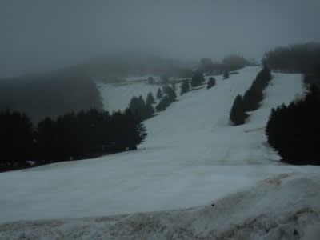

焼額も，コースはまだ真っ白

ながら，ところどころ雪が薄く．

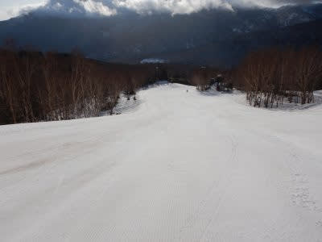

そして，コース脇は土が見えるように

なってきたわけで．

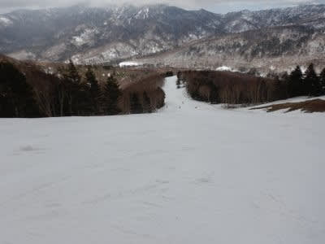

…これは，GWまで雪がもつのか？？？

と，大変心配になるわけですが．

気になったので，過去数年の

同じ時期と積雪量を比べてみると…

去年，2020年は．

コロナで4月19日に営業終了となったの

ですが．

営業最終日まで，雪はたっぷりあって…

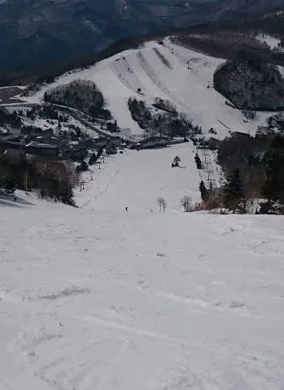

高天ヶ原も，モーグルバーン上部も

全然土が出てくる気配はなく．

それどころか，サンバレーまで

真っ白だったんですね…！！

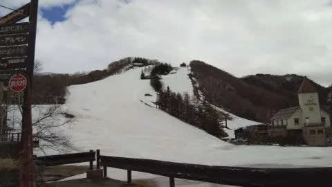

うーん．

2020年は，GWまで問題なく営業

出来そうな積雪だったのに…

GWが営業できなかったのが，惜しい！！

そして，2019年は．

この年は4月21日でも，

ダイヤモンドもまだ真っ白！

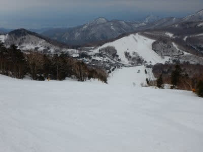

焼額も問題なく雪がいっぱいありますね～．

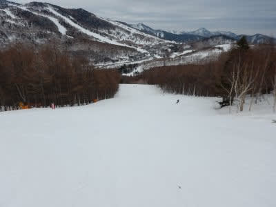

この年は，GW最終日の頃に

唐松コースに穴が開いたものの．

GWまでオープン予定のコースは，

全コース問題なく滑れた，

まぁまぁ恵まれた年でした…

で，2018年は．

この年は雪が少なくて．

4月21日に，焼額のサウスコースは

穴があきはじめ…

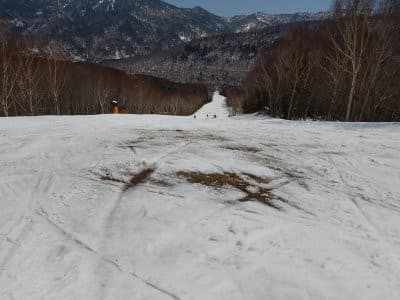

高天ヶ原も，モーグルバーン，中央バーン

ともに土が出ていて．

かなりダメな感じ…

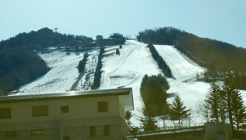

結局この年は，GW最後まで雪がもたず，

GW途中でスキー場が次々終わっていく，

寂しい年だったんですよね…

そして，2017年は．

この年は，焼額は春営業をやらず，4月第1週で

終わったんですが．

むちゃくちゃ雪が多く，4月20日前後でも

雪はまだ全面にたっぷり！

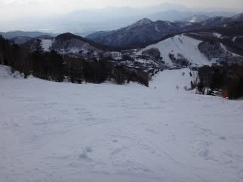

この年は，GW最後まで一の瀬も

奥志賀も，完全に全面滑走可の

恵まれた年でした…

で．2016年は．

記録的小雪の年…

4月16日の段階で，一の瀬正面バーンもかなり

穴が開いてしまって．

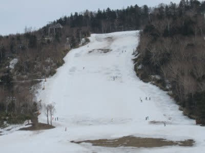

ダイヤモンドは全く雪が

無いですね…（涙）

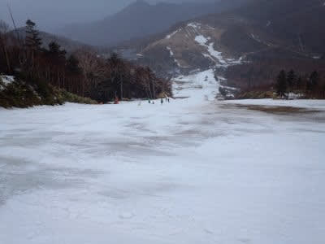

この年はGWを待たずして

ほぼ全スキー場が営業を終えた，

悲しい年でした…

6年前，2015年は．

この年は，まぁまぁ雪は多めかな．

4月18日で，まだまだダイヤも

ファミリーも雪がいっぱい

残ってますね…

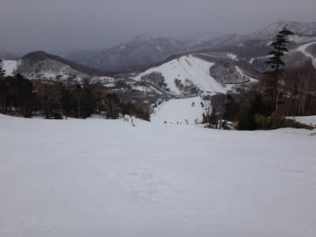

でも，確か．

GW後半の気温が高くて一気に

雪が解け．

GW後半まで営業予定のコースは，

一応全面滑れたものの．

最後はコース上にかなり穴が開いた

年だったかな…

ってことで．

むちゃくちゃ雪が少なく感じる今年でも．

まだ2018年や2016年よりはマシなんだな…

ということを心の頼りに．

なんとかGWまで雪が残ってくれるといいな…

と願う，Skier_Sだったのでした…

## 💬 コメント一覧

### 💬 コメント by (西舘)
**タイトル**: Unknown
**投稿日**: 2021-04-20 08:52:17

素晴らしい…素晴らしいよエスさん

ちょうど過去の4月中旬頃の記事を探そうと思ってたところでした。

痒いところに手が届くエスさん、流石だねぇ。

### 💬 コメント by (naoちゃんねる)
**タイトル**: Unknown
**投稿日**: 2021-04-20 15:24:33

過去の状況、とても懐かしいです！

思えば始めてＳさんとお会いした2018シーズン。熊の湯なんかオープン2週目から馬の背が滑れる程調子良く、劇冷えのシーズンでしたが、3月4月が高温で撃沈しましたよね…

今シーズンはそれと似てるかなと思ってましたが、それよりかは少しマシな感じなのが良くわかりました。

いずれにせよ厳しい状況ですねぇ(;_;)

今日なんかもポカポカで悲しい程過ごしやすい気候です(大泣)

### 💬 コメント by (かず)
**タイトル**: Unknown
**投稿日**: 2021-04-20 19:04:30

今週末土日（月）で最後の予定です Sさんのホームじゃないほうですけど！笑

### 💬 コメント by (Skier_S)
**タイトル**: 意外とこの7年で2回は今年より雪が少ない
**投稿日**: 2021-04-21 01:25:00

＞西舘さま

例年よりどのくらい雪が少ないんだろう？？

と気になって，過去の写真をひっくり返していたので．

そのまま記事にしちゃいました…

＞naoちゃんねるさま

おっと．初めてお会いしたのが2018シーズンでしたっけ？

いつも同じことを言ってしまいますが，もっと長いお付き合いだと

感じちゃいますね．

2018シーズンはオープンは良かったんですけどね～．

今シーズンと同じ，ダメダメ3月＆4月でしたよね．

ただ，今年の4月は，第1週が終わってからは平年並みくらいで

推移してくれているおかげで，意外とマシなんだなぁ…と気付きました．

これからあまり温まりすぎ無いように願うところですが，

まさかのこの時期の台風が近づいて，気温が上がるかも…

＞かずさま

あら…

シーズン終了ですか．

お疲れ様です．

今シーズンの後半は，全くパウダーに当たりませんでしたね…

今年，私は太板を1回しか履かずに終わりそうです（泣）

### 💬 コメント by (ikkun)
**タイトル**: Unknown
**投稿日**: 2021-04-21 10:22:42

おはようございます❗さすがだなあ😆うっすらですよね と云うのも小雪でも滑れる事ほとんどなので(笑) ゲレンデの雪も消えつつあり 山桜もその辺迄開花して参りました  さてまた非常事態宣言??が？ならばゴールデンウィークはまたまた??なんか仕方ないでは色々言えない？事もありますね  志賀高原行って見ようかな？(笑)

### 💬 コメント by (Skier_S)
**タイトル**: ＞ikkunさま
**投稿日**: 2021-04-23 01:29:55

非常事態宣言，出ないでほしいです…

K奈川県は対象じゃなさそうですが．

うーん．

なかなか出かけにくい雰囲気になってきましたね…

