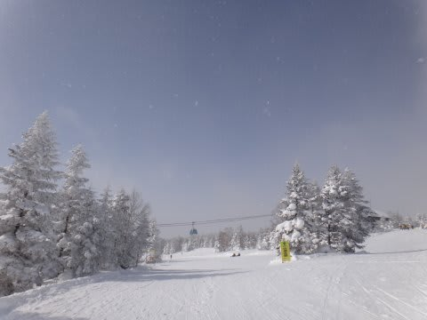
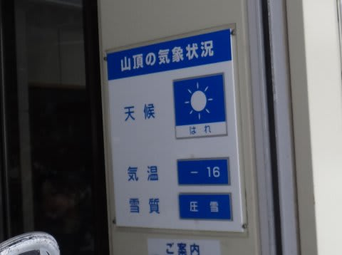
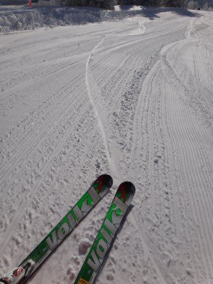
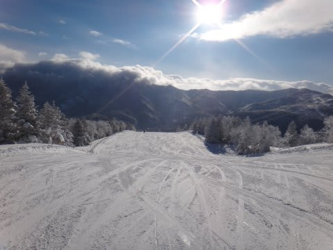
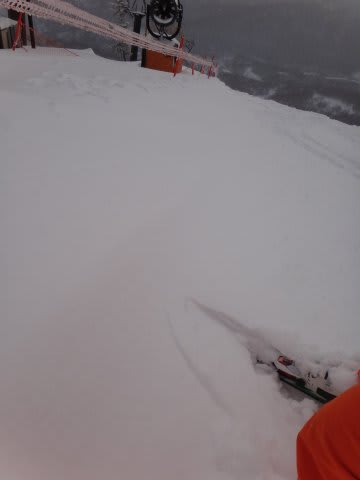
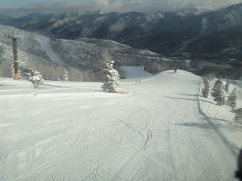
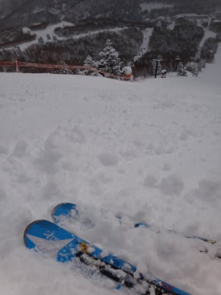
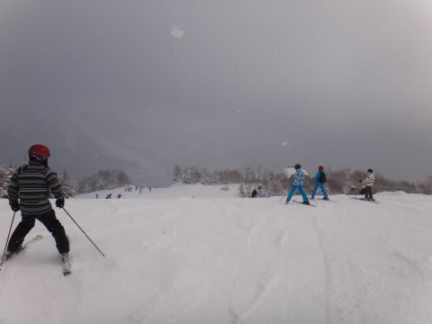

# 1月19日の焼額は…午前中は最高！

📅 投稿日時: 2013-01-19 17:33:15

あー．

なんだか．

天気予想に

「降ったり止んだり，午後は時折日も差す」

って書きましたが．

実態は，「降ったり止んだり，午前は時折日も差す」

…って感じで．

ちょっと微妙なはずし方をした天気予想でした．

って感じで．

午前中は時折日もさし…

気温もマイナス10度以下！

そして…

昨日積もった雪が圧雪された，やわらかいバーン！！

やわらかいふわふわシマシマ．

天気で視界もよく，快適！

オリンピックコースは，20cm弱の新雪．

ブーツが隠れるほどかなぁ．

ようやく下地のアイスバーンが隠れてくれたので，滑りよくなりました．

3連休よりは人も少なく．

ゴンドラ待ちはほぼ0．

コースも比較的すいてて，よかったですよ～！

んでも．

午後はやっぱり，

まぁ，この日も，朝のうちはきれいなやわらかい雪の圧雪が滑れるでしょう．

そして，午後に向かってぼこぼこになっていくパターンだなぁ…

って予想通り．

午後にはぼこぼこになって行きましたけど…

まぁ，ぼこぼこになってもやわらかく，下地のアイスバーンが

出てくるわけでもなく．

比較的すべりやすく．

一日満喫できましたね～．

…でも，午後は日も翳って，ちょっと寒かったかな．

これから夕食食べて，ナイター行ってきます～

## 💬 コメント一覧

### 💬 コメント by (りり)
**タイトル**: おはようございます
**投稿日**: 2013-01-20 09:03:04

今日は第一ゴンドラ動いてませんね

ホテルでご飯を食べながら見てましたU+1F4A6

朝から雪が降ってますけど

気をつけて滑ってくださいね(^-^)

### 💬 コメント by (ゆうこ)
**タイトル**: お疲れ様です。
**投稿日**: 2013-01-20 19:36:15

今、帰りの新幹線です。

今週末もSkier_Sさんは、わかりませんでした。残念です。

また来週も頑張って探してみます。

### 💬 コメント by (Skier_S)
**タイトル**: おつかれさまです
**投稿日**: 2013-01-20 23:45:07

＞りりさま

いやー．

故障で第1ゴンドラが朝から動かず，

第2ゴンドラが混んで途方にくれました…

11時ごろから動いたんですけどね！

日曜は滑らなかったんですか？？

＞ゆうこさま

あれ？

今回も新幹線で帰宅ですか？

今日は焼額で滑ってたんですか…？

私は，第1ゴンドラが止まって第2ゴンドラが

むちゃくちゃ混んだので，昼まで奥志賀で

滑ってました．

午後は焼額に復活したんですけどね～．

また来週，探してみてください(笑）．

### 💬 コメント by (ゆうこ)
**タイトル**: 引っ越し
**投稿日**: 2013-01-21 09:09:05

週末は引っ越しをしていたので、車は家に置いて行きました。

引っ越しの立会いは主人と弟に頼んで、私は志賀高原満喫！

土曜朝出発した家と日曜帰宅した家が違うという！

今週は毎晩部屋の片付けになりそうです。

### 💬 コメント by (Skier_S)
**タイトル**: ゆうこさま
**投稿日**: 2013-01-22 01:01:41

あららら～！！

引越しなのに，スキー行ってたんですかっ！！

好きですね～（笑）．

今週，部屋の片付けがあるのに，また志賀ですか…

すごい…

とりあえず，この週末も焼額出没予定ですので，

またさがしてやってください…

### 💬 コメント by (mari)
**タイトル**: Unknown
**投稿日**: 2013-01-24 10:04:50

ここのブログの読者さんはみなさんスキー中毒患者ばかりでいいですね（笑）

（私もヒトのことは言えませんが…＾＾；）

この土日は我が家も志賀におりました。

といっても、熊の湯から出られませんでしたが。

9か月の赤ちゃん連れて来た友人夫婦と一緒だったので、宿から近くレストランに長居しやすい熊にこもってました。

下の子は熊の第二と第三の間にある馬の背コースをなんとか滑れるまでに上達しました。

ただ、直滑るには斜度がありすぎるため、大人が少し先を滑ってターンする場所を誘導してやらないといけませんが。

まだ急斜面はあんまり楽しそうじゃないので、なかなか焼額には連れていけそうにないです。

ファミリーの迂回コースやタンネの森なら喜んで滑ってくれそうなんですが。

いつの日かSさんにゲレンデでごあいさつすることを夢見て、ぼちぼち頑張ります。

### 💬 コメント by (Skier_S)
**タイトル**: このBlogは…
**投稿日**: 2013-01-24 23:27:52

このブログ，書いてる人間が重度の中毒患者だからでしょうか…

かなり重い中毒症状の方が集まってますね（笑）．

