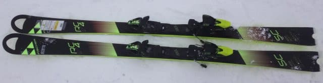
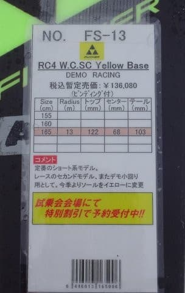
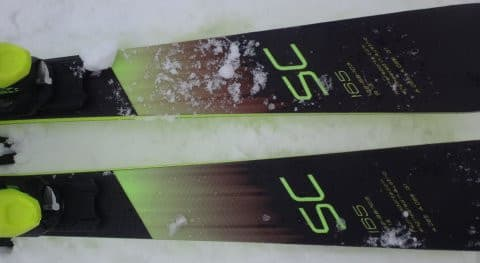

# 2018シーズンモデル，スキー試乗レポート第11回…FISCHER編

📅 投稿日時: 2017-05-26 04:26:13

そろそろ5月も下旬に入り．

スキーのことを気にする人が減ってきたらしく．

このBlogのページビューが着実に減りつつある

今日この頃．

皆様，いかがお過ごしでしょうか．

いやー．

まだまだスキーシーズン真っ盛り

なんですけどね～←普通の人はそうじゃないから

ということで．

まだまだ続くスキーネタ．

今日はデジカメネタでしばし中断していた，

スキー試乗レポート．

本日は，フィッシャー編です．

では，どうぞ～！

----

FISCHER RC4 WC SC Yellow Base 165cm

基礎小回り用．

R=13，最も長い板で165cmという，完璧小回り重視の板．

SL競技用のRC4 WC SLのセカンドモデルという

位置づけでもある，この板ですが．

比較的グリップが強めのカービング指向．

アイスバーンでもそこそこのグリップを示し，

谷回りでトゥピース付近を抑えていくと

トップから切り込んでいくようにすっとたわんで

雪面を捉え．

板全体，トップからテールまでのエッジがしっかり利いて，

きれいに回りはじめ．

そして，しっかり山回りまで板が雪面をとらえ続けます．

谷回り時，トゥピース付近の押さえ具合で

回転弧を制御できるので，乗り手の思った

半径で回っていくことができます．

メタルのばね感があり，最後に反動で板が

すっと抜けていくような，そういう気持ちよい

切り替えができます．

板の重さはVolkl Platinum SDほど軽いわけではないけど…

履いた感じはかなり軽快．

小回りメインのこの板ですが．

グリップさせたまま，カービング小回りチックに

滑れるし，

そこそこの張りがあるので．

小回りベースで中回りから

小さめの大回りまで行けるか…

ただ，がちがちアイスバーンの斜面を，

大回りでガンガンスピードを出すと，ちょっと

板のばたつきが出て，多少板が叩かれる感じを

受けたので．

決してトップスピード大回り用ではなく，

やはり小回り～中回りに特化した板という印象です．

しかし，小回り～中回りをするにはすごく気持ちよく．

すっとたわむのにばね感が強く，たわみ量で

回転弧を制御できて．

最後まできれいに弧を描ける…という，

私が好きな傾向の板でした．
