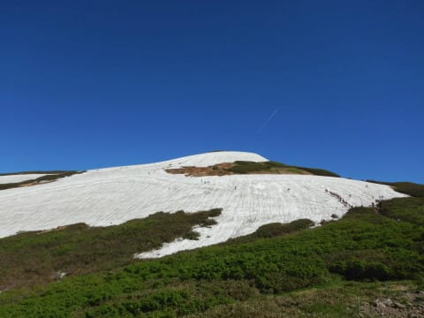
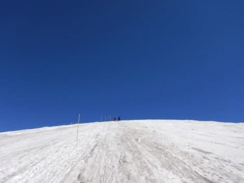
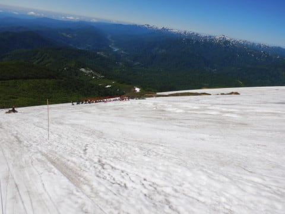
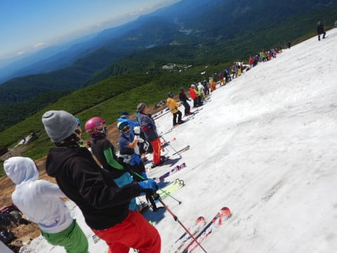
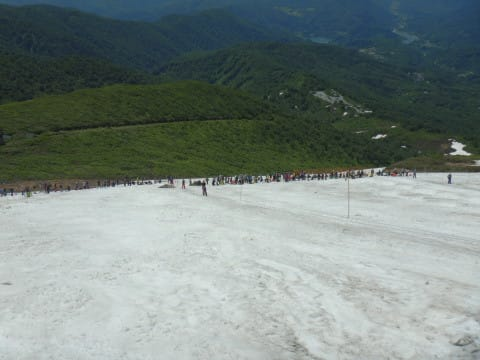
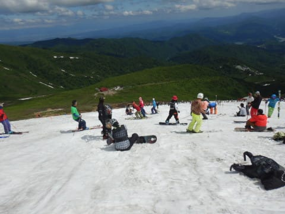
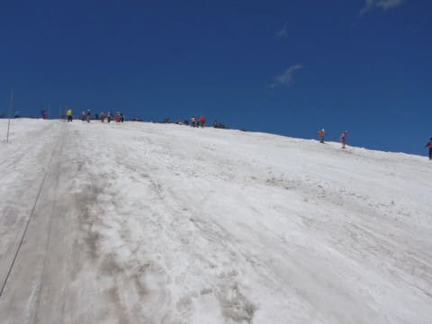
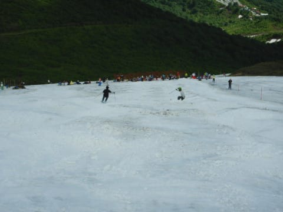
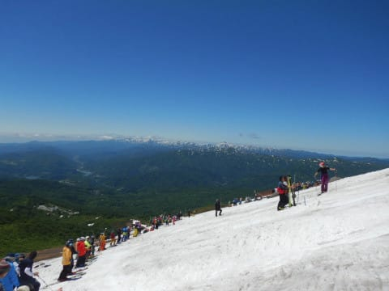
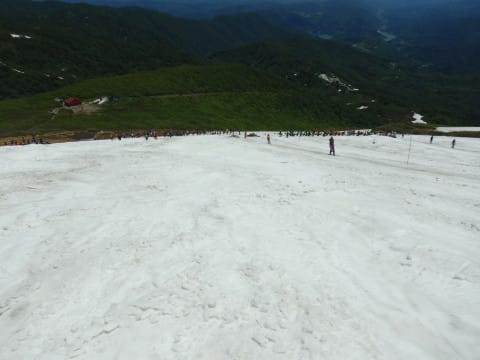

# 2020/6/21(日)の月山スキー場の状況，速報モード！…って，日帰りじゃなかったの？？晴天なれど混雑の一日

📅 投稿日時: 2020-06-22 01:28:42

えー．

昨日，[6月20日土曜の月山レポート](ee21b6cb4e170aaa5f044235f9c2f29d3.md)をお送りしましたが．

…もうどうせ月山はリフトが滑れなくなり，

リフト上の短いTバーしか滑れないので，

2日間滑るほどでもないよな…

まぁ，土曜日帰りで行っておこう…

と，思っていたわけですが．

実に2か月半ぶりのスキー，わずか100m程度の

Tバーでも楽しくて．

…さらに，睡眠1時間で家から出てきたので

スキー後にすごく眠く．

月山のすぐ麓，「道の駅にしかわ」で温泉に

入っていると，もう夜になってしまってい．

「今日帰るのはあきらめた」

と．

そのまま寝ることにして．

（なぜか車中泊セット搭載済み）←確信犯なのでは？？

…そして，どうせ朝まで寝ちゃうんなら，

日曜も，朝ちょっとだけ滑ってから

帰ればいいよね…！！

ってな感じで．

午前中ちょっと滑るだけのつもりが，

大方の予想通り，

Tバーの営業ラストまで滑ってしまいました．

…帰宅したら，日付変更線を過ぎてました…

明日朝起きて仕事に行けるかな…

やっぱり月山は遠い…

ってなことで．

本日は帰宅も遅いので，本日の月山レポート，

定番の速報モードにて！

えー．

まず，本日の朝は．

昨日と違い，すっきり晴天でスタート！！

あさイチは人も少なく，天気も良く．

昨日と違って視界も良くて最高！！

…土曜で帰らなくて良かった…っ！！

朝のうちは，Tバーの列も短く．

バーンのコブもそんなに深くなかったけど…

午前9時半を過ぎたころから激烈に

混み始め．

10時ごろには…

Tバー待ち時間15分！

これだけの長さのコース，滑るのに20秒．

そして，Tバー待ちは9時半から2時頃まで，

7分～15分という感じでした（涙）

しかし．

人はやっぱり多かったかな～．

とはいえ，コースはちゃんと順番待ちして

クリアなコースを滑れるし．

コブラインも何本もあって，

午後はコブも深くなってましたね～．

で．

今日は天気は良くて，長袖TシャツでOKな

くらいの感じではあったけど．

この時期にありがちな「暑くてたまらん！」

というほどでなく，涼しい風が吹いて

気候はちょうどいい感じでしたね～！

ってな感じで．

今シーズンはもうスキーを諦めてたけど．

この時期にこれだけの雪で滑れれば，

文句はない！

ということで．

明日また詳細レポートやります～！

## 💬 コメント一覧

### 💬 コメント by (Goku)
**タイトル**: Unknown
**投稿日**: 2020-06-22 18:45:39

リフト待ち15分で滑るの20秒って ！

日本にこんなにもスキー○○がいるとは驚きです(笑)

でもこれで心置きなくシーズン終了ですね！

ですよね・・・

### 💬 コメント by (yumi)
**タイトル**: Unknown
**投稿日**: 2020-06-23 00:35:05

Ｓさぁ～ん🎉🎉🎉

お帰りなさぁ～い✨🎵✨

ワタシ、はじめから お泊まりするって 思ってましたぁ～😅

儀式が出来て 良かったですね☺️

ワタシは飛べる✈️のでしょうか・・・😢

### 💬 コメント by (Skier_S)
**タイトル**: 詳細レポートは明日…
**投稿日**: 2020-06-23 02:17:19

＞Gokuさま

月山も，リフトが滑れればもう少しマシなんですが…

Tバーしか滑れないと，もう滑れるのは15秒です(笑)

でも，これで何とかシーズン終了できました～！

＞yumiさま

私も土曜に月山から下山するまで，日帰りで帰宅する気

満々だったのに，yumiさんのほうが私より私に詳しいかも…(笑)

とりあえず，こちらは無事シーズン終了です．

yumiさんが無事飛べるよう祈ってます．．．

