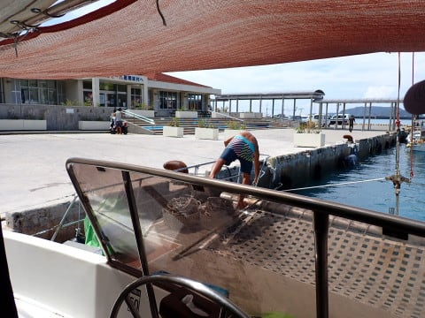
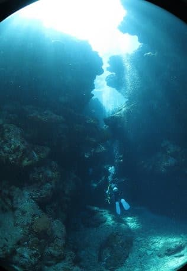
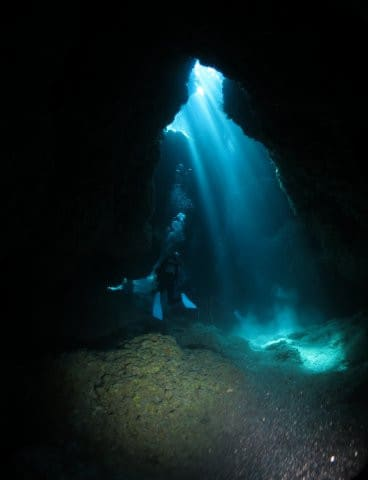

# 2023年8月，座間味で親子3世代ダイビング！その11…ダイビング2日目の2本目は，充実の地形ダイブ！

📅 投稿日時: 2023-09-25 05:17:17

この週末も，山に行きたかったけど…

とてもじゃない大量の宿題に，土日とも

泣きながら夜中ずっと仕事してました…

いや．

土曜日は死ぬほど疲れていたのか，

午後3時ごろまで11時間ほど寝てしまい，

その後日曜昼まで夜通し仕事して，

また4時間ほど昼寝したので．

完全徹夜ってわけではないのですが…

日曜夜から仕事を再開し，月曜朝5時現在，

まだ仕事してます…（涙）

そして．

この土日はいろいろ仕事の来年度計画やら

プランやらを考えていたわけですが…

どうも来年は今年より忙しくなりそう

という恐ろしい状況に気づいてしまい．

これ以上忙しくなったら死ぬんじゃないか？？

と，心配する今日この頃…

あぁ…今シーズンの滑走日数が昨シーズンより

減らなくて済むように祈るばかり…←それより死なない心配した方がいいかも

ってなことで，本題へ．

今日も[昨日の続き](e24a7648b377bc9ee6c6b09be429ba9ec.md)，ダイビング日記です～！

ーーー

という感じで，

大満足だった1本目を終えたら…

ボートは一旦港へ戻ります．

ちょうど，港に入るときに高速船の

クイーン座間味と行き違いましたが…

どうやら，このクイーン座間味で到着

したお客さんをピックアップに，いったん

港に戻るようです…

ってなことで．

朝10時ごろにいったん港で新しい

お客さんをピックアップしたら…

すぐに2本目のポイントに向けて，出港！

今日も海況は穏やかで，絶好の海日和…

そして．

8月の沖縄は酷暑の東京より涼しい！！！

船が進んでいる間，最高の景色を見ながら，

海を渡る気持ちいい風を感じられる，

最高の癒しタイム…

どうやら今日の2本目は，いつもより

ちょっと遠出をしてますね…

ポイントに到着したのは，11時ちょっと前．

やってきたのは，座間味島の西側を

回って，北西側にあたる部分．

ここでロープを取りました…

で．

2本目のブリーフィングによると．

ここは地形ポイントらしく，

光が差す洞窟が楽しめるようです…！

ってなことで．

早速準備して…

いざ，エントリー！！

そして…

娘はフィートファーストというより．

最初はヒップファーストで潜行して

いってました（笑）

ボート下で全員集合しますが…

ボート下ですでに地形が入り組んでいて．

溝の底は結構深めで．

いかにも地形ポイントっぽい…！！

そして…

外洋側だからか，透明度が高いよ！！！

はるか遠くまで見渡せます…！

これは気持ちいい！！

で．

地形ポイントに行くのかと思ったら…

なんだかみんな集まってますね．

ガイドさんが何か示してますが…

このあたりツユベラをはじめとする，

各種ベラやらオビテンスモドキ，

カガミチョウチョウウオの幼魚など．

いろんな幼魚がごちゃっといますね…

右下のオビテンスモドキっぽい奴，

人差し指の爪より小さいサイズです…

ダイバーなら，この真ん中に写っているのが

ゴミじゃなく，魚だってわかるはず…（笑）

ってなことで．

イントロが終わったら，いざ本番の地形

ポイントへ向かいます．

だんだん岩の両脇が迫ってくるところを

進むと…

その先は，光が見事に差し込む洞窟です！

幻想的に光が差し込む洞窟の中を

進んでいきますが…

いや．

差し込む光がきれい！！！

光の帯がキラキラ動いて，

実際に見るともっときれいなんですが…

静止画だとこのきれいさが伝わらない！

いや～．

でも，このきれいさは伝わってほしい…

娘は，本格的な洞窟のポイントは

初めてじゃないのかな？？

ダイビングライトを持たせてないん

だけど…

でも，洞窟ダイビングはきれいで

楽しかったようです．

そして…

これもおばあちゃんと孫で記念撮影！

いや…我が親ながら，元気なことよ…

ってなことで．

時折狭いところを通ったりしながら…

洞窟探検は続きますが．

なかなか本格的な地形ポイントで．

これも1本目に続いて，満足度が

高いポイントですね…！！

ってなことで，洞窟探検終了！

明るい外に出てきました…

洞窟の外に出ると…

いや，やっぱりここ，透明度高いわ！！

娘もこのダイビングはかなり満足度が

高かったようですが…

いや．

しかし．

あんな狭いところをくぐったり，

ライト無しで暗いところを潜ったり…

全然怖くないみたいですね．

ってなことで．

ボートの下へ戻ってきました．

最後はボートの周りのサンゴを堪能

したら…

ガイドさんから浮上の指示がでて…

なかなか楽しめた2本目も終わりです．

そして，エグジット！

水面に上がると．

慶良間の気持ちいい日差しが出迎えて

くれました…

（[続く](e1a4980db6a4197279eb2ff3c4bd627ce.md)）
