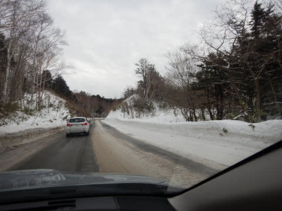
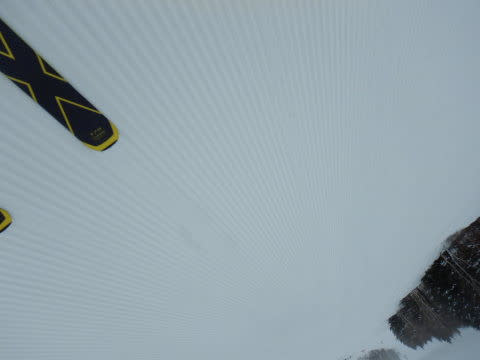
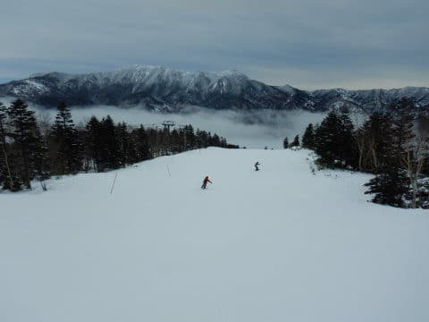
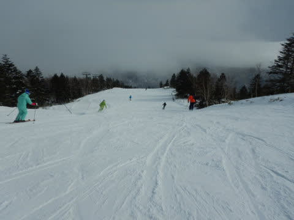

# 2020/1/18(土)の志賀高原スキー場は…雪質はトップシーズン！曇り空ながら人も少なめ，終日ゲレンデは荒れず良かったよ．

📅 投稿日時: 2020-01-18 22:39:24

というわけで．

今週末も飽きもせずに志賀高原へ

やってきているわけですが．

本日の志賀高原への登り路．

この時期，路面にアスファルトが

出ているとは…

雪，少ないですね(涙)

そして，

いつもの焼額ゴンドラ乗り場に

やってきますが…

時計を見てわかるように．

本日のゴンドラ乗り場到着，8:32（泣）

8:30のゴンドラ営業開始に，

2分遅れたっ！(涙)

朝一番に乗り遅れててしまい，

泣きながらゴンドラに飛び乗り，

山頂に向かいますが…

みんなに追いつくため，急ぐんだ！

第1ゴンドラ！！←いや，ゴンドラ速くなっても，前の人もみんな一緒に速くなるから

ってなことで．

山頂に着くと…

本日の天気は，水曜の予想が

ぴったり当たった曇り空．

そして，山頂の気温は-8℃と．

予想の-8～-9℃がぴったり正解！

そして，雪は…

ふははははは！！

シマシマっ！！

それも，超冷え冷えのトップシーズンの

柔らか雪がしっかり押し固められて，

エッジがぐいぐい食い込んで最高に

傾きまくれる，ザ・焼額グレードの

ハイスピード快楽フラットシマシマバーン！！

これまで悩まされたコロコロもなく．

間違いなく，今シーズン一番の雪質！

もう，最高冷え冷えの勘違い雪！

雪不足の気配がみじんも見られない，

限界官能バーン！！

ピカピカのシマシマを切り刻んでいく，

この快感…

いや…

この世にこれ以上の快楽があるだろうか…（恍惚）

天気は残念ながら曇り空だけど．

下に雲海が見える中，

時折うっすら日も射して．

朝のうちは，完全真っ暗曇り空じゃなく，

凸凹がそこそこ見えるいいコンディション！

シマシマが崩れた後も，

冷え冷えのトップシーズンの雪で．

エッジが気持ちよく食いつくのに，

軽めの最高級のバーン状態で．

白樺コースにブッシュ＆浮石があった以外．

コース全面，ブッシュはほぼ完全に

隠れてくれて．

今シーズン，どうなることかと思ったけど．

焼額は，ちゃんといいコンディションで

全面滑れるようになってくれて，

良かった…（感動）

ただ．

午前10時ごろになると，ちょいと

コース上の人口密度が上がって

来ちゃったけど…

それでも，先週は超混雑だった

サウスコースも，ピークでせいぜい

このくらい．

第1ゴンドラは，ピークに一瞬ゲートの

外まで人が並んだけど…

こんなに待ったのは1回のみ．

あとはゲートの外まで人が

あふれることは一度もなく．

正月休み，3連休と続いた次の

この週末は，さすがにお出かけ

する人が少なかったのか…

コース上の人も少な目で．

そのおかげで，午後になっても

コースはそれほど荒れず．

結構フラットなまま！

普通はこれだけ雪質がいいと，

柔らかい雪が掘れちゃって

荒れ荒れになるものですが．

今日は，いい雪質なのに

午後までフラットなままで…

恵まれてる…！！！

オリンピックコースは，ちょいと

硬めの雪質ながら，カリカリアイスバーンでは

なく，エッジがちゃんと引っかかる感じの

雪が，しっかり固く締まった感じで．

いつもコブコブになるオリンピックコースも，

そのおかげで凸凹になることなく，

午後まで大回りで飛ばせました！！

天気は，基本的に曇り空の一日で．

ごく一瞬，コースの僅か一部が

ガスったりもしましたが．

雲は薄めで，時折明るくなったりと，

凸凹も比較的見やすく．

いい感じでしたね…

さらに．

今日は昼間も気温は-5℃程度までしか

上がらず．

昼を過ぎても，冷え冷え最高

雪質のまま…！

午後になると，ただでさえ少なめの，

コース上の人がさらに減っていき…

雪は冷え冷えフラットなままなので．

うはははは！

もう，滑りたい放題！

好きなライン取り放題！

いや…

楽し～っ！！

ってな感じで．

今シーズン最高の雪質の一日に，

寒気歓喜の雄叫びを上げながら．

今日もしっかり，営業終了の16:15まで

滑り続けたのでした…

いやー．

良かった．

今日は，良かった…

今晩，残念ながら雪の積み増しはなさそうですが．

これから明日にかけても冷え冷えなので．

このままでも，明日も最高のコンディションを

キープしてくれるんじゃないかな？？？

## 💬 コメント一覧

### 💬 コメント by (レインボー１号red)
**タイトル**: Unknown
**投稿日**: 2020-01-19 07:45:45

早起きして1ゴンを７時20分に通過。すると、緑のヘルメットに青いウエアの二人組がすでに。某H多夫妻だ。こんな人と今までファーストを張り合ってきた自分が、なんと小さく感じたことか。

ただの落下運動に魂を奪われてしまった人間が、そこにいた。

### 💬 コメント by (カンタロス)
**タイトル**: Unknown
**投稿日**: 2020-01-19 08:55:43

志賀高原、雪に恵まれてきたようでなによりですね！

20モデルのs9に、ついて元アトミックで選手を、やっていた方からの情報を。

トップシートのメタルが厚くなったので、かなりのレベルのレーサーが使用する感じになったそうです。

通常のゲレンデ滑走では不必要なスペック。

競技やらないのなら、絶対いらない。

との事でした。

昨年モデルの赤はもはや無さそうなので、今年モデルを型落ちで買うなら繰ろが良さそうですね。

たた、灰色が板に入ったことにより、個人的にカッコ悪くなったなぁ、と感じます(笑)

### 💬 コメント by (まーさん)
**タイトル**: Unknown
**投稿日**: 2020-01-19 15:54:06

突然の仕事のシフト変更で先週に続き、土日月の3連休。速攻で宿を予約して金曜夜から車中泊で志賀高原。土曜日は奥志賀、焼額、一の瀬でスキー三昧、日曜は高天ヶ原、東館、寺小屋等で霧に苦しめられながらも遊んでいましたが、こんなに空いていてスキー場大丈夫なのかな…リフト待ちがないのは嬉しいけど、このままではどんどん縮小されていずれは…皆さんスキー場に行きましょう。

### 💬 コメント by (m&t)
**タイトル**: Unknown
**投稿日**: 2020-01-19 22:57:47

m&tです。

今日も終礼でのあいさつだけになってしまいました。

本日も朝イチ奥志賀スタートで(最前列にレインボーお二人が)ダウンヒルとエキスパを堪能し、ヤケビは状況が良かったオリンピックを中心にジャイアントまで行って来ました。

今年は気温が高いのでジャイアント、ファミリー上部、エキスパ、オリンピックでエッジがよくかみますね!普段だと落とされてしまいます。

ではまた2月にごあいさつします。

### 💬 コメント by (ほっぽ)
**タイトル**: ラスゴンにて
**投稿日**: 2020-01-19 23:34:12

Ｓさん

今日はラスゴンで合流できましたね。

お話させてもらってありがとうございました。

今日の滑走日記をアップしておきました。

奥志賀スタートで西館山まで滑って戻ってきました。

また来週末もお会いできたらうれしいです。

http://www2.tokai.or.jp/nana_hoppo/

