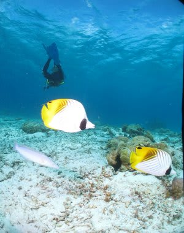
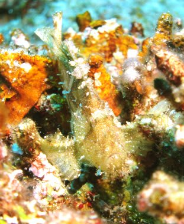
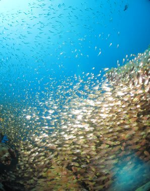
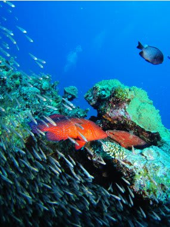
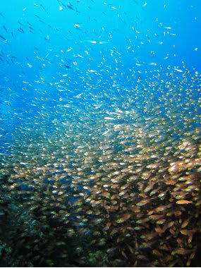
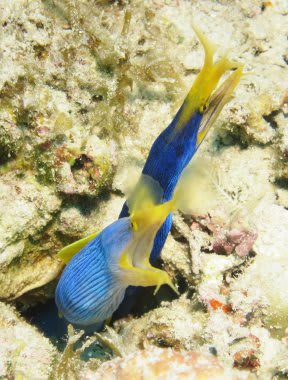
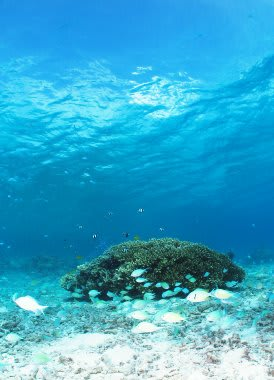
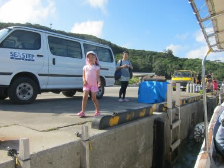
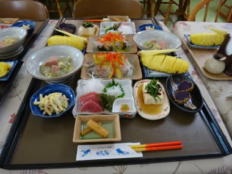

# 2012年7月　子連れ座間味ダイビング旅行記6　初日の2本目

📅 投稿日時: 2012-08-02 00:30:23

っつーことで．

本日の2本目ですが．

娘に見送られてから，ボートで走ること5分．

到着したのは，「アダン下」というポイント．

エントリーすると…

いかにも慶良間っぽい感じの，

明るい海とサンゴがきれいな海ですな．

ハダカハオコゼや…

キンメモドキの群れ．

キンメモドキの群れに囲まれるアザハタ…

アザハタって，キンメモドキを食べちゃうので．

ご飯に囲まれて暮らしてるようなもんですな．

なのに，キンメモドキはなぜアザハタがいる根に住み続けるかというと．

アザハタは，自分のご飯を守るため(？）に，

キンメモドキを狙う他の魚がやってくると，追い払ってくれるらしく．

それで，ある程度の共存共栄関係になっているらしいんですが．

ホントかな？

さらには同じ穴に住み着いている2匹のハナヒゲウツボ．

ひとつ穴に2匹って…

狭くないんですか～？？

あとは，きれいなサンゴを見つつExit.

いやー．慶良間らしい，いい海だったことよ．

港に戻ると，娘がお出迎えに．

「ただいま～」

今日はダイビングスタートが遅かったので，ダイビング終了は午後5時近く．

宿に帰って，シャワーを浴びて，器材を干してばたばたしていると，

あっという間に夕食タイム．

ペンション星砂さんは，食事の量が結構多く，おいしいので満足…

沖縄料理が好きに育った娘は，海ぶどうをぱくぱく食べてゴキゲン．

いやー．

ホントに子連れ旅行が楽になってきたなぁ…

で．

食後は，宿の本棚に大量にあった絵本を

「読んでー」

と持ってきた娘．

絵本を読んでいると，わずか数ページ読んだだけですやすや…

まー，今日は移動もあったし．

泳いで公園で遊んで，疲れてたんだろうなぁ．

私も，娘の後を追うようにバタンキュー(死語の世界）でした．
