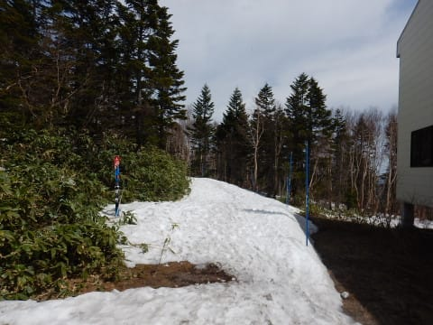

# 4月30日（月）GW前半3連休ラストの奥志賀高原のゲレンデ状況は？…うーん．やばいよ．あと2-3日でダメかも…

📅 投稿日時: 2018-04-30 20:59:50

ということで．

GW前半の3連休も終わったわけですが…

…悲惨な3連休でした…（涙）

ここまで雪がなくなるとは…

昨日まで頑張って営業していた焼額ですが．

なんということか．

本日はついにスキー場の営業をあきらめて．

ゴンドラのみ観光用に営業

という事態に陥りました…

残念だ…今シーズン，あまりにも残念すぎる…

他のスキー場ではありえない，プリンス系列

ならでは…と感動していた人海戦術での雪付けを

昨日の午後まで続けていたというのに．

大自然の驚異の前に，人力は無力だったようです（涙）

ってなわけで．

本日は奥志賀スタート！

…早朝に起きる元気がなく，

通常営業から参戦だったのはナイショです．

…今日の通常営業スタート時の気温は

すでに+10℃近く（涙）

そして．

今日も容赦のない日差しが降り注ぎます…

…雪，融けそうですね…（泣）

そして．

朝のエキスパートコースは．

…気のせいでなければ，

すでに茶色い部分があるように

見えるのですが！？？

この辺りは一見まともで，気持ちよさそうに

見えますが…

何だこりゃ！！？？

昨日は，リフト営業終了時も

ここまで土が出てなかった気がするんですけど…！？？

…これは…

ヤバい．

ヤバいよ！

こんな一気に土が出始めるとは…！

朝でこれだから…

カンカン照りの本日．

夕方，ヤバいのでは？？

2か所ほどのデンジャラスゾーン以外は，

まだまともに滑れるのですが…

デンジャラスゾーンは，幅いっぱい

コブ溝が抜けかけてます（涙）

エキスパートより上側，

第3，第4ゲレンデはどちらもまだ雪が

あるので，ここはもう少しもちそうですが…

でも，朝のうちから滑りが悪い雪に

なっていきます…（泣）

あぁ…

日差しが．

意味もなく強烈な日差しが憎い…（涙）

で．

本日は滑れない焼額山スキー場ですが．

ゴンドラも動いていることだし．

常連として，ここはやはり．

最後のあいさつに行かねばなるまい！！

…と，奥志賀山頂から焼額へ歩き．

下りゴンドラに乗って，ふもとへ向かいます．

わが住み処として慣れまくっている第1ゴンドラ．←だから，住んでないから

いつもとは支柱の逆側を通過していくのに，すごい

違和感を感じつつ…

ゴンドラ駅舎でやっていた，シーズンラストの

感謝イベントの抽選会に参加．

…スキー場やってないので，誰もいない

さみしい抽選会場でした…

（外れ景品のKitkatとサービスのスープ）

そして．

再び登りゴンドラで山頂へ戻りますが…

雪があればGWまで営業予定だった

オリンピックコースを横目に見つつ…（虚しい…）

おとといまで滑れたGSコース．

あぁ…

こんなになっちゃったか…

本当なら．

あと一週間は滑れたはずなのに…（涙）

ってことで．

今シーズンも600回以上は乗ったであろう第1ゴンドラ．

12月から見飽きるほど眺めた，ゴンドラ降り場からの

景色も，これで今シーズンは見納め．

お世話になりました～！！

焼額第1ゴンドラ！！

ってなわけで．

山頂を歩き，再び奥志賀へ戻ります…

いやー．

終わってしまった寂寥感が漂う焼額と違って．

奥志賀は賑やかですね～！

昼前は第4リフトが大人気で．

リフト待ちもあるくらい．

焼額とえらい違う…

…第4は，その気になればGW最後まで

雪がもちそうですね．

そして，第3も…

にぎやかですね～．

搬器数台分程度ですが，

こちらも昼前まではリフト待ちがありました．

で．

第2高速ペアリフト沿いのエキスパートコースも，

結構人が多く．

そして，気温もTシャツで十分なくらいの

暑さだったので…

デンジャラスゾーンの雪が，さらに

薄くなって来たんですが（涙）

ただ，午後1時半ごろに．

うっすら雲が出てきて…

これは…環水平アーク！？

うーむ．

環水平アークが出てきたということは．

これから雲が増えていくんじゃないかな…？

…と思ったら．

やっぱり午後は雲が増えて，

曇り空になってきました…

そして…

午後3時を過ぎると．

さすが3連休最終日，誰もいなく

なってきました…

ってな感じで．

本日もラストリフトまで，奥志賀を滑ってましたが．

本日ラストの段階での奥志賀のゲレンデは…

午後は曇ったというものの．

午前中からの激しい日差しと高温で．

一番下の第1緩斜面．

…かなり，ヤバくなってきてますね…

ここも，切れそうですね…（涙）

これは結構ヤバいのでは？？

そして，エキスパートコースも…

かなりヤバそうですね…（泣）

うーむ．

エキスパートコース，

もってあと2-3日のような気が…

エキスパートコースが終わったら，

迂回コースで下まで滑らせるのかな…？

でも，

第1緩斜面が切れたら迂回路も意味ないし．

ここも，あと一週間もつとは思えないんですが…（涙）

リフト乗り場も危険な感じだし．

うーむ．

奥志賀の第2高速ペア．

滑れるのは，あと2-3日かな？？？

第3高速ペアは，まだ全然いけそうなんですけどね～．

ってことで．

思った以上に早く，ヤバくなってきた奥志賀．

あと何日滑れるのか？？？

…とりあえず．

明日も奥志賀を滑る予定の，Skier_Sなのでした…

## 💬 コメント一覧

### 💬 コメント by (Goku)
**タイトル**: たった一日で
**投稿日**: 2018-04-30 22:06:02

エキスパと第１ゲレンデが一日でこんなに融けてしまうとは、まるで夢を見ているようです。

この調子だと、ＧＷ後半は第３・４ゲレンデのみな感じですかね？

それにしても、ヤケビ、滑れないのにゴンドラを開放したり、抽選会をやったりと、何だか頑張っていますね！

来シーズンこそ、雪たっぷりの焼額山でＧＷ終了まで滑りたいものです。

### 💬 コメント by (ほっぽ)
**タイトル**: Unknown
**投稿日**: 2018-04-30 23:05:40

Ｓさん

今日は見つけて頂きありがとうございました。

ヤケビの抽選会でもお会いし、気が付けば20000m倶楽部の主要メンバーが揃っていました。

私たちはまさかのＧＳコース強行しましたが、なかなかの未体験ゾーンでした。(^^;

私は今日で今シーズン終了、最後に何人かの皆さんにご挨拶出来て良かったです。

次回は１０月のイエティ、あの上下ウェアで滑っていますので、次回はイエティでお会いしましょう。

### 💬 コメント by (しんちゃん)
**タイトル**: 雪、溶け溶け
**投稿日**: 2018-04-30 23:28:08

たった一日ですごく溶けましたね。

今シーズン、ヤケビ第1ゴンドラには大変お世話になりました。

来シーズンは雪たっぷりの焼額山を期待しています。

例の踊りと黒魔術でよろしくお願いします(笑)

### 💬 コメント by (Skier_S)
**タイトル**: すごい勢いで雪が消えてます
**投稿日**: 2018-05-02 01:17:19

＞Gokuさま

もう，エキスパートは今日で終わりな感じです．

明日もぎりぎり滑って降りられるとは思いますが，

もう楽しくないでしょう…（涙）

こんな悲惨な年は，もう今年だけで十分です．

来シーズンこそ，雪たっぷりのGWを！（懇願）

＞ほっぽさま

昨日はお世話になりました～！

結局ヤケビに皆さん揃ってましたね．

まさか，パノラマじゃなくてGSを降りていたとは…

かなり板を脱いで歩かねばならなかったのでは

ないでしょうか．

これでシーズン終了，お疲れさまでした．

また来シーズンのYetiでお会いしましょう！

＞しんちゃんさま

いやーーー．

ここ数日の雪の消え方，半端ないです．

あのBBQの前日は，エキスパートは

幅全面問題なく滑れたんですから…

来シーズンはGWまでどっさり雪が残るよう，

怪しいお祈りでもしましょうか(笑)

### 💬 コメント by (かみ)
**タイトル**: 本日
**投稿日**: 2018-05-03 12:56:45

最終営業日です…

エキスパートは動かず、ゴンドラで上は滑れました。こちらのHP参考にさせてもらいました。ありがとうございました！！

### 💬 コメント by (Skier_S)
**タイトル**: かみさま
**投稿日**: 2018-05-03 20:54:29

何か参考になったのなら幸いです…

いや，しかし．

奥志賀終わっちゃいましたね…（涙）

昨日の段階では，ゴンドラ上はまだ数日は

滑れそうな感じだったのですが，

まさかもう終わっちゃうとは…

今日は，第3・第4ももうダメな感じでしたか？

もうあと2日，もってほしかった…（泣）

