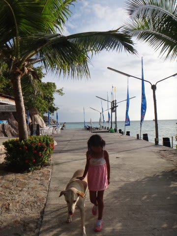

# 2013年9月　子連れタイ・タオ島ダイビング旅行記　その25…そして4日目もジンベエを見ることなく…

📅 投稿日時: 2013-11-15 00:35:44

🏷️ カテゴリ: [ダイビング日記](ce3a7a8d424d112fce83ee85c81a0e344.md)

という感じで．

シュノーケリングが終わってから．

船の上で，しばらく待つと…

ダイバーが次々浮上してきました．

「おかえりなさーい！」

ってことで．

本日のダイビング，すべて終了．

ダイバーをすべて収容したら，船は帰路につきます．

でも．

…本来は．

本来なら…

今日は，ジンベエ狙いのセイルロッククルーズだったはずなのに．

今日も，ジンベエを見ること無く終わってしまったなぁ…（涙)．

…ってことを考えている間に，船は無事ホテル前に到着．

お昼は海が荒れて，ホテル前に船が止められなかったけど．

午後は波が収まっており，

何事も無かったかのような，穏やかなホテル前の海に停泊してます．

…くうぅぅ…

なぜ．

なぜ，午後に限って波が収まるの？？

午前からこんな波なら，セイルロックに行けたのに…(泣）．

ってことで．

お出迎えの水上タクシーに乗って…

ホテルに戻ります．

桟橋に戻ると．

今日は娘，すぐにプールに行きたがらず．

しばらく桟橋のワンちゃんと遊んで…

夕日の中，桟橋脇の海で遊んで．

沈み行く夕日を眺めて過ごしたのでした…

