# ときどき，この質問を受けるので…回答を記事にしてみた

📅 投稿日時: 2017-02-03 01:18:02

えー．

本日．

やはり，予想通り．

志賀高原は，かなりの積雪があったようですね…！

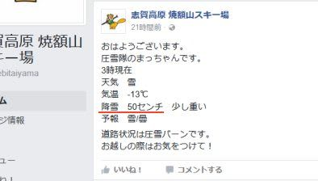

（[焼額山FB](https://www.facebook.com/yakebitaiyama/posts/1210649922363685)より）

それも，50cmですか…！

とりあえず．

この雪は，金曜の朝まで降り続けますので．

また，土曜の朝はいいコンディションになりそう…！

で．

気になる日曜の天気ですが．

朝9時の850hpa図はこんな感じで…

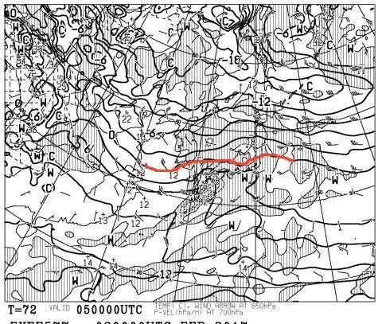

…うーむ．

0℃線はぎりぎり志賀高原より南…

そして，地上天気図は．

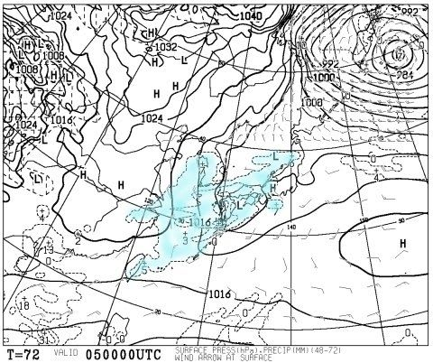

降水域がまだぎりぎり志賀高原に掛かっていないので．

朝は，気温が高めの曇り空でスタートか…

で．

夜9時になると．

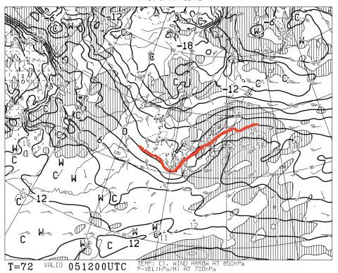

うーむ．

まだ0℃線は，ホントにぎりぎり，きわどいところで

志賀高原の南にいてくれそうですね…

地上天気図を見ると．

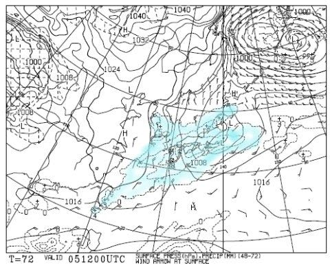

降水域が志賀高原に掛かっているので…

日曜．

朝9時から夜9時の間に．

志賀高原には…

何かが降ります．

でも．

今のところ．

0℃線は志賀高原より北に行きそうにないので．

ギリギリ雪．

午前中は曇り空で．

昼を過ぎたあたりから，パラパラと時折，

ウエアに着くと濡れちゃうような，湿った雪が舞う…

…って感じになりそう．

とりあえず，今週の月曜のような雨にはならなさそうですが．

…そうです．

これは．

水曜の記事で．

　私が祈るので，雪になるはず

と書いた通り．

私が祈ったからに違いありません！！！←いや，違うから．そこ，全力で間違ってるから

これからも引き続き祈り続けるので．

みなの者，安心めされい．

日曜の志賀高原は，雨にならぬぞよ！←これで雨になったら，つるし上げだな…

ってことで．

今日の記事はここで終わらせようと思ったんだけど．

それじゃちょいと寂しいので．

本日は，ちょいと小ネタを…

えー．

私のゲレンデレポートの写真で．

時々写っている，こいつ．

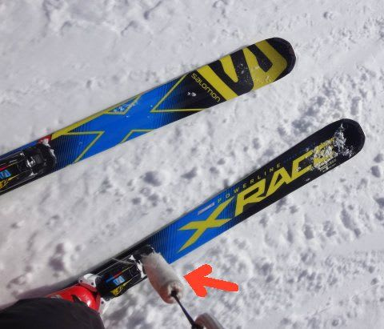

そう．こいつ．

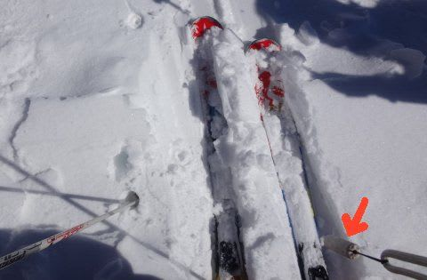

「それ，一体なに？」

と，聞かれることが時々ありますが．

…みなさん，これが何か気になって，

夜も寝られないようなので←そんなことないから．そんな人いないから…

今日は皆さんに．

その答えをお見せしましょう…！

これは，私のデジカメにこんな感じでつけている…

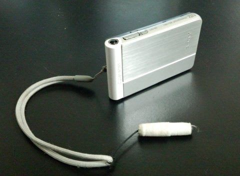

はい．そうです．

タッチペンだったのですっ！！！

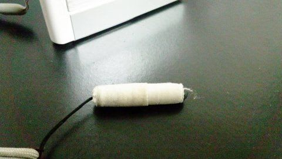

…って．

もったいぶっていうほどのモノでもない，

ごくありふれた，100円ショップに売っているタッチペン．

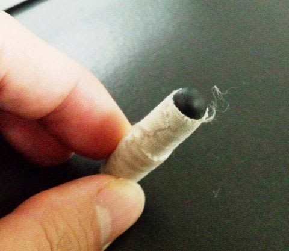

タッチペンの金属のボディでカメラの液晶画面に

傷をつけないように，ボディ部分にテープを

巻いてあります…

カメラがタッチパネル方式なので．

グローブをはめたままでも操作できるように…

と，タッチペンを付けたのですが．

タッチペンのついた紐を，ポケットから外に出して

ぶら下げておけば．

スマホもグローブを外さず使えるので，便利です…

ってことで．

スキー場では非常に便利なタッチペンなのですが．

こんな感じで…

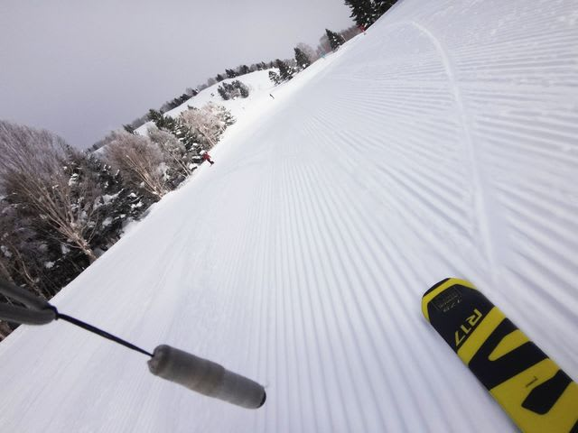

結構いいな！…と思った写真に，

思いっきり写りこんでしまい．

写真をボツにせざるを得なくなることが時々あるのが

ちょっと悔しい，Skier_Sなのでした…

## 💬 コメント一覧

### 💬 コメント by (yama)
**タイトル**: 平日スキー
**投稿日**: 2017-02-03 07:20:06

今日はヤケビスタートです。雪ありすぎです。

### 💬 コメント by (yama)
**タイトル**: 訂正
**投稿日**: 2017-02-03 18:47:31

ゲレンデはピステン後の新雪が10センチほど積もっていました。オリンピックコースのみすねぐらいありましたが、2時間で不整地になりました。平日にもかかわらず新雪を滑る人が多かったようです。午前中はヤケビを午後は一之瀬方面で滑りました。雪質は先週の方が柔らかく良かったです。コンスケさんは喜ぶと思います。ただし、固まった雪玉が、気になります。下が固いのでフラットなバーンが、多かったです。

### 💬 コメント by (michi)
**タイトル**: 明日は…
**投稿日**: 2017-02-03 19:20:12

会社のスキーイベントがあり栂池に行く予定です。

リフト券＋ランチ1000円無料なんです(^^)

ちなみに自分は栂池でスキーは初です。

八方までは何度も行ってますが栂池まではなかなか行かなくて(^^;)

明日は天気良さそうですね。

### 💬 コメント by (しんちゃん)
**タイトル**: 謎が解けました
**投稿日**: 2017-02-03 21:08:01

私も「それなんですか」と思っていた一人です。

ゲレンデで教えていただいたときは感動しました。

「な～んや」って感じでした(^^♪

しかし、映り込んだがために時々写真を没にされていたなんて、知りませんでした。

そんな苦労を感じながら、これからもありがたく拝見させていただきます。

### 💬 コメント by (Skier_S)
**タイトル**: あと5時間後に出発
**投稿日**: 2017-02-03 22:14:41

＞yamaさま

今年はパウダー率高いですね…

＃ちょっと重い雪が続きますけど

でも，下地の固いのが出てきてる感じですか…

でも，明日は晴天でいい一日になりそうです．

またよろしくお願いします～．

＞michiさま

栂池は，志賀高原シーズン券を買うようになる前は

良くいきましたが…

私ももう10年近くいってないかも（笑）

明日はGoodコンディションだと思いますよ．

楽しんできてください～！

### 💬 コメント by (Skier_S)
**タイトル**: しんちゃんさま
**投稿日**: 2017-02-04 08:33:35

やっぱり、何かか気になりますよね(^^)

タネあかしするとたいしたことないのですが…

今日の志賀高原は晴天最高です！

