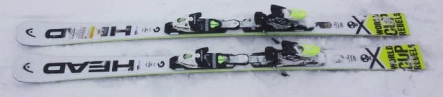
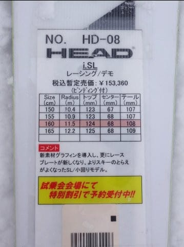
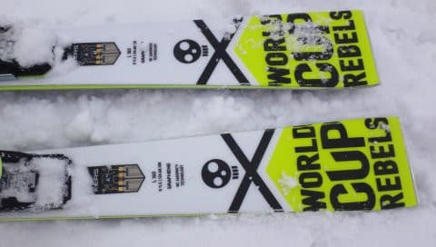
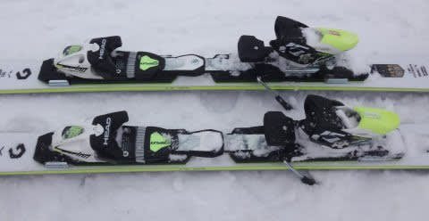

# 2018シーズンモデル，スキー試乗レポート第14回…HEAD編その2

📅 投稿日時: 2017-06-05 00:53:51

えー．

スキーに行かない週末を過ごすと．

なんだか体調がすぐれない気がする，Skier_Sです．

しかし．

実に6か月以上ぶりの，スキーに行かない週末…

運動の習慣がある人間が，いきなり運動をやめると，

なんだか体が死ぬほどなまっていく気がするし．

なによりも…気分がリフレッシュされない…（涙）．

ホントに明日，会社に行かなきゃならないのか…

＃こんなんで，オフシーズンに耐えられるのか

とりあえず．

スキー試乗レポートでも書いて，

ちょいと気を紛らすのだ．←むしろ禁断症状を悪化させるのでは？

2018シーズンモデルのスキー試乗レポート．

本日はヘッド編です．

では，どうぞ～！

---

HEAD i.SL 160cm

SL競技用・基礎小回り用

レーシングトップモデルはRaceplateがついた，

i.SL RDというモデルになりますが．

この板は，それよりワングレード落ちる，

プレートのついてない優し目のモデルになります．

しかし．

バリバリSLモデルからちょっとマイルドにしてある

このくらいが，ゲレンデでは気持ちいい感じがします．

去年から，ビンディングも変わってないみたいだし．

コスメチェンジのみの継続モデルなのかな？

今回の試乗板．長さが160cmと，私にしては

ちょっと短めでしたが…

ターン導入部，すっと柔らかくターンに入り．

そこから谷回りで雪面を捉えに行き，板が

きれいにたわみ．

そのサイドカーブに乗って深くターンが切れ，

そして最後にすっと抜けていく…

という，気持ちいいターンが描けます．

板自体は結構柔らかくたわむ感じだけど，

ペタペタにたわみきってしまうような弱さは無く，

気持ちよくたわんで，深い切れたターンが

できる感じ．

私のような深回り大好き人間にはいい感じです…

ずらして行っても，

ズレた中で板がターン方向にぐぐぐっと

回っていくようなフィーリングを受けるので，

ズレを使ってもかなり攻めて行ける感じ．

切っていくだけでなく，ハイスピードでも

ズレが使える，かなり自由度が高い板に

感じました…

昨シーズンも思ったけど，ゲレンデ用小回り板としては

かなり乗りやすく，結構深いターンが気持ちよく

決まる，いい板じゃないかな～．
