# 2021/3/2(火)の志賀高原スキー場特派員情報…朝は強風曇り，昼は雨→昼過ぎに雪．それほど雨は長く降らなかったようだけど，特派員の優秀さに脱帽

📅 投稿日時: 2021-03-03 01:55:13

えー．

本日…というか，もうすでに昨日となった，

3月2日(火)ですが．

やはり，

　2日（火）：諦めましょう．

　強烈な南風で，ゴンドラ動かないかも？

という予想が当たったようで（涙）

焼額は第1ゴンドラも…

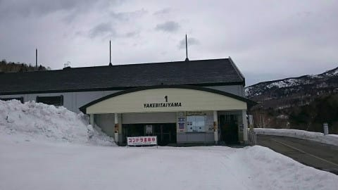

第2ゴンドラも運休だったようですね…

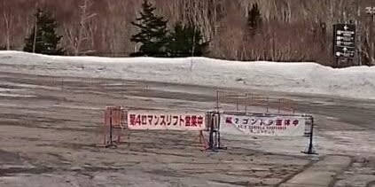

焼額は朝は4ロマのみで営業開始，

昼前に風が弱まり2高も営業を開始

したようですが…

結局，ゴンドラは終日運休．

そのほか，寺子屋も全面運休で．

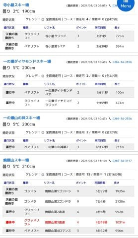

([志賀高原索道協会ホームページ](https://www.shigakogen-ski.com/)より)

さらに，奥志賀は第1ペア以外は運休，

熊の湯も朝は第2ペアが運休(昼過ぎから運転)，

横手・渋は横手第1，第2以外はすべて運休…

という状況だったようですね…

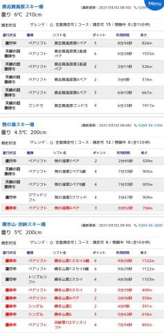

([志賀高原索道協会ホームページ](https://www.shigakogen-ski.com/)より)

ただ，特派員情報によると．

朝は風は強かったものの，雨は降って

いなかったので．

滑るうえで問題はなかった

という．

さすが志賀高原特派員は違う

と思わせるコメントと共に，写真が

送られてきていました…

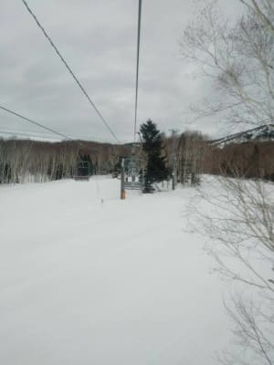

朝のうちは焼額の4ロマをグルグル

していたようですが．

さすがにこの天気だったので．

他に滑ってる人がいないですね…

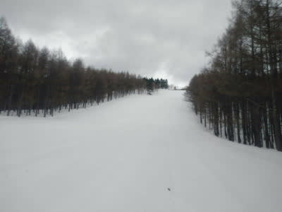

雨は降ってないものの，高温の強風で

雪が融けて，かなりネットリした雪質

だったようですが…

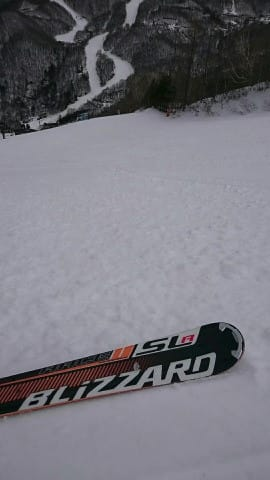

西舘から下は，風が弱かったのか

運休してるリフトは無く．

朝からフーディークワッドも

動いてたようで．

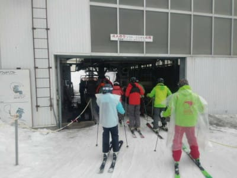

11時ごろには，焼額第2高速も動き始めた

みたいですね…

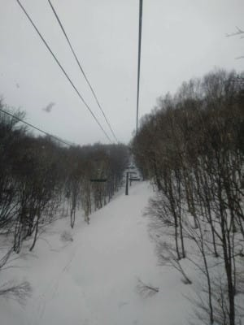

午前中は雨が降ってないこともあり，

ジャイアントも意外と悪くなかった

ようですが．

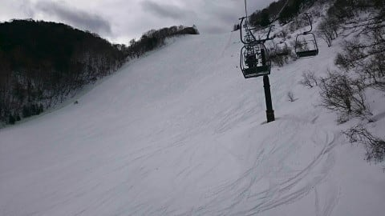

…しかし．

午後11時過ぎには雨がポツポツ

ふりはじめて…

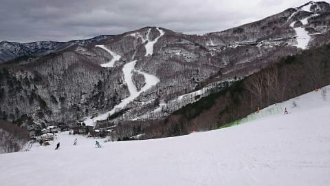

12時過ぎには，かなりの強い雨に

なっちゃったようです（涙）

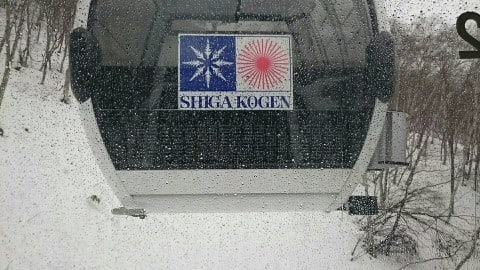

だけど，午後1時半ごろには

雨も雪に変わってきたようで．

雨の時間は1時間ちょっとで済み，

雪が壊滅的にやられちゃうような雨には

ならなかったのが，ちょっと救いかな…

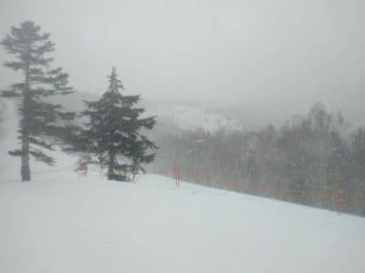

で．

予想通り，気温は夕方にかけてぐっと

冷え込み．

雪の降りも本格的になり，

リフト営業終了までに，10cm近く

積もったようです！！

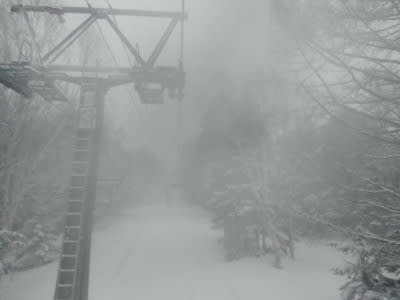

この雪は，午前1時半の今も降り続いて

いるようなので…

明日の朝までには，20cmほど積もって

くれるかな？

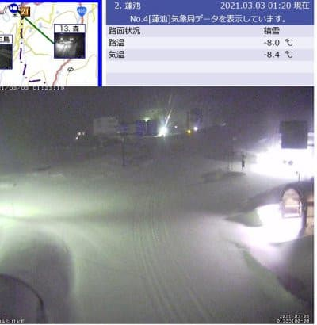

明日は，日曜夜に予想した

3日（水）：朝までに10~20cm積もってるか？

　この日は朝は-10℃クラスの冷え冷え！

　ガチガチ硬い雪の上に新雪．

　午前中に雪は止む．

　午後は晴れていくかも…

　昼間も-5℃程度と冷える一日

という予想の通りですが．

雪の止むタイミングが，午前中という

よりも，朝のリフト営業開始時にはもう

止んでいる感じかも…

まぁ，明日の朝までに20cm程度の

冷え冷え雪が積もってくれそうなので．

今日の雨で溶けた雪が固まった

ガチガチバーンは隠れて，

明日はまぁまぁいい雪で滑れそうな感じ

でしょうか…

…ただ，急斜面の一の瀬ファミリー正面

バーンとかは，下がガチガチのところに

まだらに新雪がかぶさる，難しい

バーンになりそうな予感…

とはいえ．

雨の直後に積雪があったおかげで，

今回の雨の影響もそれほどひどくなる

ことは無さそうな感じで，よかった…（一安心）

…しかし．昨日の段階では，

さすがの悪天候の予想の今日，スキー場の

様子を見に行く人はいても，滑って

ゲレンデレポートをしてくれる特派員は

いないだろうなぁ…

と思っていたところ．

この天気の中，複数の特派員が

滑りに行っていた

というだけでも驚愕なのに．

それだけじゃなく，

『激混みのゴンドラに何十分も並ぶ根性はなくても、無人の貸切快適バーンを滑る根性はある』

という迷言を残し．

本降りの雨が降り始めても，その後雪が降って，

かなり冷え込んでウェアが凍り付いても

滑り続けるという．

さすが，志賀高原の特派員は違う…

と，特派員のおかしさ優秀さに深く感動した，

今日一日だったのでした…

なんでこのBlogの読者は，こんなに標準からずれた人すごい人が

多いんでしょうかね…

## 💬 コメント一覧

### 💬 コメント by (レインボー73)
**タイトル**: Unknown
**投稿日**: 2021-03-03 12:56:14

水曜日の志賀高原情報

湯田中で10cm積雪。上林ー５℃　蓮池ー11℃。小雪がふわふわ舞っている。8時20分ニゴンスタート。いつの間にか晴れ間が。太板の出番は？

真っ先にお目当てのＧＳサイドへ。凸凹の硬いコブに新雪10cm。ゴツンゴツンと腰に悪い。太板失敗みたい。

オリンピックは平坦で滑りやすいけど、朝圧雪なので予想通り新雪5cmだけ。山頂ー12℃。

スーパーは吹きだまっているので、20cm。いいぞ！仲間は奥志賀へ旅に出たけど、連絡路が腰に悪いので私はスーパー回しとしましょう。

やっぱりいい。底づきはたまにするくらい。スーパーは右に行かずに左側のコースを選ぶと、深いし長く楽しめますよ。

そのあとのミドルへの連絡路が本日のベスト。深くて快適。

9時35分１ゴンが４分待ち。カラマツへ逃げまーす。

パノラマの壁？は快適フラット勘違いバーン。右側非圧雪を滑った76歳爺は『新雪は少しだけ。ゴツゴツで楽しくない』よかった！（人の不幸を喜ぶようになったら先が短い？）

カラマツも快適フラット。

ニゴンは10時も10時25分も飛び乗り。目指すはダイヤモンド！

ダイヤの新雪も15cm程度。上部はしっかり底づきするけど、カカト荷重なのでテールが当たるだけ。日差しは強くなったけど、気温は上がらず、どこもずっと快適バーンは維持されました。が、しかし、腰痛悪化が怖くて、昼前に勇気ある？撤退をしたレインボーなのでした。

帰路の高天ー６℃　蓮池ー２℃　上林１℃。

### 💬 コメント by (レインボー73)
**タイトル**: Unknown
**投稿日**: 2021-03-03 13:10:20

エキップ2022スキー試乗会

日程:3月6日　9時00分〜12時00分

場所:志賀高原ダイヤモンドゲレンデ

　　　ダイヤモンドペアリフト脇

試乗スキーメーカー　FISCHER.Head.VOLKL.Rossgnol,ID-One

6日はID-ONEフリースキーライダー須田和美(FS-MO全日本選手権入賞多数あり)も参加します。

13日にも予定しておりますが、6日の方が、スキーの台数は揃う予定です。

今回は、受付(お名前、連絡先等ご記入頂きます）して頂き、各社から試乗スキーの貸し出しもしてもらう都合上、貸し出し、返却費用がかかりますので、お一人試乗料金￥2000徴収させて頂き、ご購入時に利用できる￥1000割引チケット発行する、システムとさせて頂きます。

宜しくお願いいたします。

物欲にまみれたエス様、いかごなさいましょうや！

おいでやす志賀へ！

### 💬 コメント by (レインボー73)
**タイトル**: Unknown
**投稿日**: 2021-03-03 13:26:30

お借りします。

エキップ（長岡市）試乗会２

読者の皆様、ふるってご参加願います。私はこれ以上物欲に火をつけたくないんですがー！今年は板、太板、上衣４着、ズボン、フェイスマスク２枚etc. 離縁されたら私にはあとがないんです。

なお、当日はダイヤモンドにポールも張ります。国体選手から私レベルまで、楽しくやりましょう。（ポールは一人500円かかります）

### 💬 コメント by (副院長)
**タイトル**: Unknown
**投稿日**: 2021-03-03 14:36:58

Skier_S様

感動いたしました。2日（火）ゴンドラストップで4ロマンスのみの時も、S様配下の特派員の方々が、並んでおられるのを、ホテルの窓から拝見しました。

2日は私はリフト状況を確かめ、車で、サンバレー。10年以上ぶりに、横手。熊の湯を滑り　最後に山の駅にから、ジャイアント、西舘、高天滑って、終了にしました。

私の志賀通いは今回で終了です。

今年は1月17日から2月第3週お休みで計6回（日、月、火）と滑りました。微力ながらスキー場に貢献できたかと思っています。（私の車は2か月で6000キロ走りましたが）

時々、S様は都会に影武者を残して、こっそり焼額におられるのではと思うような　背格好の方を見かけましたが、違ったのですね。

来シーズンお会いできればと思っております。

コロナが落ち着くように祈っております。

### 💬 コメント by (かず)
**タイトル**: Unknown
**投稿日**: 2021-03-03 16:17:04

本日もしかしてラストパウダー？なので期待してきました！

ファースト1ゴン  しかし底ツキ 所々いいのですが 恐る恐るなので爽快感無し…

本日奥志賀ゲート初体験してきました！同行してくれた二人に感謝してます！ツリー慣れてないので難しいですね… Sさん得意ですか？

### 💬 コメント by (Northfox)
**タイトル**: Unknown
**投稿日**: 2021-03-03 23:23:16

レインボー様　試乗会のご案内ありがとうございます。

私は13日に参加しようと思っています。

今週末は志賀高原でのスキーお休みの予定です。

たまに休みを入れないと体力的にも経済的にももちません．

今度の土日はゆっくり身体と財布を休め、万全の態勢で再来週に臨みますので宜しくお願いします。

### 💬 コメント by (西舘)
**タイトル**: ポール参加料金は
**投稿日**: 2021-03-04 01:53:25

>レインボーさま、いつも何かとありがとうございます。

ポール参加料金は万が一の際の備えで1,000円だったように思いますが、いかがでしょ。

今週末も、どうぞよろしくお願い致します。

### 💬 コメント by (レインボー73)
**タイトル**: Unknown
**投稿日**: 2021-03-04 05:21:57

ポールは500円です。スキー場に支払う金額が、一人あたり500円なので。

前回は借りてたポールだったので、万一に備えて1000円集めさせて頂きました。

剰余金は今後に備えさせていただきます。

お心遣いありがとうございました。

### 💬 コメント by (Skier_S)
**タイトル**: 春ですねぇ…
**投稿日**: 2021-03-04 05:42:45

＞レインボー73さま

試乗会情報ありがとうございます！

うーむ．

今週末，参加しようかなぁ…

＞副院長さま

志賀に来られてたのですね！

そして，優秀な志賀高原の特派員をご覧になっていたとは…

でも，今シーズンはもう終わりですか．

お会いできず残念．早くコロナが落ち着いて欲しいものです…

＞かずさま

滑りに行ってたんですね！

私はツリーランは昔1-2回やったことがある程度なので，得意かどうか…

木の密度が高いところは難しいですよね(笑)．

＞Northfoxさま

私はNorthfoxさんの最近の焼額LINEグループ出現頻度から，

てっきり志賀に住んでいるものだとばかり(笑)．

久しぶりのお休みですか．ゆっくりしてください…

＞西舘さま

ポールだけじゃなく，試乗会も参加ですか？

また，物欲に負けて日本経済に貢献しそうですね(笑)

