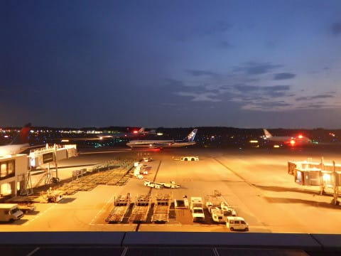
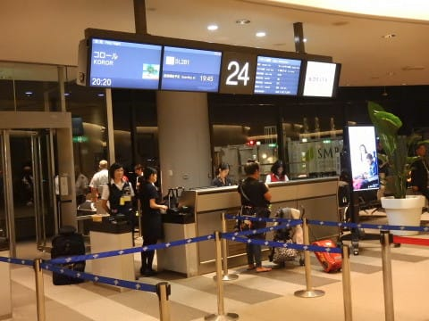
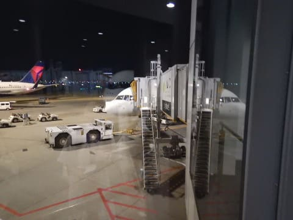
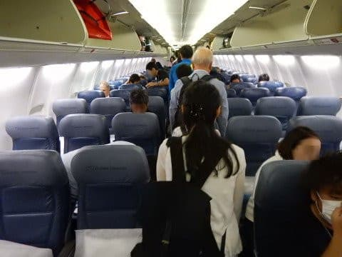
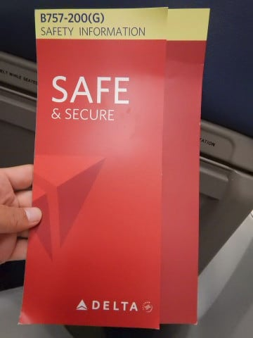
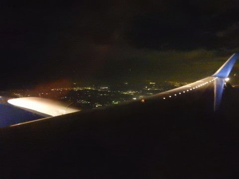
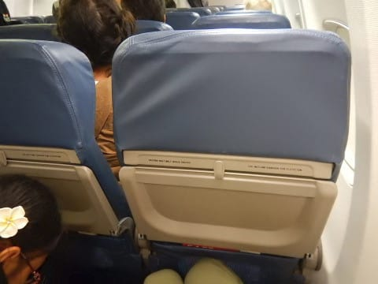
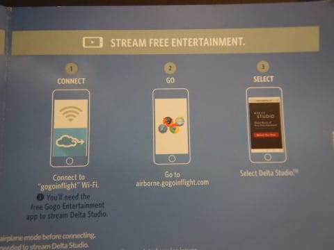
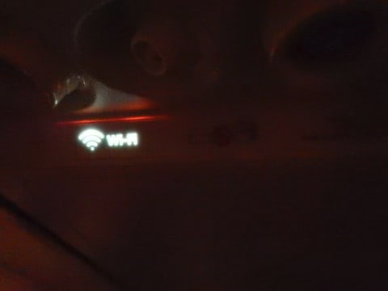
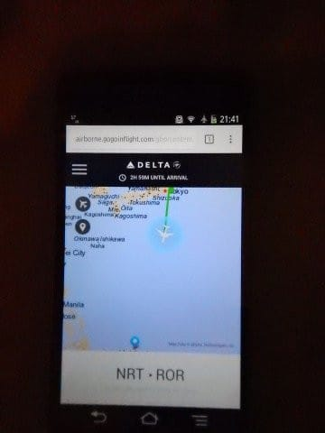

# 2017年8月，小学生の子連れでパラオ再訪！その1…いざ，出発！

📅 投稿日時: 2018-08-23 01:01:48

🏷️ カテゴリ: [ダイビング日記](ce3a7a8d424d112fce83ee85c81a0e344.md)

えー．

もう，今週末から．

座間味にダイビングに行くというのに…

いろいろと忙しく，ダイビングに行く気分が

まだ高まっていないSkier_Sです．

…しかし．このダイビング旅行が終わると，

私の今年のダイビングは早くも終了．

そして，もう8月も終わっちゃいます…

ってことは．

もし，次のシーズンインも，Yetiオープンが

10月はじめだったら…

シーズンインまであと1か月しかないのか！！

とりあえず．

そろそろスキーシーズンも始まるので．

急ぎ書き上げようと思っている，パラオ旅行記．←いや，今年中に終わらないって結果がもう見えてるから

徒然工作日記の途中ですが．

今日から本編スタート！

---

というわけで．

8月22日の火曜日が，

パラオへ出発する日だったんですが．

出発直前の週末．

19，20日の[一泊二日で志賀高原](ef703bddea0ae0c4452f3d0ed19e48334.md)へ遊びに

行っていた気がするのですけど…

中一日で，22日からパラオへ出発ですか…

でも．

22日のパラオ出発は，夜8時20分発の便だし．

のんびり家を午後3時に出れば間に合うよね…

だから，出発日は遅くまで寝てられるし．

しっかり疲れもとれるはずだから，タイトな

スケジュールに見えるけど，大丈夫だよね…

…と．

出発前は考えていたのだ．

そう，出発前日の，あの電話がかかってくるまでは…

それは，出発前日の21日，月曜日の朝のこと．

職場に上司から電話がかかってきたのだった…

上司　「今日は終日出張なんで，例の件は明日報告してね」

私　　「え？？私は明日から休みなんですが…」

上司　「私は今日出張で，明日しか時間がとれないんだよね」

私　　「私は明日から休みなんですが…」

上司　「先週はお盆休みで一週間出社してないんだよね．私は」

私　　（それはあなたの都合ですよね…）

上司　「そしてチミは明日から今週いっぱい不在となると，

　私とチミは2週間，顔を合わせないことになる」

私　　（このままずっと顔を合わせないで済ませたいです．ええ．）

上司　「この件は2週間放置するわけにいかない．

　　　チミの旅行先に大量のメールや電話が追いかけてくるのと，

　　　明日直接話し合って一気に解決しておくのと，

　　　どっちがいい？」

私　　「…は，話し合いの方がいいです…（涙）」

ということで，22日も午前中出社ということに

決まってしまったのでした…（泣）

で．

8月14日～18日の週をお盆休みとして休む人が

多かったこの年．

休み明け初日となる21日の月曜となったこの日は．

同じような投げ込み仕事が続出し．

とても出発前日に仕事が終わらない

という，毎年恒例のイベントと化しているような

事態に陥り．

案の定，21日も深夜まで仕事をし．

22日の午前中は上司との会議で費やし．

そして，22日の出発直前，14時になって．

「もう間に合わないっ！」

と，特殊魔法【すべて出来たことにする】を発動し．

各方面にメールを投げつけて全力で帰宅．

間に合うかどうかぎりぎりの午後3時に，

家に帰って．

玄関に置いてあった荷物を車に突っ込んで，

家に上がることなく，そのまま成田空港へ向かった

という．

バタバタの出発だったのでした…

とりあえず．

出発はばたばただったけど．

何とか無事，フライトの2時間前には成田空港に到着！

無事チェックイン＆出国手続きを終えて．

20:20発のコロール直行便に搭乗するわけですが…

これまで，パラオへはJLのチャーターと

コンチのグアム経由便を利用したことはありますが．

今回利用するのは，パラオ行としては初めての

デルタ航空ですね…

で．

座席の並びが3+3の6アブレストなので，

あれ？B737？通路が長いから，B737-900？

って思いましたが．

あら．日本では珍しい，B757じゃないですか！

米国の国内線では良く乗りましたが，日本に

来てるのか…B757.

それも，B757にウイングレット付きがあるとは

知らなかった…

ということで．

飛行機は成田を離陸しましたが．

…この飛行機も，機内エンターテイメントは

無いのね…（涙）

でも，最近の標準となりつつある，機内WiFiによる

ビデオプログラムの配信をやっていて．

離陸後しばらくして，こんな感じでシートベルトサイン

横のWi-Fiランプが点灯すると．

スマホやタブレットで，ビデオやオーディオ，

マップサービスが受けられます…

…これからはこういう方向性で，

機内エンターテイメントシステムは絶滅

していくのかな～…．

（続く）←さっさと終わらせるつもりが，飛行機に乗ったところでその1が終わっちゃってる

んですけど！？？5泊6日の旅行記，何回連載にするつもりなんだ…？？
