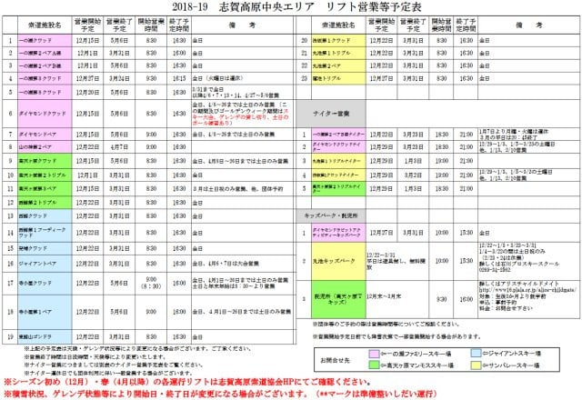
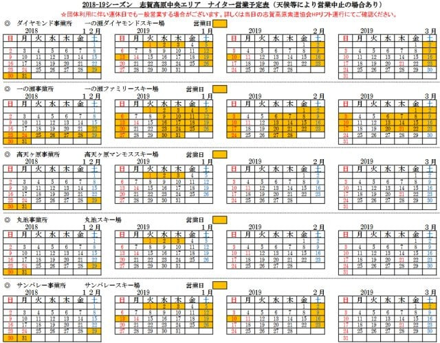

# 志賀高原中央エリアの2019シーズン営業予定が出ていたよ…微妙に営業期間減（ちょい涙）

📅 投稿日時: 2018-10-10 00:49:23

🏷️ カテゴリ: [日記](cc4b5682fb7b8b144980957a978653fb0.md)

さてさてさてさて．

スキーシーズンインまで，あと2週間を切ってきましたよ～！！！

この10，11月．

スキーしてる暇があるのか？？

という感じですが…

ってなわけで．

志賀高原中央エリアを管轄する，

[志賀高原リゾート開発さん](http://www.shigakogen.co.jp/)のウェブページを見ると．

2018/2019シーズンの営業予定が公開されていますね～！

リフトの営業予定は[こんな感じ](http://www.shigakogen.co.jp/cms/wp-content/uploads/2018/10/8901a52e2248ee75ab6008301984d0c8.pdf)で．

ふーむ．

シーズン開始・終了の日程を見てみると．

オープンが一の瀬ペア＆高天ヶ原トリプルで12/1，

終了が一の瀬ファミリー，ダイヤモンド，高天ヶ原，寺子屋の5/6と，

概ね昨シーズンと一緒ですが…

さらにじっくりと見て，昨シーズンとの違いを探すと．

○一の瀬クワッド，ダイヤモンド，高天ヶ原の営業開始が

　昨シーズンの12/9⇒今シーズン12/15に一週間後ろ倒し（涙）

○一の瀬，高天ヶ原以外（寺子，西館，東館，ジャイアント，

　丸池，サンバレー）のスタートが，

　昨シーズンの12/16⇒今シーズン12/22へ，

　こちらも一週間後ろ倒し（涙）

　

○蓮池クワッドの営業開始は，

　昨シーズンの12/16⇒12/27と，こちらは一週間半以上後ろ倒し

ってな感じで．

うーん．

なんだか，微妙に営業期間が短縮されています…

ちなみに，山の神の営業開始も，

昨シーズンの12/16⇒今シーズン12/22と

一週間後ろ倒しされてます（激涙）

終了は昨年と同じ4月第2週（4/7)ですが．

12月第1週には焼額がオープン，第3週には一の瀬ダイヤが

オープンしているにもかかわらず．

その両者をつなぐリフトを12月第4週まで動かさないとは…

何か微妙な感じ…（泣）．

そして．

ダイヤも焼額もGWまで営業するにもかかわらず．

山の神を4/7に止めて両者の行き来をできなくして

しまうことに，なにかしらの悪意すら感じる…．

そして，こちらが[ナイター営業の案内](http://www.shigakogen.co.jp/cms/wp-content/uploads/2018/10/2b1747b45a241ae6d09fbfe1d3e71e3d.pdf)ですが．

これも，一の瀬ファミリーは12月3連休～3月4週目まで，

ダイヤは年末12/29～3月第4週まで，

高天ヶ原＆丸池は正月休みのみ…

と．昨年とほぼ同じですが…

違いとしては

○一の瀬ファミリーのナイターの月・火営業休止が正式決定（涙）

○サンバレーナイターの終了が，昨シーズン3/15⇒3/2と

　2週間前倒し（激涙）

と．

これも微妙ですが，あまり良くないニュースが並んでます…

うーむ．

やはり，志賀高原の中央エリア．

ひたすら縮小方向に進んで行っているのが，

どうにも悲しい…（泣）．

何かいいニュース，ないかなぁ…

PS.

そういえば，[横手山のFaceBook](https://www.facebook.com/yokoteyama2305/posts/1584501941649709)で，[こんなの](https://www.jomo-news.co.jp/news/gunma/politics/82277)を見つけたけど．

いくらなんでも，これは無理でしょう…

## 💬 コメント一覧

### 💬 コメント by (まうちゅう)
**タイトル**: Unknown
**投稿日**: 2018-10-10 21:24:05

改めてマップを見たら、蓮池→ジャイアントに矢印が１つ追加されてるようですが気のせいでしょうか？

ヤケビ～奥志賀間みたいにかなり歩きそうです。

### 💬 コメント by (Skier_S)
**タイトル**: まうちゅうさま
**投稿日**: 2018-10-11 01:13:06

あ！ホントだ！

前に記事を書いた時から，地図が微妙に変わってますね…

これは，ロープトーのあったところを歩いて登るパターン

っぽいですね…

行けなくはないけど，確かにヤケビ⇒奥志賀と同じく，

結構疲れる行程ですよね…たぶん．

### 💬 コメント by (yumi)
**タイトル**: 死にそうでした💧
**投稿日**: 2018-10-11 01:43:57

Ｓさぁ～ん🎃まうちゅうさぁ～ん🎃

ヤケビ↔️奥志賀どころでは無いですよぉ～❗️❗️❗️

一度、騙されて（ロープトーが動いていなかった）泣きながら登りましたが、死にそうでした💧

### 💬 コメント by (Skier_S)
**タイトル**: yumiさま
**投稿日**: 2018-10-11 02:01:10

夜遅くのコメント，お疲れ様です（笑）

私は，ロープトーがむちゃくちゃ混んでた時に歩いて

登ったことがあります…

死にそうってほどではなかったですが←アホほど滑り続けて鍛えられた体力バカだからかな？

…かなり疲れるし，途中何回も休んで時間がかかるのは

間違いないです…確かに．

しかし，志賀高原中央エリア，サービス悪化していくのが

ちょっと悲しい感じです…（涙）

