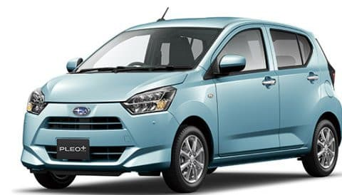
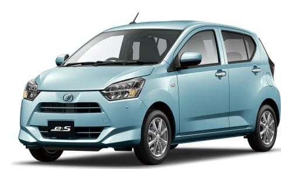
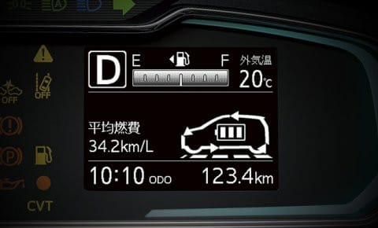
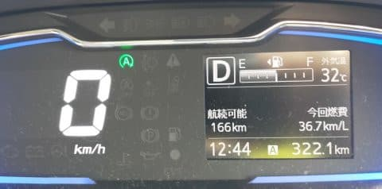

# 車検の代車，軽四のスバル プレオプラスで500㎞日帰り移動してみたけど…今の軽自動車，すごすぎる…

📅 投稿日時: 2023-06-21 04:04:02

ってなことで．

わがVMG レヴォーグ君も，そろそろ購入

5年目ということで．

先週末，ディーラーで車検をしてきたのですが…

土曜朝に車を預け，日曜夕方仕上がり．

そのため，土日2日間のために代車を

借りたのですが…

その代車が，スバルの軽自動車，

プレオプラス．

（[スバルホームページ](https://www.subaru.jp/pleoplus/pleoplus/)より）

うーん．

せめてインプレッサかCrosstrekクラスが

良かったんだけど…軽自動車か…

さすが軽自動車で長距離高速移動は

辛いだろうから．

この土日，遠くに出かけるのはあきらめよう

と，思っていたのですが．

久しぶりに晴れそうという週末の天気予報に

誘われて．

普段睡眠不足にもかかわらず，朝4時に

起きて，軽自動車で日帰り往復500㎞

走ってきてしまったのでした…

で．

以前，[サンバーバンの代車を借りた](e89c59157670eec668c354fcb08445487.md)ことは

ありますが．

サンバーバンは半日借りただけで，

ディーラーから自宅までの往復しか

使ってないし．

それ以前にちゃんとある程度の距離を

走ってみた軽自動車の経験となると…

10年近く前のレンタカーまでさかのぼるな…

ってなことで．

実に久しぶりに軽自動車で長距離走って

みましたが．

はっきり言って，

最近の軽自動車の進歩にめちゃくちゃ

びっくりしました…！！！←いや…お前が最近の

軽四を知らなすぎるだけだろ，という突っ込みが多数来るよ

ちなみに，今回借りたプレオプラスは，

ダイハツからスバルへのOEM車種で，

中身は実体ミラ イースですね．

こいつがミラ イースの写真ですが…

まぁ，見た目一緒というより．

カタログ写真も使いまわしてますね(笑)

（[ダイハツホームページ](https://www.daihatsu.co.jp/lineup/mira_e-s/)より）

ってなことで．

まず，車を受け取って走ってみますが…

シートリフターもなければ，

ステアリングのテレスコは当然として，

チルトすらなく，ヘッドレスト調整もないし．

「やっぱりコストを徹底的に抑えた

軽自動車だなぁ…」

と思いながら走り出したところ．

どうも，自分の軽自動車体験が，

4速AT＋パワステなしか油圧パワステ

という時代で終わっている自分にとって．

（以前借りたサンバーも4速AT）

「うぉおおお！なんだこれは！！？？

エンジン ＆CVT制御，めっちゃ洗練

されてるじゃないか！！」

という衝撃を受けたのでした…

走り出して，加速時はやはり660㏄の

アンダーパワー感はありながらも．

思った以上にトルクが出ている感じがあり…

そして，加速フェーズが終わって，定常走行に

入ると…

ぐっと回転数が落ちて，タコメーターが

ついてないのでわからないけど…

時速60㎞でも1400回転くらいしか回って

ないんじゃないか？

という低回転に落ち込みます．

え？

660㏄で，そんな低回転に落としていいの？

と，驚かされるだけじゃなく．

定常走行で低回転に落ちたとき．

エンジン音が明らかに落ちて，スコスコした

感じの，いかにもトルクを出してない

ミニマムの燃焼をしているスカスカした

感じのエンジン音に変わり…

ちょっと待て！？？

これ，吸気カムシャフト位相操作無茶苦茶

入って，アトキンソンサイクル燃焼してるか，

大量EGRでトルク制御してる？？

これ，燃費改善のためのポンピングロス

低減目的で，ぎりぎりスカスカの燃焼で，

最低回転数スロットルガバ開けで走ってる

エンジン音に聞こえるんですが？？

コースト状態から回転数が上がらない

程度にわずかにアクセルを入れると．

ほとんど回転数が変わらないのに，

スカスカした感じのエンジン音から，

パパパパ…という感じで圧縮が上がって

燃焼してる音が立ち上がって来て，

トルクが出てくるので…

間違いない．

吸気カム位相制御の可変圧縮と

大量EGR入れてるよ…！

ってことは，スロットルは完全電子制御で，

CVT&エンジン統合制御してるの？？

これ，電制スロットルでCVT&エンジン統合

コントロールが載った，ドライブバイワイヤー

車じゃないか！！

そして吸気カム位相制御の

アトキンソンサイクルで熱効率

あげるのに，圧縮比もかなり高めて

あるんじゃないかな…？？

ノックセンサー使ってかなり厳密な

燃焼コントロールしてるっぽいし…

（全開時はかなり点火タイミング

　リタードしてるっぽい．全開にすると

　燃費も一気に悪くなる)

これ，軽自動車ですよ？？

軽自動車も，200万近くするトップグレードなら

まだしも…

110万円の一番安いクラスの軽四ですよ！！？？

110万円で買える車に，今はこんな手間暇

かかったエンジン＆CVTが乗ってるの…？？

…そして．

定常走行から軽い減速に入れると…

メーターに現れる充電表示！！

ええ？

まさか，減速時の回生が入ってる？

ISGで回生発電入ってるのか？

このクラスでマイルドハイブリッド？？

まさかこの値段の車に，ISGと大容量

バッテリーは積まないだろうから…

単なる充電制御かな？

…気になってのでエンジンルーム見ると．

ジェネレータとスターターは別だったので，

エンブレ時にのみオルタネータで発電させる

単なる充電制御だな．これは．

でも．単なる充電制御とはいえ．

アイドルストップ機能…それも，スピードが

10㎞/hくらいに落ちるとストンとエンジンが

止まるアイドルストップがついてるので…

かなり充電受け入れ量のあるバッテリーと

大容量オルタネータがいるし．

それをきちんと制御するのもコストがかかるし…

今の軽自動車って，ここまでして燃費を

稼いでいるのか…！！

そして，この車は3気筒エンジンだけど，

3気筒は1次は完全バランス，2次の偶力

バランスは4気筒よりいいし．

意外となめらかでエンジン音は静か．

定常運転に入れると，軽自動車と思えない

静かさ…

ブレーキもフィーリングは悪くなく，

ストロークでスカスカ効くブレーキじゃなく，

ブレーキペダルの踏力（反力）の立ち上がりと

減速Gの立ち上がりがいい感じにシンクロ

してくれているし．

何より，電動パワステの反力の出し方が

かなりしっとりとした高級な感じ…

これ，電動パワステの反力の出し方が

めちゃくちゃいい！！

そして．

ボディ剛性が想像以上に高い！

段差を乗り越えてもミシリともいわないし．

（昔の軽四は，段差を乗り越えるとギシギ

　いう車もあったもんだ…）

ボディのしっかり感は想像以上！！

しっかりしたボディに，バネレートが

結構低めのバネがついていて…

各部ブッシュの容量も適切なのか．

段差の乗り越えなども，ガタガタする

下品さはなく，予想以上に滑らかに

柔らかく段差を乗り越えていきます！！

だのに，強めの横Gをかけても，低めの

バネレートから予想されるほどロールが出ず，

リアがロールを押さえている感じがして…

リアサスがトーションビーム式なので，

結構リアでロールを押さえてるのかな？

あと，フロントのロールも，ロール

モーメントが短くロールが抑え込まれて

いる感じ．

ロールセンターが意外と高そうで…

横Gをかけると，フロントはペダルくらいの

高さを中心にロールする感じ．

「え？そんな高いところ中心にロールする？」

という感覚が…

もしかしたら，リアよりフロントのロール

センターが高いという，禁断の前上がり

ロール軸なのか…？

フロントサスを見てみると，ロワアームは

そんなに外下がりじゃなかったので，

ジオメトリー的にはそんなにロールセンターは

高そうに見えなかったけど…

ってな感じなので．

ロール剛性はそこそこ高めで，

バネレートが柔らかいのに，腰砕けロールは

しません．

ただ，ロールを強く出すとフロントインの

接地感は弱まるかな…

まぁ，でもフロントの外側タイヤの対地

キャンバーが適切なのか，そこそこ強めの

横Gをかけても，簡単にフロントがアウトに

逃げていくことはなく，

フロント外側のタイヤが意外と頑張って

インへ切れ込んでいってくれます．

結構な山道で，かなり限界まで攻めてみましたが．

意外とタイヤがスキール音を出し始める限界は

高いし．

…昔のBRレガシィよりも横Gをかけられるかも？？

…これ，昔のロールを許容しなかった某車の，

バンプ時キャンバー変化が限りなく0の

フロントサスで大きな横Gをかけたとき，

対地キャンバーがメチャポジティブになり，

フロントがすーーーっとアウトに逃げていった

のに比べれば，結構粘ってくれるフロント

サスです．

意外と電動パワステのフィーリングもいいし，

660㏄では仕方がないパワー不足感を除けば…

山道も怖くない，意外と攻められる足ですね．

ただ…

すごくいい感触のパワステなんですが．

これ，パワステの反力，ほとんどがタイヤからの

力じゃなく，モーターのフィードバックで

出してるんじゃないかな…？

ステアリングを切り始めて，タイヤが

コーナリングフォースを出す反力を

ステアリングに感じるんですが．

その感覚からワンテンポ遅れて，実際に

フロントが回り始める感じ．

…たぶん，街中とかでは全くわからないと

思いますけど…

山道でラインを㎜感覚で合わせて攻めようと

したとき，予想よりワンテンポ早く

ステアリングを切り始めないと，

ちょっとインのクリップポイントを外しちゃう

感じ．

おそらく，ステアリングの各部の剛性が

そこまで取ってなくて．

でも，ステアリングの剛性の低さが生む，

ステアリング反力の「グニョ」感をステアリングに

伝えず，

反力を電動パワステのモーターで出すことで，

ステアリングの安っぽさを消してるんじゃないかな～．

本来はグニョ感が終わってからフロントの

コーナリングフォースが立ち上がって，

旋回を始めるところ．

この「グニョ」感が伝わらないため，

電動パワステの反力が出たところで

フロントタイヤのコーナリングフォースが

立ち上がってくると誤解しちゃうため…

フロントの横Gの立ち上がりが，ステアリング

反力の立ち上がりから予想されるより

ワンテンポ遅れて出てくる感じ．

まぁ，普通に街中で走っている分には気づかないです．

で．

高速道路で走ってみると…

エンジン回転数がひくい！！

100㎞定常走行で2000回転行ってないかも？

エンジン音は驚くほど静か…

今の軽四，100㎞でこんな静かなのか！！

と驚くレベル．

…ただ，遮音にコストをかけてられないのか，

フロントタイヤのロードノイズは割と

にぎやかに伝わってきますが…

でも，エンジン音は驚くほど静かで．

エンジンが限界で回っている感じもないので…

100㎞巡行でも，そんなに疲れません．

さらにステアリングも…

これ，たぶん電動パワステが良くできてる．

結構まっすぐ走ります．

電動パワステの反力がいい感じで出るので，

自然にニュートラルが保持できる感じで，

100㎞/hを越えても，自然にまっすぐ走れます．

いや…

軽四で高速数100㎞って疲れるだろうなぁ…

と覚悟してたけど．

これなら疲れない！！

…いや…今の軽四，すごいな…

そして，100㎞程度でも，CVTは最低ギア比で，

アトキンソンサイクルで燃えてるっぽくて…

燃費は27㎞/Lくらい行くし．

さらに，大体エンジンとCVTのプログラムと

動作を理解して．CVT最低ギア比，アトキンソン

燃焼モードを維持すれば燃費が良くなることを

見切ったので…

慣れれば，信号のない郊外道路を

100㎞くらい走った平均燃費で，

燃費リッター当たり37㎞近くまで

行けました～！！！

いや…ハイブリッドでもないのに，

すごい燃費がいいなぁ…

ってなことで．

高速の100㎞巡行も意外と疲れないし．

（アイサイトなしで久しぶりに長距離運転したよ…)

燃費はかなり良くて，500㎞走っても

ガソリンは18Lくらいしか使わなかったし．

意外と，山道のコーナリングもよくて．

志賀草津道の激しいコーナーを，速い車に

追い立てられることなく，むしろ

他車に追いつきまくるくらいに楽しく

攻められたし…

フロントシートも，すごい高級とまでは

いわないまでも，500㎞走ってお尻や

背中が痛くなることもなかったし…

この車が110万円って，すごい．

日本の車づくりの技術は，すごすぎる…

と．

軽自動車の進歩を目の当たりにして，

いまさらながらにすごく感動した，

Skier_Sだったのでした…

## 💬 コメント一覧

### 💬 コメント by (マルハバ)
**タイトル**: それにしても・・
**投稿日**: 2023-06-21 07:27:16

車検の代車で500km走行ってのも、すごい。

ディーラー担当者も「はぁっ？？」だったんじゃないでしょうか。（笑）

軽自動車いいですよ～♪

ウチのフォレスターは今やすっかりセカンドカーに成り下がってます。（汗）

### 💬 コメント by (副院長)
**タイトル**: Unknown
**投稿日**: 2023-06-21 08:57:49

S様、おはようございます。軽自動車110万円ですか、最近ロードバイクのトップエンドは200万近いです（素で）。スキー板20万円、うう～～～ん。う～～ん。そういえば昔の上司が、「なぁ、趣味にはお金かけなあかん！そうしないと趣味の道具を売ったり、作ってくれる会社がつぶれるやろ！最後に困るのはお前や。」とか、指導してくれた上司を思い出します。S様の試乗コメント読んでると、今の僕の板ヘタってるなぁ～。シェルもヘタるのか。あかん、物欲は押さえなければ。

### 💬 コメント by (私はロボットです。)
**タイトル**: Unknown
**投稿日**: 2023-06-21 09:49:21

普通にオットーサイクルです。

### 💬 コメント by (ozuriski)
**タイトル**: 36.7km/Lはすごい！
**投稿日**: 2023-06-21 13:46:37

信号のない郊外道路だけでということで、いわゆる定地走行燃費だとしても、実燃費でJC08モード燃費（現行ミライースだと34.2~35.2km/L）を超えるのはなかなかないのではないでしょうか。

私もハスラー4WDターボ（前モデル）で郊外区間だけならJC08モード燃費26.2km/Lを超えることがありますが、36.7km/Lという数字のインパクトが…。

軽だからといって不安や疲れはありませんが、ハスラーの足回りの特性なのか、カーブでのギャップ（橋の継ぎ目など）で浮いてしまうようなところがあり、トレッドの狭さのためか高速安定性ももうちょっとほしいかなと思わなくもありません。

ミライースも今どきは110万円かと思って調べたら、ベースグレードは税別だと80万円切ってました。軽と言ってもN-BOXにオプション付けて諸費用込み200万円オーバーの人が多いご時世ですが、80万円でも利益が出ているのでしょうから、それはすごいと思います。

### 💬 コメント by (ゴン太@SALLOT CLUB)
**タイトル**: 軽もアリです
**投稿日**: 2023-06-21 23:54:12

昨年の買い替えで思い切って軽にしました。夫婦2名乗車で板は2本を中積み。志賀高原までの往復550kmを昨シーズンは計16往復。ついつい高速のスピードが上がってしまうせいか燃費は17km/L程度ですが、高速代、自動車税とかランニングコストは節約できてます。タンク容量が小さく、片道で給油が必須な点が難点です。

### 💬 コメント by (Skier_S)
**タイトル**: 意外とこの記事人気ですな…
**投稿日**: 2023-06-22 03:39:12

＞マルハバさま

いや…最近の軽自動車はいいですね．

大物を運ぶとかいう必要がなければ，一人で移動するならこれでいいかも…

と思いました．フォレスターがセカンドカーになるのもわかります

＞副院長さま

エンジンがついてないロードバイクより，軽自動車のほうが安いです(笑)．

しかし，趣味にお金をかけろってのは名言ですね…！

いやー．板とスキー，そろそろ買い替え時じゃないですか！？？（物欲を刺激する）

＞私はロボットですさま

はい．中～高負荷域ではオットーサイクルで燃えてます．

超高負荷域では，かなりタイミングリタードしているので

オットーサイクルからはずれてそうですが．

ただ，低回転・低負荷域では，可変バルブタイミングで吸気バルブをかなり遅閉じして圧縮比＜膨張比としてるので，

燃焼サイクル的にはアトキンソンサイクル（ミラーサイクル）です…

おそらく，吸気バルブを30度くらい位相コントロールしてるんじゃないでしょうか？

＞ozuriskiさま

一ノ瀬から草津越えで100㎞ほど中之条まで走った燃費が36㎞だったので…

日本国道最高地点を通る上り下りを走った後での燃費です．

上りは辛かったけど，下りでかなり燃費を回復させました．

ちなみに私はカタログのJC08燃費13.2km/LのLEVORGの2Lで，購入してから11万㎞走った

トータル燃費が13.24km/Lという，すごい燃費がいい走りをする人なので…

高速走行が多いとはいえ，これよりいい生涯燃費で走ったVMG LEVORGはほかにないんじゃないかと

思ってます（笑）．

2Lターボの使い方を間違ってますが…

＞ゴン太@SALLOT CLUBさま

いやーーー．

見直しました．軽自動車，なめてました．

最近の軽四，すごいです…

しかし，毎週軽自動車で志賀高原往復はまたすごいですね．

トール型軽四は空気抵抗が大きいので，高速道路を90㎞程度に抑えるとすごい燃費が上がると思いますが，

ミライースは550㎞なら20Lのガソリンで走ります…すごい．

でも，ガソリン代も安いし，高速代も税金も安いし．

軽四，いいですね…！

### 💬 コメント by (koi)
**タイトル**: Unknown
**投稿日**: 2023-06-22 08:30:58

S様のこの圧倒的な知識量、今さらではありますが改めて感服します。もっと見せてください！

### 💬 コメント by (すな兵庫)
**タイトル**: Unknown
**投稿日**: 2023-06-22 08:45:42

齢を重ね現在は人生初の軽自動車に乗っています。

社会人になって以来、普通車7台を乗り継ぎ7台目はgolf5(2.0ターボ)を自損事故で廃車にして、その際に軽自動車ミライースを貸していただきました。この時、その乗り回しにビックリ！取り回し、燃費、街中でのパワー充分等々で過去の軽自動車に対する感覚がひっくり返りました。年齢的にも過度の遠距離移動もしませんし、経済的にも優しい軽自動車をチョイスするに至りました。

因みに1年経過しましたが、現在ホンダn-one RSに乗っていますが、特に不満はありません。

### 💬 コメント by (ほっぽ)
**タイトル**: Unknown
**投稿日**: 2023-06-22 13:41:19

お久しぶりです。

車検通したということは2年後に期待して待ってます😊

### 💬 コメント by (Skier_S)
**タイトル**: 軽自動車のレポートにここまで反響があるとは
**投稿日**: 2023-06-23 05:26:03

＞koiさま

感動する車があって，長時間試乗できればレポートできますが…

普通のディーラーでの試乗だと街中を15分走るくらいなので，ここまで濃厚な

レポートはなかなかかけないです…（笑）

＞すな兵庫さま

いや，何の予備知識もなくミライースに乗ったら，結構びっくりしますよね…

100万円の軽自動車ってこんなに完成度が高いのか！！って驚くのはわかります．

n-oneはお値段が高い分もっと高級で，かなり評判もいいので，普通に使うには十分

なんだろうと思います．

HONDAのNシリーズも乗ってみたいと思いました…

＞ほっぽさま

うーん．

7年乗るかはわかりませんが…

意外と走行距離が伸びてないので，このままだとあと2年乗ってしまいそうです．

LEVORGのD型がどうなるかが気になるところ．

### 💬 コメント by (ほっぽ)
**タイトル**: Unknown
**投稿日**: 2023-06-23 10:43:59

Sさん

２年後でなくてもOKです😊

アウディの車検が来年8月なので、間に合えば通さず売りますし、２年乗られるなら車検通して入れ換えのタイミングまで乗りますから😊

今のレヴォーグは何型でしたっけ？

今度の年改でC型ですかね？

となると来年のD型でビッグマイナー、Sさんの魂を揺さぶる年改だと乗り換えですかね😅

### 💬 コメント by (Skier_S)
**タイトル**: ＞ほっぽさま
**投稿日**: 2023-06-23 23:48:58

今のLEVORGはC型です．

この10月（だと思われる）更改でD型になりますので，今年がビッグマイナーです！

フロントマスク変更，SUVグレード追加という以外大きな変更はなさそうで，

先代VMのD型デビューの時のアイサイトツーリングアシスト搭載のような

大きな変更はなさそうな感じです．

### 💬 コメント by (ほっぽ)
**タイトル**: Unknown
**投稿日**: 2023-06-25 08:59:14

Ｓさん

新型レヴォーグももうＤ型ですか。

ビッグマイナーな時期ですね。

ＢＥ／ＢＨレガシィからスバルの年改はＤ型で大きく変わるので熟成されたＤ型以降はオススメです。

来年以降、何時でも下取りできるようスタンバイしておきます😅

そういえばＢＤ／ＢＧからＶＭレヴォーグまで、全年式のカタログもらってたけど、新型レヴォーグは１つも無いことに気づきました😅

すっかりスバルに縁遠くなってしまいました。

### 💬 コメント by (Skier_S)
**タイトル**: ＞ほっぽさま
**投稿日**: 2023-06-26 02:16:32

そうなんですよ．

新型VN，早くもD型です．

私もBR，VMともにE型を買っているので，後期型狙いです…

カタログ数値上は変わってなくても，熟成度が高くなることが多いので…

まずはD型がどうなるか．

そして，D型が出てからしばらくたって，いろんな評価が見えてきたころに考えます（笑）

### 💬 コメント by (ほっぽ)
**タイトル**: Unknown
**投稿日**: 2023-06-26 09:08:09

Sさん

早いものですね。

VNレヴォーグももうD型ですか。

来年にはE型ですね。

来年秋のE型狙いか、はたまた再来年夏のE型最終狙いか、今から楽しみです。

スバルは新型を満喫するA型か

熟成のD型以降がメリハリがあって良い買い方かなと思います。

私もVNレヴォーグのカタログだけ貰ってこようかな😅

### 💬 コメント by (Skier_S)
**タイトル**: ＞ほっぽさま
**投稿日**: 2023-06-27 03:54:40

そうなんです…VNも早くもD型です．

一応，D型がどうなるのか情報を見てから考えます…

### 💬 コメント by (ほっぽ)
**タイトル**: Unknown
**投稿日**: 2023-06-28 06:50:56

Ｓさん

ＳＵＶ風レヴォーグ、サブネームは「レイバック」だそうです。

こちらに情報がありました。

そして愛妻とのバージョンアップもあるようですから、

Ｓさんにはこちらが心揺さぶられるかもしれませんね。

「先進安全装備のアイサイトについては、

ハンズフリーまでサポートするアイサイトXを装備しているレヴォーグだったが、

従来までのステレオカメラに加えてクロストレックとインプレッサに採用された

広角単眼カメラを追加してその機能をアップさせる模様。」

https://bestcarweb.jp/news/scoop/666404?fbclid=IwAR0cz8M9WkyAunATR359bAsdMT5jshlRokw0Ae0Lw2KWwVFNp-OjcHN7KlM

### 💬 コメント by (Skier_S)
**タイトル**: ＞ほっぽさま
**投稿日**: 2023-06-28 23:37:36

うーん．

アイサイトは今のツーリングアシストでも結構満足しているので…

これ以上進歩してもあんまり惹かれないかも（笑）．

ただ，SUVモデルは結構お値段高そうですね…

