# 4月15日（日）の志賀高原詳細モード…雨のち曇り＆ガス，午後時々晴れ間．超ガラガラだけど，雪は減ったなぁ（涙）

📅 投稿日時: 2018-04-17 03:01:45

🏷️ カテゴリ: [2018スキー滑走日記](c11b88dc181f34079ab41db74a3587646.md)

なんだか．

今週末は天気が良さそうではあるのですが．

6月か7月の気温では！？？？

…というくらいに気温が上がりそうな

気配にあふれまくった土日になりそうで（涙）

…はたして，雪がもつのかどうか，

心配が尽きないSkier_Sです．

ってなわけで．

昨日速報した，日曜の志賀高原．

本日は詳細レポートをば…

えー．

まず．

朝は，昨日速報したように．

かなりの雨で始まったわけで．

第1ゴンドラの駅舎が，雨にかすんでます…（涙）．

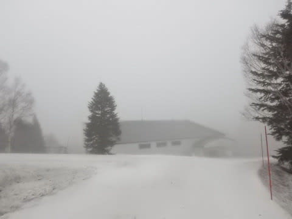

朝から強風のため，早朝営業はゴンドラが動かせ

無かったようなのですが．

なんだか，朝8:30の通常営業開始時間を過ぎても，

まったく営業開始の気配がないんですが…

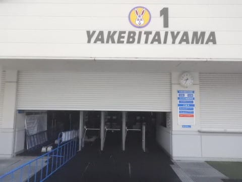

…これは．

今日はヤバいか…？？

雨の中リフトに乗って滑らないといけないのか…？？？

…と，思っていた朝9:15すぎ．

無事ゴンドラの営業が開始されました…

良かった～！

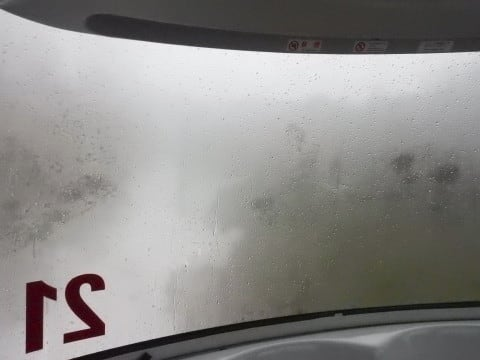

でも，ゴンドラの窓を，時折強く

雨粒が叩きます…（涙）

ってなゴンドラで，山頂に出てみると．

朝9時半ごろの山頂の気温は+7℃！！！！

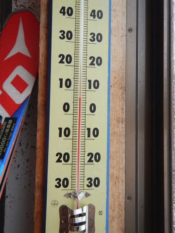

なんてこった！！

この時期の朝に，これだけ気温が上がってしまうとは…

ありえない高温…（涙）．

で．

山頂に出たものの．

やっぱり雨のゲレンデ．

誰もいないよ…

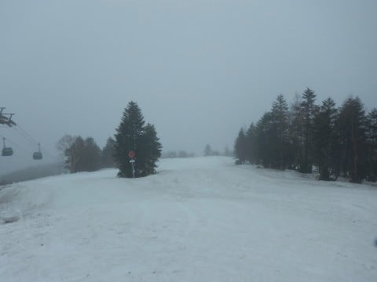

コースはシマシマというより，圧雪後の雪が

雨で解けて，キャタピラの形に残った感じ…

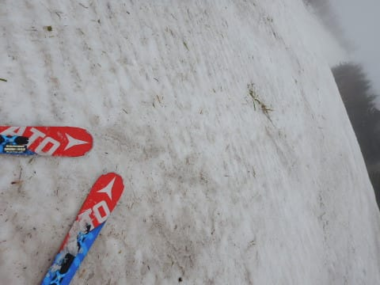

でも．

雨のおかげでネットリと板に張り付く雪にならず．

板が良く滑るから，いいんだいっ！！

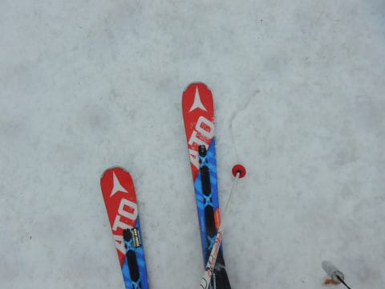

そして，ゲレンデが完全に無人で

貸し切りだからいいんだいっ！！！

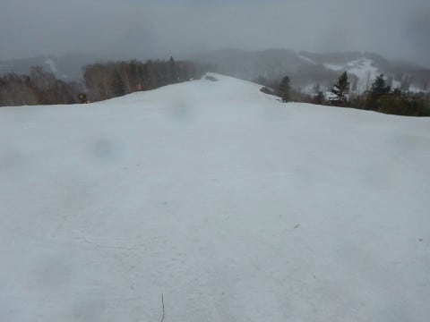

誰も滑ってないコースを，好き放題滑れるんだっ！！！

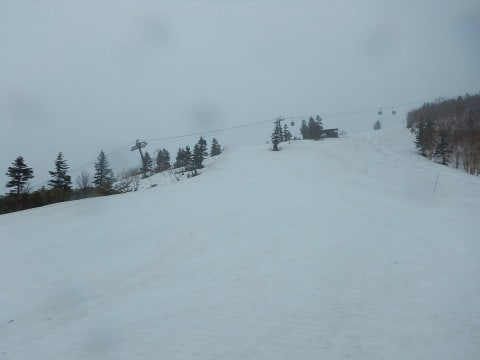

…と，雨の中．

自分に暗示をかけながら滑ってましたが．

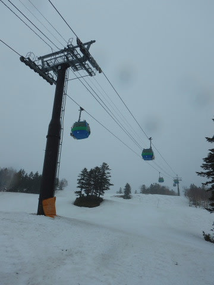

でも．

時折ガスで前が見えなくなるんですが…（泣）

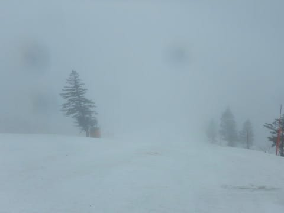

これは…

週末に向けて，神のようにいい行いをするように

お願いしたのに．

みんな，行いが悪かったんだな…←いや，そうじゃないから．人のせいにしちゃダメだから

うーむ．

GSコースも，土が出てきたところが

増えましたね…（涙）

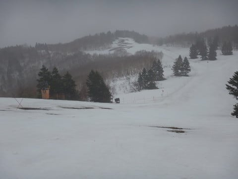

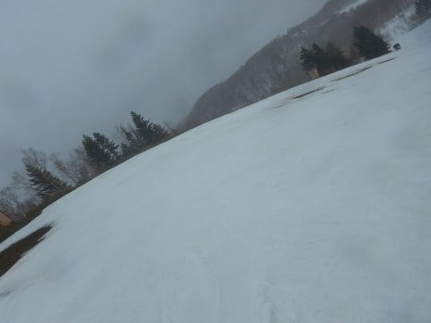

…そして，2ゴン沿いの唐松コースも

見に行ってみましたが…

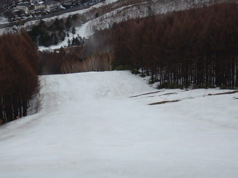

え？？

唐松コースも，もうコース真ん中に土が！？？

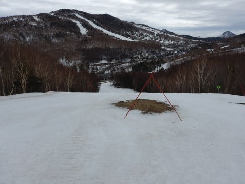

…やばい…

こんなに土が出てると…

営業終了まであと3週間あるけど．

それまで雪がもたないのでは…！？？？

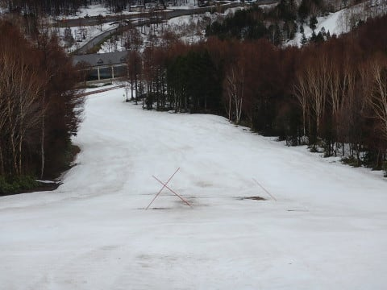

うーむ．

これはマズい…

唐松コース沿い，第2高速リフトの下も．

もう，雪が消えてちゃってますし…（涙）

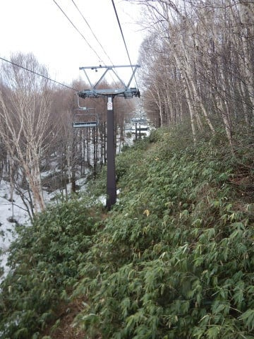

うーーーむ．

例年より2週間以上，雪が消えるのが

早い感じ…（泣）．

で．

昼ごろまで降り続けた雨は．

とりあえず，昼には止むという天気予想通り，

12時前に上がってくれて．

雨が止んだ午後は，一の瀬方面へも遠征してみました…

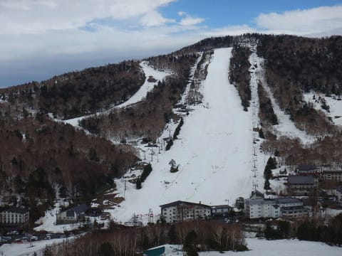

うーむ．

ダイヤモンドも，早くもコース上にかなり

土が出てきましたね…（涙）

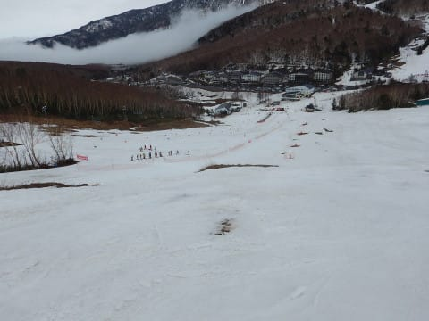

ダイヤモンドとファミリーを繋ぐ橋も

雪が無くなってPislabマットが露出してますし．

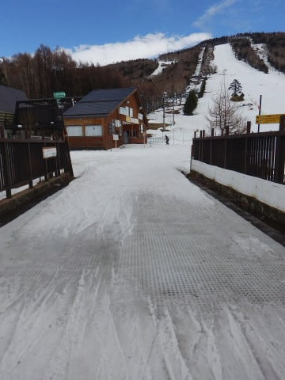

そして，一の瀬ファミリーも．

パーフェクターは終わってますね（残念）．

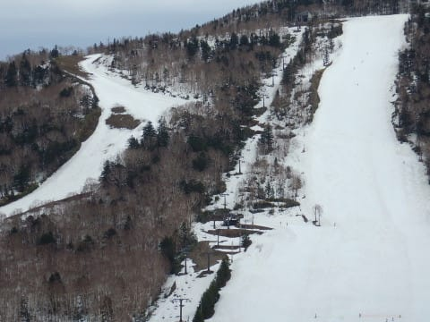

でも…

正面バーンはまだ行けそうな感じ！

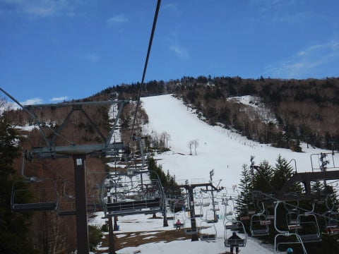

うむ．

正面バーン，まだ土は出てきてませんね…

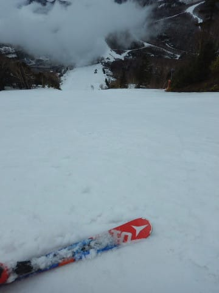

ってか，一の瀬正面バーンも，人が全くいないのですが！？？？

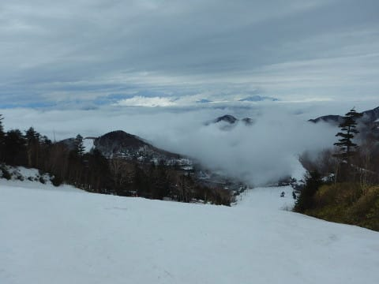

そのせいで，コースも凸凹にならず，

ほぼフラットのまま…

一の瀬から高天ヶ原の連絡路は．

うーむ．

ここもそろそろヤバそう…

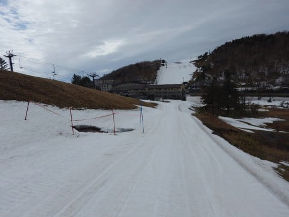

そして．

高天ヶ原は．

まだ行けそうかな？？

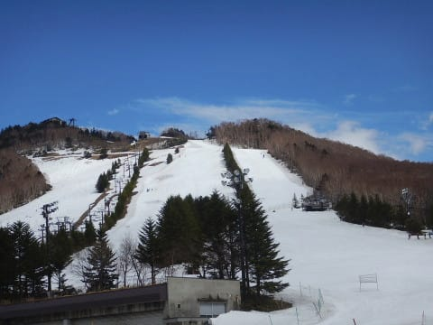

でも，モーグルバーン側は…

あぁ．

コブ溝にかなり土が出てきてますね…

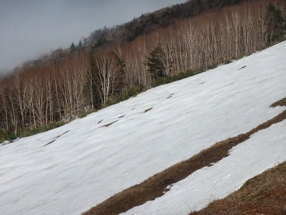

モーグルバーンは，GWまでは厳しい感じか…

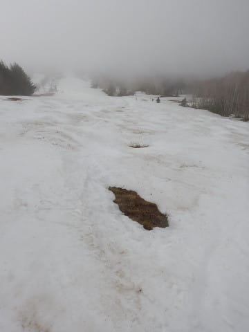

人工雪をたっぷり載せてある，NHKバーン側は

まだ大丈夫そうな感じ．

ここはGWまでもってくれそうな感じ…

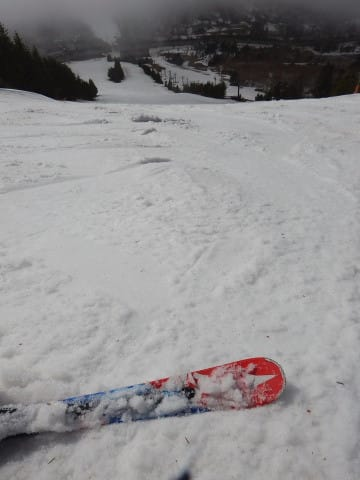

ってな感じで．

午後もすっきり晴れと行かず，

時折ガスに覆われるような天気でしたが．

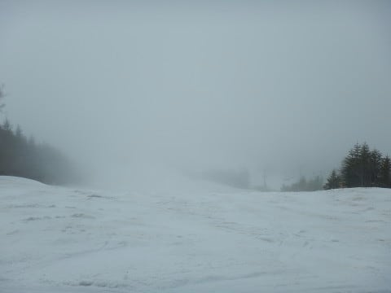

日曜というのに，恐ろしいほど人がいない

ゲレンデを滑り倒し…

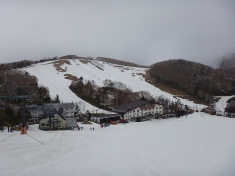

ラストはいつも通り，焼額へ戻ってきましたが．

ここも人が全然いないため，夕方になっても全く

荒れてないコースで．

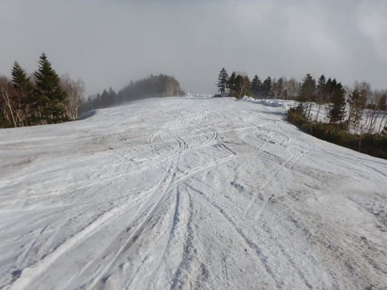

だのに，雨が降ったのでそこそこ滑走性が

良い雪を，

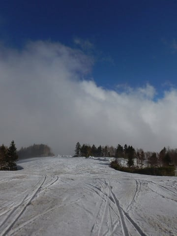

いつも通り，リフトストップまで

滑り続けたのでした…

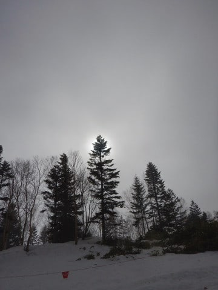

…しかし．

GWが終わるまで，あと3週間．

今週も気温が高くなりそうだし．

雪がもつのか心配…

うーむ．

今シーズン，11月，12月は冷え冷えで雪に恵まれて，

いつも数週間早くコースコンディションが良くなって，

楽しめたけど．

11月の雪は，おまけで余計にもらえたボーナスでは無くて，

4月に返さねばならぬ借金だったのか…

と，今になって思い知らされた，Skier_Sだったのでした（激涙）．

## 💬 コメント一覧

### 💬 コメント by (Seeker.NT)
**タイトル**: 残存積雪量
**投稿日**: 2018-04-17 07:15:09

ダウンヒルは降りていないのでわかりませんが、奥志賀第4〜第3〜エキスパ〜第1は、唯一、土が露出していないゲレンデでした。

露出する1歩手前の黒ずんだ箇所も無く、まだまだ行けるぞっ！と思いました。

ただ、今週中頃の雨と、週末の高温で悲惨な事になりそうですね。奥志賀混みそう。

### 💬 コメント by (Unknown)
**タイトル**: 一の瀬ダイヤモンド・山の神は終了
**投稿日**: 2018-04-17 20:16:44

https://www.facebook.com/ShigaKogen.Ski/posts/1620753194707544

ATOMIC ALL STAR CAMP が終わって力尽きましたね。

http://atomicsnow.jp/ski/event/Entry/atomic-ski-event/3170.html

### 💬 コメント by (さち)
**タイトル**: Unknown
**投稿日**: 2018-04-18 11:22:18

一の瀬只今どしゃ降りですが、朝から5名様ほど滑っておられる模様。

なんかの罰ゲームなんでしょうか…(・・;)？

なんにせよ、スゴい方々です。

### 💬 コメント by (Skier_S)
**タイトル**: コメント遅れてごめんなさい
**投稿日**: 2018-04-19 01:10:55

＞Seeker.NTさま

奥志賀の積雪はまだ大丈夫なんですね…

ヤケビのGSよりコンディション良さそうですね．

しかし，今日の雨がどの程度の影響を

与えたのか…

ヤケビはこの週末に1ゴンが営業できるのか

心配です．

＞Unknownさま

あああああ~！

終わっちゃいましたか！

山の神…

うーん．

これで，ヤケビと一の瀬が切れてしまう…

残念…

＞さちさま

志賀高原レポートありがとうございます~！

いや，どしゃ降りで5人滑ってますか…

一体どんな人なんでしょうか，気になります（笑）．

とりあえず，半端ない精神力か，

ホントに滑らないと死ぬようにできてる方か，

どちらかかと．

この雨で雪がどんなになったか，

また志賀高原レポートよろしくお願いします~．

