# GW4連休2日目，5月4日の志賀高原は…晴れ，午後曇りのまぁまぁの一日

📅 投稿日時: 2014-05-04 20:45:47

🏷️ カテゴリ: [2014スキー滑走日記](c992167609b6415052179ee69ea1ea7d8.md)

うーーむ．

予想より低気圧の通過が早まって．

残念ながら．

4連休3日目の明日．

昼過ぎに，雨が降りそうです…(涙)．

それも，一瞬，強く降るタイミングもあるかも…

その代わりといっては何ですが．

4連休最終日，6日は．

雨の心配はなくなりましたね～．

…っていうか．

上手くいくと，晴れるかも！？

…とりあえず，本題

4連休2日目の志賀高原レポートをば．

…当然，本日も朝6時からの早朝に繰り出すわけですが．

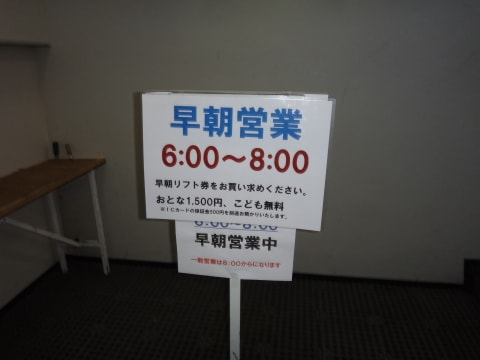

…うーむ．

今日は，今シーズン一番の人の多さかも…

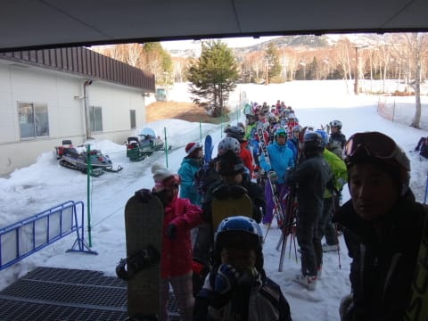

山頂に登ると．

気温はプラス5度を指してますが…

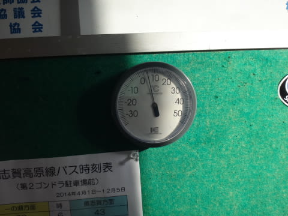

んでも．

朝イチバーンは，このGWでも最高の硬さ！

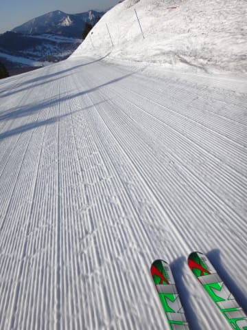

金属音がする，しっかり固めのバーンだぁ！

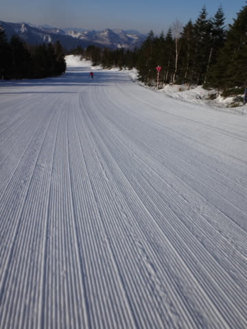

今日も，晴天のピカピカシマシマバーンを，

気持ちよく大回りっ！！

＃硬いのがだめな人はきついだろうけど

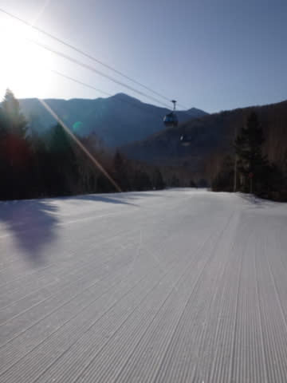

晴天だというのに．

朝は放射冷却でしっかり冷え込んだからか．

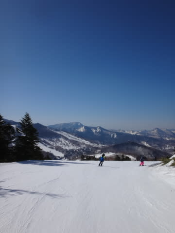

早朝終了の8時ごろまで，しっかり硬い

超快楽ハイスピード大回りバーンでしたよ～っ！！

んで．

通常営業開始時も，すっかり快晴で．

ジャケットを着ていると耐えられない暑さに

なってきて．

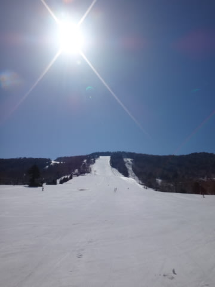

この暑さで，朝9時ごろには雪が緩み始め…．

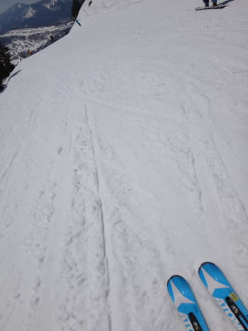

10時ごろには，緩みきった感じの，ちょっと板に

粘りつくような感じの雪になってきちゃいました…

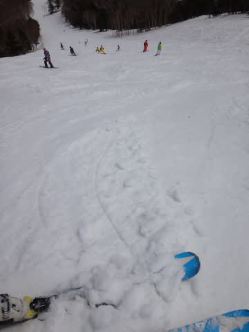

そして．

4連休2日目といえば．

おそらく，一番混雑する日．

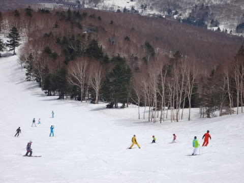

こんな感じで，ゲレンデの人はちょっと多め

ではあったけれども．

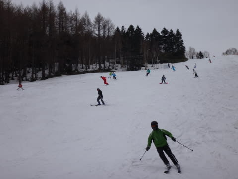

まぁ，ゴンドラ待ちはほとんどなく．

ゲートの外まで人が並ぶことはなかったですね～．

タイミングを計れば，こんな感じで．

見渡す限り誰もいないときもありますし．

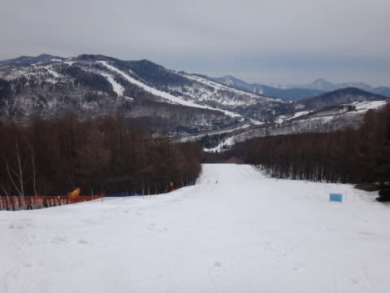

リフト待ちは完全に0でしたし．

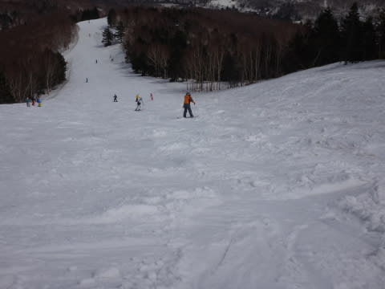

ちょっと雪が重くて．

すべりがちょっと悪いところがある以外は．

まーまーだったかな～．

と，おもったところ．

午後3時ごろ．

あり？すっかり晴天だったのが，

からちょっと曇ってきたよ…．

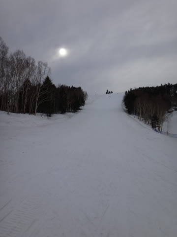

とおもったところ．

さらに追い討ち．

焼額第2ゴンドラ，機器故障により

午後3時過ぎより運休（涙）．

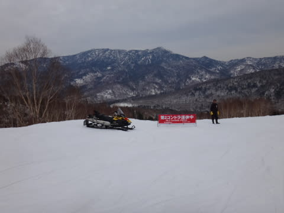

あうーん．なんで壊れるかな～．

まぁ，その代わり．

第2高速リフトを4時45分まで延長して営業

してくれたから，よしとしよう…←どこまで上から目線なんだ

ってことで．

雪もまだまだたっぷりある志賀高原．

あと2日，まだまだ楽しめますよ～！！

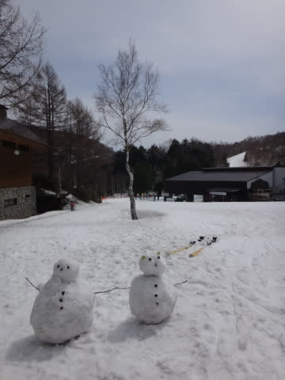

＃明日は午後は雨だけど（涙）

## 💬 コメント一覧

### 💬 コメント by (rousan)
**タイトル**: 明日は雨ですか…(ToT)
**投稿日**: 2014-05-04 21:37:11

私たちは、奥志賀コブ祭りに参加してました。

第4リフト横くらいの斜度なら、気持ちよく滑れるんですよね。

### 💬 コメント by (ゆうこ)
**タイトル**: ご無沙汰してます。
**投稿日**: 2014-05-04 21:49:00

こんばんは。今年は志賀高原に行く頻度が低かったのであまりお会い出来ませんでしたね。

私は本日奥只見丸山スキー場で、今シーズンを終えました。

また来シーズンお目にかかりましょう！

でも、ブログは年中読んでますから、これからも記事を期待してます。

Sさんは忘れてるかもしれないですが、私はジンベイ様気になってます。

私はスキーシーズン終わったので、お手軽にシーパラに見に行こうかなと思います。

### 💬 コメント by (いか)
**タイトル**: Unknown
**投稿日**: 2014-05-04 22:04:01

私もGW後半になんとか八方にたどり着きました…！

今日はコブ祭り、振り回したり

縦に落ちたりといろいろ楽しめてよかったです！

そちらは雪が多そうで、コース幅が広いですね。こちらはロング板はいらないくらいの幅です(ノω・｀)

### 💬 コメント by (はなげ親分)
**タイトル**: 早朝デビュー！
**投稿日**: 2014-05-04 22:41:54

とうとう…。

Sさんの影響で我慢出来なくなり、本日夫婦揃ってデビューしました（笑）

いや～   想像通りいいもんですね!!

癖になりそうです。いや、やられちゃいました（感涙）

10時頃には、暑くなってきたので春仕様に着替え、14時頃に力尽きる迄食事も取らず楽しみました。

うちのカミさんも明日の早朝は…、なんて気力十分です（爆）

現在、泥酔中につき明日起きれるかな～

### 💬 コメント by (Skier_S)
**タイトル**: Re:早朝デビュー！
**投稿日**: 2014-05-05 06:25:12

今日は、2ゴンが故障でペアリフト

で早朝やってます…

あんまり面白くありません（涙）

2ゴン、修理に時間がかかるので

今シーズンはもう動かないようです（泣)

明日は奥志賀早朝かな～

みなさんのコメントには、後ほど個別レス

いたします…

### 💬 コメント by (Skier_S)
**タイトル**: 今日は小雨で済みました
**投稿日**: 2014-05-05 20:01:24

＞rousanさま

今日は，午後2時ごろ瞬間的にボタボタと

降ってきましたが，それ以外はなんとか小雨で

もってくれて，助かったって感じでしょうか．

今日も奥志賀だったんですか？

うちは午前は一の瀬，午後はヤケビでした…

＞ゆうこさま

あらー．

今シーズンもうおしまいですか…

春はほとんど志賀でお会いできませんでしたね～．

冬モードでダイビングレポートもあれなので，

今回の冬モードが終わったら，ジンベエレポート

する予定です～．

お待ちください～

＞いかさま

あれ？

八方はそんなに雪がないんですか…

こちらはまだ整地大回り祭りですよ～！

特に早朝は最高ですよ～！

＃ヤケビゴンドラ動いてないけど(涙)

＞はなげ親分さま

いやー．

いいでしょ？早朝．

＃今日はかなりがっくりでしたけど…

はっきりいって，昼間寝てて早朝だけ

滑っても良いくらいだと思ってます．

でも，ホントに早朝から昼まで滑れば

十分一日分滑った感じがしますよね～

