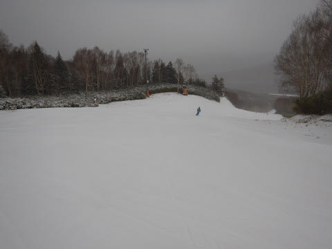

# 2018/12/9(日)の志賀高原焼額山スキー場，詳細モード…終日冷え冷えの雪降り慣れど積もらず．そしてリフト待ち10分以上（涙）

📅 投稿日時: 2018-12-11 04:23:39

ということで．

本日は，昨日速報した，日曜日の焼額山スキー場の

詳細レポート！

えー．

まず．

日曜の朝．

起きてから，宿の周りを見たところ…

をを！

雪が積もってるよ！！

真っ白だよっ！

と，喜んだのもつかの間．

積雪，わずかに2cm程度…（涙）

足りない…

圧倒的に積雪が足りない（泣）

今日も朝イチから焼額にやってきましたが．

うーん．

積雪はほんのわずか…

8:30のリフト開始時に並んでいたのは

それほど多くなかったですね～．

「これは…昨日のゲレンデコンディションが悪いという噂が

　広がって，今日はそれほど人が来ないかも…？」

と．

朝のうちは楽観的に思っていたのでした…

ゲレンデに出ると．

一面真っ白に見えますが…

積雪わずか2cmのため．

ゲレンデコンディションは全然改善して

おらず．

ゲレンデ脇は，まだブッシュ

ぼうぼうです（涙）

コース幅も，全く広がってません…（残念）

あさイチこそ，ゲレンデの上にうっすら新雪が

積もっていたものの…

こんな感じの柔らかい雪を滑れたのは

1～2本だけ．

すぐに下地の硬いバーンが顔を出し．

昨日と同じ，ツルツル地獄と化して

行ったのでした（涙）

そして．

ツルツルバーンを泣きながら滑っていると．

朝9時半にはリフト5分待ちを超えてきて…

そして，10時を過ぎると．

うぎゃーーーー！！

リフト待ちがすごいことに！！

リフト待ち最大12分（激涙）

さらに激遅ペアリフトは，乗車時間

8分近くかかるので，1本滑り終わってから

次に滑るまで，20分間かかります（泣）．

そして，ペアリフトは寒い吹きさらしの中

8分間宙づりになるという，冷凍人間製造

アトラクションのため．

氷点下10度近いこの日は，かなり

きついんですが…（涙）

そこまで苦労して滑るゲレンデは，

人があふれてこんな感じだし（悲）

実質滑れるコース幅は，20m程度なので．

ゲレンデはかなりすごい状況に…

そこまでして，なぜこんな大勢の人が，

こんなブッシュやら浮石がところどころ

顔を出すアイスバーンゲレンデを滑って

いるんだろう？？←あなたもその中で滑ってる一人でしょ

結局この日は，終日雪がぱらついたり

止んだりで．（雪は降ったものの，全く

積もる気配はなし（涙））

そして．

昼休み時間は，5分前後までリフト待ちが

短くなったものの，午後3時まで5～10分の

リフト待ちが続き（涙）

結局この日は，

雪が吹き付けて寒い

リフト待ちが長い

バーンコンディションは

ブッシュ＆浮石＆アイスバーン

コース幅が狭い

という感じで．

3重苦に一つ加えた，4重苦の一日でした…

結局，リフトが空いてきたのは午後3時を

過ぎたころ．

ほとんどの時間は4重苦状態の一日でした…

うーーーーむ．

とりあえずこの日は一日結構冷え込んだので．

焼額第2高速リフト側の唐松コース．

全力で人工降雪を打ち続けていたのが，

わずかな心の支えだったかな…

雪がつき次第，平日でも第2高速を

営業開始するようなので．

今週末には，第2高速が動いていると

いいなぁ…

今のところ，11日夜から12日朝にかけて．

0度線は志賀高原より北に上がり，

雨になる可能性が高いけど…

でも，0℃線の予想位置．

昨日の予想より南に下がってる！！

志賀がギリギリ0℃線の近くなので．

0度を超えるのは一瞬で済むかも…！？？

そして．13日以降は…

また冷えるよ！

こんな感じで，13，14，15日と．

平年比最大-6℃まで冷え込みます！

これは，奇跡の冷え込みかも…

うむ．

志賀高原はドサドサ積もるほどではないけど．

積雪もちょっとありそうだし．

人工降雪機もフル稼働し続けられそうだし．

今週末は，ちょっと期待してもいいかな？？

## 💬 コメント一覧

### 💬 コメント by (サトシ父)
**タイトル**: 週末に期待
**投稿日**: 2018-12-11 17:07:30

週末今シーズン初滑りです、ブログ拝見してワクワクしてきました。唐松コースオープンするといいですね。奥志賀は無理かなぁ…

### 💬 コメント by (いか)
**タイトル**: Unknown
**投稿日**: 2018-12-11 23:13:34

いやはや、開いているスキー場もそれはそれで厳しいコンディションですね、、、

私はホームが開かないので、まったくなにも出来ずです（笑) 今週末開かないと、なんと年内滑走が1日という珍シーズンになってしまいそうです。

という大変なシーズンですが、今シーズンもどうぞよろしくお願いします〜

### 💬 コメント by (Skier_S)
**タイトル**: コメント回答遅れました…
**投稿日**: 2018-12-12 23:57:40

＞サトシ父さま

今週末初滑りですか！

焼額にいらっしゃるんですか？？

おそらく，13日～14日はそこそこ積もるので，

14日の金曜までには2高動いてくれるのでは…

と期待！

今週末はリフト2本動くはずです…

奥志賀は…うーん．

ちょっと厳しいかも…

＞いかさま

八方はまだまだ厳しそうな感じですね…

シーズン券買ったのに使えないのが辛いですね．

まだ今週末の営業も確定してないようですから，

ぜひ今週末は志賀高原にお越しください（笑）

今シーズンもよろしくお願いします．

