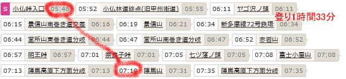
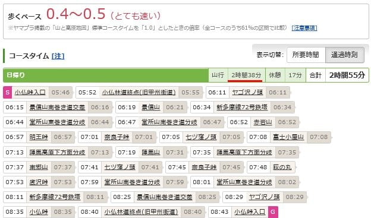
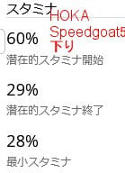

# 私の2023/2024シーズンも無事始まったけど

📅 投稿日時: 2023-10-25 06:07:35

ってなことで．

私の2024スキーシーズンも無事始まったわけですが…

初日のイエティを滑ってみて．

スキーを履いても，まったく久しぶり

感がなく．

最初の1本目から何の違和感もなく

滑り出せて．

…そのせいで，最初の1本は大切に行く

つもりが，

「これだけ滑れたら，大事に行かなくて

いいや」

って感じで，人がいないガラガラコースを

思いっきりかっ飛ばしちゃったわけ

ですけど…

撮ってもらった自分の滑りのビデオを見ても，

まぁ初日とすれば，まともに滑れてるんじゃ

ないかな？

久しぶり感がないのは，板を履かない

オフシーズンが4か月切ってるからという

のが大きいかもしれないけど．

あと，シーズン初日というのに．

コース整備中の1時間休んだだけで，

それ以外は昼も休まずぶっ続け8時間

滑っても，まったく疲労感はなくて．

筋肉痛も何も起きず．

シーズン初めから完全に体が出来上がって

るよ…！

とも思った，イエティでの初滑り．

うむ．

これは明らかに，山登りで体力がついた

というのが大きい…！

いや．

夏の山歩き．

スキーのトレーニングに無茶苦茶

いいんじゃないか？？

…と，思い始めたわけですが．

おそらく，（人がいないところは）

かなりのハイペースで走って下る，

私の山歩き←「歩き」じゃないよね

筋力や持久力がつくのは当然として．

トレッキングポールを使って走って

いるので…

感覚的には下り坂はストックをもって

滑ってる感覚に近いし．

さらに，木の根っこや石とかで足場が

悪いところを，瞬間の判断で足場を

選んでバランスを取りながら下って

行くのって，体幹を鍛えるのに

めちゃくちゃ効くし，

バランス感覚もすごい研ぎ澄まされる

感じがあるので．

おそらく，山を走るの．

スキーのトレーニングに無茶苦茶

いいんじゃなかろうか…

と思った今回．

いや，山を歩き始めてまだ5年．

そして，夏の間隔週で行くように

なったのはコロナが始まってからの

3年間．

さらに，走るようになったのは

膝のサポーターとトレッキングポールを

使うようになり，膝の痛みが出なくなった

ここ2シーズンのこと．

そして…

今シーズンはだんだんタイムが上がり．

この夏，小仏P→景信山→陣馬山を靴を変えて

何度か[チャレンジした報告](ee26072a2a0983fdce7ac9ffbd495d510.md)をしたけど．

最初のLaSportivaデビューでは登り1時間53分

2度目のTECNICAチャレンジでは登り1時間40分

3度目のHOKAでのチャレンジでは登り1時間39分

と．

着実にタイムを詰めてきましたが…

実は先々週の週末，TECNICAの靴で

今年4回目の小仏P⇔陣馬山のチャレンジを

してきたところ．

登り1時間33分と，HOKAの記録を6分縮めて

しまいました～！！

…うん．

タイムが上がったのは靴のせいもあったけど．

やっぱり，何度も走るたびに体力が

上がって，タイムがあがったってのも

あったのね…

ちなみに，下りは最初のLaSportiva

デビューでは下り1時間29分．

2度目のTECNICAチャレンジでは下り1時間23分

3度目のHOKAでのチャレンジでは下り1時間15分

…そして，TECNICAの4回目では下り1時間12分と．

これもまた，記録を更新してきました…

ってなことで．

最初は3時間を越えていた小仏P⇔陣馬山

往復．

最後は2時間38分くらいで

往復できるようになりましたが．

実は今回は，それほど体力を使った感が

なく…

1回目が下り終わった後でスタミナ残1％と

ほぼ体力を使い切っており．

2回目が29％，3回目が28％のところ…

　

　

今回は，

走り終わった後でも，スタミナが49％と，

半分くらいしかスタミナを使ってないという

Garminさんのお告げであり．

走り終わった後の体感的にも，まだ

1往復くらいできそうな感じで，

まだまだ体力が残ってる感じでした…

結構走ったのに，スタミナを使ってないとは…

山を走り続けたこの夏，身体がかなり

鍛えられたんだろうなぁ…

（下グラフの青いところが走ったところ，

　緑のところが歩いたところ）

ちなみに．

この夏は雲取山にもいってきたけど．

雲取山も山頂から丹波山村駐車場まで，

1時間47分で下山してたり…

結構早いペースで移動できるように

なってきました…

ってなことで．

夏に山を歩くようになって，←だから，「歩く」じゃなくて「走る」だってば

筋力，心肺能力，バランス感覚，持久力など，

いろんなものが鍛えられた感じがあって．

シーズン初日に，むしろ前シーズン終了時より

体力がある感じで…

さらにバランス感覚も研ぎ澄まされた

感じがあり．

うん．

やっぱり山を走るのって，スキーの

トレーニングに無茶苦茶いいんだな…

と，改めて感じた，Skier_Sだったのでした．
