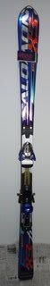
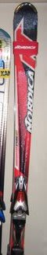

# 今シーズンの板たち

📅 投稿日時: 2010-11-25 00:39:45

先日，今シーズンの新マテリアル，小回りメインマシンとなる

SALOMON 24hours LMを紹介しましたが．

今シーズンを共に過ごす，それ以外の相棒をご紹介．

'09 SALOMON DEMO X3 165cm

昨年までの小回りメインマシンでしたが，

新小回りマシンを買ったので，サブ機へ格下げ．

シーズンイン・終了時の石ころを踏んづけちゃいそうな

時などに出動．

'10 ATOMIC D2 DEMO Type-A 175cm

大回りメインマシン．

特に4月ごろのざぶざぶの雪で威力を発揮する，

春雪スペシャルです．

'07 NORDICA Doberman GS-pro 181cm

朝イチ焼額専用マシン．

人がいるところで履くと楽しめない…というより，危険な板．

とりあえず，人がいなくて飛ばせるところでしか履けませんが，

人がいないところをトップスピードでひたすら落下していく

ための板．

シーズンの出動回数はそれほど多くないなぁ…

って感じで．

今シーズンは，これら4セットの板と共にすごします．
