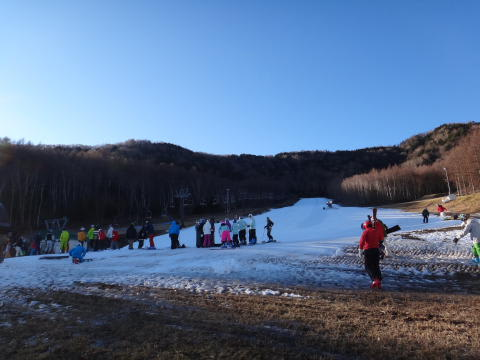

# 12月4日の八千穂高原スキー場の詳細レポート

📅 投稿日時: 2011-12-06 01:36:52

🏷️ カテゴリ: [2012スキー滑走日記](cca3a0e9524e0203150f790b1fc3c71ad.md)

本来．我が家にとって．

12月の最初の週は．

シーズン券を買った志賀高原に行くのが恒例となっているのだが…

金曜の段階で．

どう考えても[土曜の天気は激悪](e03e6c74503520854ae874b2915babaa7.md)になってしまうのは明白．

…土曜のスキーはあきらめたぞよ（涙）．

日曜に日帰りスキーに行こう…

んで．

スキー仲間より「八千穂高原はこの時期にしては結構いいよ」

とのことだったので．

これまで一度も行ったことのない八千穂高原へGo!

場所的には，佐久から南下すること1時間．

小海リエックスの近くまで行った所ですねぇ．

高速からちと遠いです．

で．晴天だけどそこそこ冷えた日曜．

この時期滑れるのは第4リフト1本．

コースは，幅30m，長さ500m，斜度10度強の見事にフラットな緩斜面．

ホントに長方形の板を傾けたような，見事な一枚バーンです．

ここに，1本ペアリフトがかかってます…

朝イチから，結構人が待ってるなぁ…

雪質は…

前日あったまって，この日の朝は冷え込んだので．

見事に硬く締まったバーン．

ちょっとアイスバーン気味…

でも，夕方のアサマ2000みたいにつるつるじゃないです．

でも．

雪がしっかり固いので．

緩斜面なのにしっかりスピードが出る！

おおお！

アサマ2000並みの高速トレーニングができる！

（緩いけど)

幅が広いから，問題なく大回りできる！

（緩いけど）

人口密度はアサマ2000より低いから安心して飛ばせる！

（緩いけど）

…このゲレンデ上の人の少なさを見よ！！

さらに．

雪は100％人工雪で，そんなに厚さはないものの，しっかり固かったので

コース上に土がコンニチハすることはなかったですね～．

先日の雨にもかかわらず，コースに穴があいていないというのは，

この時期としてベストに近いコンディションではなかろうか？？

この週末にオープンするはずのスキー場が，雪不足で営業できなかった

影響か，比較的コンディションのよかったこのスキー場に人が

集まったようで，普段はほとんどリフト待ちがないらしいこのスキー場．

この日はリフト待ちがありましたね～．

朝イチから，3分程度．

10時ごろにピークで7-8分，

列は短いけど，ペアリフトで輸送力が低いので，

そこそこ待ちます．

…しかし．逆に言えば，ペアリフトで運べる分しかゲレンデに

人がいないので，ゲレンデの人口密度はすごい低いです．

だから，気持ちよく飛ばせるという…

うーむ．一長一短だな．これは．

で．

午後は，トレーニングに来ていたレーサーなど，スキーヤーは

一気に減ったけど…ボーダーが増えてきて，2-3分待ち．

…まぁ．このスキー場．マイナーですので，リフト待ちがあるのも

シーズン中にこの日一日くらいじゃなかろうか？？

で．

午後になっても．

気温は結構低いまま．

天気は快晴なのに，雪は全く緩まず．

ざくざくになったりせず，ずーーーーっと

固さを保ってくれています．

そのため…

ををを！

午後になってもフラットなのでぜんぜん大回り可能！

（リフト待ちがあるけど）

午後になっても人が少ないので飛ばせる！

（リフト待ちがあるけど）

なんにしろ，アサマ2000だと，午後はコブコブ＆小回り道になるけど．

ここは午前と午後，全くコンディションが変わらない…

すばらしい！！！

とても，午後3時近くのゲレンデとは思えないフラットさ．

あと，ゲレンデの人の少なさ！

ということで．午後3時くらいまで．

全くこれっぽっちも雪が緩んだりすることなく．

朝イチの気持ちよい固め斜面のまま，

ずーーーーっと楽しむことができたのでした．

全体的にゲレンデコンディションが最悪だったこの週末．

一日天気も良く，ゲレンデもよく．夕方まで気持ちよく滑れたので．

日曜日の八千穂日帰りを選んだのは大正解だったかも…
