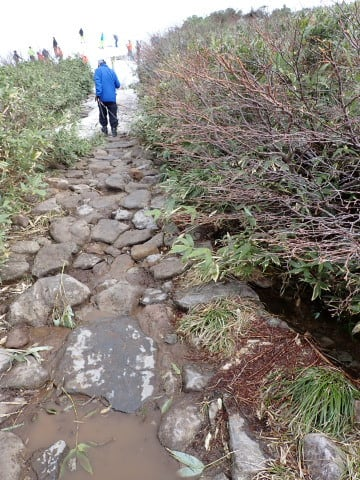
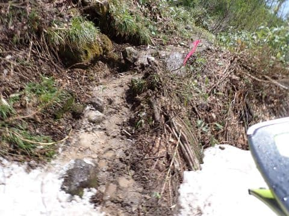
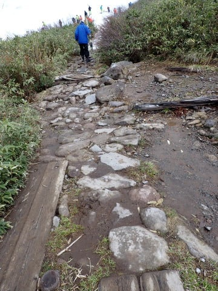

# FISCHER RANGER 130のブーツを月山で使ってみたら…素晴らしい！これは月山用に作られたブーツに違いない…っ！！

📅 投稿日時: 2023-06-13 01:41:00

この土日は，来週の中頃までにやっつければ

いい宿題はあったものの．

月曜までにやらないと死ぬ宿題がなかったので，

どうも本気になれなかったからか…

土曜は睡眠不足のために一日ほとんど寝て過ごし．

日曜はスキーシーズンには買う暇がなく，

スキーシーズンが一息ついたら買わねば

ならないと思い続けていたいろんなものを

買いに出かけたりなんだりで夕方に

なってしまってたのでした…（涙）

土日に仕事をやりためて，今週は徹夜

しないですむようにしようと思っていたのに．

結局仕事を始められたのは日曜午後になって

からだったので，あまり仕事は進まず（涙）

今週も，いろいろクリティカルになるかも…（泣）

ってなことで，本題へ．

こないだ月山に行ってきたわけですが…

月山といえば，駐車場からリフト乗り場まで

かなり歩くし．

さらに，リフトが最終形態となったら，

リフト乗り場・降り場で岩場や泥の上を

歩くことになるので…

こんな時こそ，ウォークモード付きで

ビブラムソールで岩場もそのまま安心して

歩けちゃう，RANGERブーツの出番では？？

…と．

今回は新しいFISCHER RANGER 130のブーツを

履いていったのですが．

いつもなら，駐車場からはリフト乗り場までは，

スキーブーツを持っていき，普通の靴を履いて

歩いて行くところを…

まずはそこから，RANGERブーツで歩いていって

みましょうか！

…長距離のアスファルトの上も，ウォークモード

だと足首が自由に動くし．

始めて，グリップウォークソールの

ブーツで雪の上以外を歩いてみましたが…

スキーブーツにソールプロテクターを

つけたのと全然違って，歩きやすい！

ブーツにソールプロテクターをつけただけでは，

平らなソールがガッコンガッコンいって

歩きにくいけど．

グリップウォークソール，足裏のつま先部分が

軽く反り返っているので，結構歩きやすく

できてる…！！

この赤線で記したわずかなロッカーで，

すごい歩きやすくなってますね…！

うん．

これなら，月山の駐車場まで歩くのも，

全然苦じゃない…

ブーツを持って駐車場まで歩かなくて

いいので，楽！！

そして．

月山の最終形態では．

リフトに乗るときにこんなところや…

降りた後には，こんなところを歩かねば

ならないんですが．

これも，スキーで滑り終わった後，

いちいちソールプロテクターをつけなくて

済むし…

さらに，ソールプロテクターをつけた

ブーツより，ビブラムソールがついてる

ブーツはグリップが強くて濡れた岩の上でも

滑りにくいし．

そのうえ，ウォークモードで足首が自由に

動くので…

足場が不安定な岩の上でもバランスをとって

歩きやすいです！！

そして．

雪の上に出たら，スキーモードに

切り換えてバックルを締めるだけで

すぐに滑り出せて．

ソールプロテクターを外す必要もなければ，

泥だらけのソールプロテクターをどうやって

持ち運ぶかの心配もいらない気楽さ…

うーん．

このブーツ，実は最終形態の月山用に作ったんじゃ

ないかな…！？←そんなわけない

そして．

肝心の滑りですが…

まぁ，普通のフレックス130のブーツにしては

柔らかさを感じるけど．

駐車場から岩場を歩いた後では．

これだけ歩けるブーツで，こんなにしっかり

板が踏めていいのか？？

という感じで．

板がもぐって，ガンガン雪にたたかれちゃう

ような，ずぶずぶの重い春雪ではなく．

しっかり踏まれた感じの柔らかめ圧雪の

沢コースでは，結構いい感じだったし．

月山の柔らかめのコブ斜面には，むしろ

このくらいの柔らかさのブーツがちょうど

いいんじゃない？

という感じで．

実はコブ斜面用ブーツとしては，

ぴったりくる感じのフレックス．

いや．

月山の雪やコブにもちょうどあった

フレックス感だし．

長距離や岩場，ぬかるんだところを歩くのも

歩きやすいし．

泥だらけのソールプロテクターのつけ外しを

しなくても済むし…

たぶん．

いやきっと．

このブーツは，月山の最終形態を滑るために

つくられたに違いない…っ！！←違いすぎだから

とりあえず．

最終形態の月山で滑るには，めちゃくちゃ

適したブーツで．

買ってよかった

と思ったけど…

これが型落ちの超バーゲンプライス品で，

エキップさんチューン込みで3万円台で

買えたということを考えると．

これから2度とこんなお買い得ブーツは

出てこないだろうし，物欲に負けて正解だった

と，物欲に負けたことを自己正当化し続けた，

Skier_Sだったのでした…

