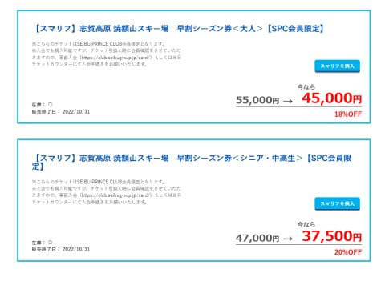
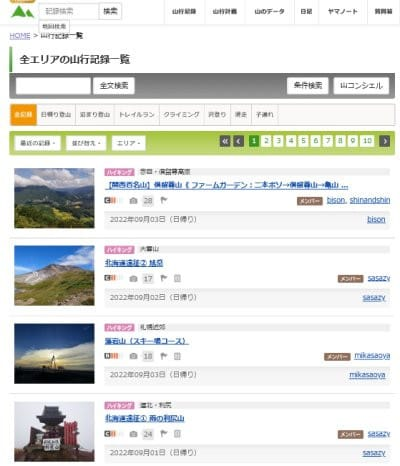
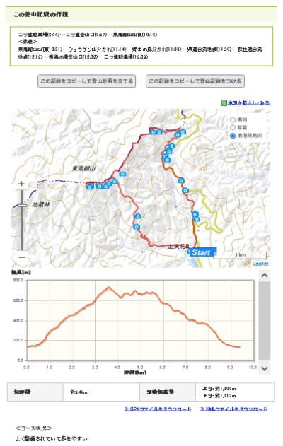
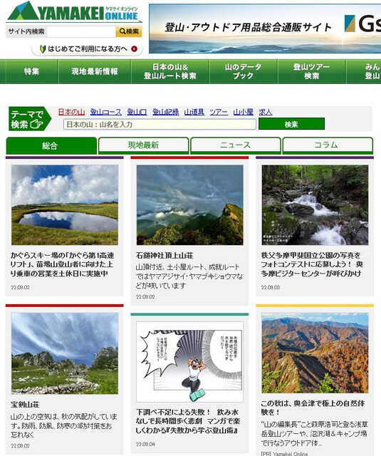
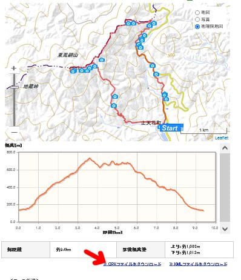
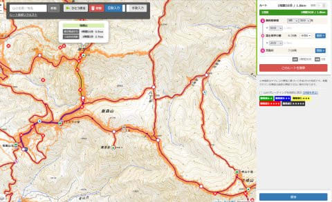
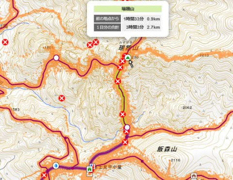
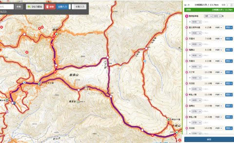
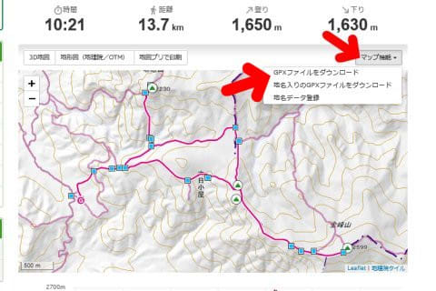

# 新しいスマートウォッチ，Garmin Fenix7Xを買ったよ！その14…PC版Garmin Connectを使って登山用ルートを作成，まずはGPXファイルの作り方

📅 投稿日時: 2022-09-08 01:15:07

えー．

本日，コメントをいただいたのですが．

どうやら，[SURF&SNOWのページ](https://surfsnow.jp/guide/htm/r0130tk.htm)で，

既に焼額山限定リフト券の販売が

始まっているようです…！

（[SURF&SNOW　焼額山ページ](https://surfsnow.jp/guide/htm/r0130tk.htm)より）

これを見ると…

22/23シーズンの焼額山限定シーズン券．

早割のプリンスクラブ会員料金が

大人：45,000円

シニア・中高生：37,500円

ということらしく．

（プリンスクラブ会員には無料で登録できます）

昨シーズンの大人41000円．中高シニア34000円から，

それぞれ4000円と3500円値上がりですね…

やっぱりだいたい1割値上がりですか…（涙）

このパターンで行くと．

全山共通一日券が昨シーズン6000円だったけど，

今シーズンは6500円くらいになるってことかな？？

気軽に来れるお値段じゃなくなるので，

来シーズンお客さんが減らないか心配…

あるいは．

「リフト券が高くなった分，いっぱい

滑らないともったいない！

お昼に休むなんてもったいない！！」

って人が増えて．

お昼も休まずに狂ったように滑り続ける

人が増えるんじゃないかな…←いや，それは無いから

ってなことで，本題へ．

今日はGarmin Connectの記事の続きです！

（Garmin Fenix7Xのレポート全16回のもくじ

機能説明，登山用地図の作り方，登山で使ってみた…など

は[ここをクリック](e516b23a4874189de2e9208be87fa5184.md)）

私がこのGarmin Fenix7Xを買った理由は，

スキーの時の滑走標高差やGPSでの

滑走ルートの記録，

さらには山登りの時の心拍数や標高を

正確に測りたい

…ってのがあったのですが．

そもそも，Fenix7Xを選んだ最大の理由ってのが．

「登山時に時計で地図が見れる！」

「事前にルートを設定しておけば，

　どっちに行けばいいかのコースの

　ナビゲーションやルート外れの

　通知をしてくれる！」

「目的地・経由地までの距離が分かる！」

というところ．

だもんで．

登る山のルートマップを事前に作っておいて，

ウォッチに入れておく

というのが大事な登山前の大事な営みに

なるわけですね．

ってなことで．

このルートマップですが，PC版の

Garmin Connectを使って作ることになりますが…

まず初めに，

登山ルートのGPXファイルを作る

必要があります．

GPXファイルって，GPSデータ記録とかを

保存するのに使う，経度・緯度でルートが

記されたデータなんですが…

GPXファイルの作り方は，いくつもあります．

1．過去のGPSデータをGPXデータにして出力する

2．他の人が作ったGPXデータを使う

3．GPXデータを作れる「登山計画ソフト」みたいなのを使う

あたりが代表的なところでしょうか…

んで．

1．の過去のGPSデータからのGPXデータ作成ですが．

これは，以前行ったのと同じルートをたどるときしか

役立たないので，あまり使わないかな…

2．の，他の人が作ったGPXデータを使う方法ですが．

これはいくつも方法があります…

例えば，私が使ってる[ヤマレコ](https://www.yamareco.com/)なら．

いろんな人が過去の山行記録をのこしていて

くれていて…

（[ヤマレコ](https://www.yamareco.com/modules/yamareco/viewrecs-0-photo.html)より）

このそれぞれの記録を見てみると．

こんな感じでマップとルートが出てますが…

その地図の右上．

「マップ機能」から，

「GPXファイルをダウンロード」

すれば，その山行記録のルートのGPXファイルを

ダウンロードできます！

そのほかにも，[ヤマケイオンライン](https://www.yamakei-online.com/)とかでも多くの

記録を見ることができて…

（[ヤマケイオンライン](https://www.yamakei-online.com/cl_record/)より）

ここでも，それぞれの記録の画面に，

地図とルートが出てますが．

ここから，「GPXファイルをダウンロード」

することができます！

…ただ．

他人のルートを参考にする場合．

他人が間違えていたり，寄り道してたりすると，

その通りにナビゲーションされちゃう

という問題があります…

だもんで．

やっぱり一番いいのは，自分でルートを作ること．

私は，ここでもヤマレコを愛用していて．

ヤマレコだと，「登山計画作成」を選べば，

こんな地図から…

次に行きたいポイントを，順番に

次々クリックして行けば…

あっという間に簡単に，登山道に沿った

ルートが簡単に作れちゃいます！

そして，このルートを保存したら．

「山行計画」から，保存した記録を見れば．

この地図のメニューの右上のマップ機能から，

登山道に沿ったルートのGPXファイルが

作成できます！

私はいつもこの方法でGPXファイルを

作ってます…！

ヤマレコ，結構便利です．

ってな感じで．GPXファイルを作ったら．

次は，GPXファイルをGarmin Connectから

ウォッチに転送します！

…そのやり方は，次回に…

## 💬 コメント一覧

### 💬 コメント by (スシネコ)
**タイトル**: Unknown
**投稿日**: 2022-09-08 13:07:30

登山ルートの作成とGPXファイルでの転送、ホントひと昔前よりも便利になりましたよね。昔ながらの地図とコンパスを見ながらバリルートを行くのも楽しいですが、やっぱりGPSがあると安心です。

あれ？　一つ気になったところが「お昼も休まずに狂ったように滑り続ける人」っていう部分。

比較的空いてくるお昼こそ、ヒャッホーって声出して１ゴングルグルしてカロリーメイトをモグモグするのが、私のような一般スキーヤーの普通の滑り方だと思っていたのですが。あれ？

### 💬 コメント by (Skier_S)
**タイトル**: ＞スシネコさま
**投稿日**: 2022-09-08 23:01:02

ホントに，最近はGPSのルートガイドが便利になりましたよね…

で．

スシネコさんが言っているのは．

普通のスキーヤーではないです．

それを一般スキーヤーだと思っている時点で，すでにかなり毒されてます．

確実に終わってるレベルです…

