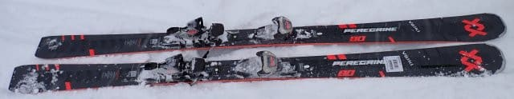
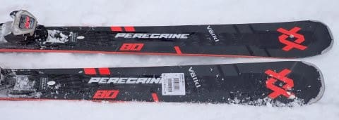
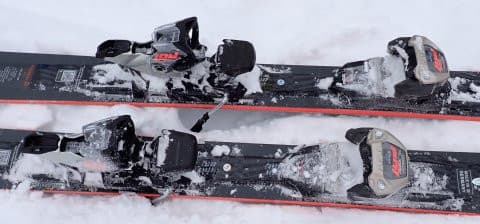
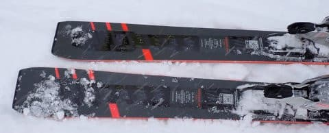
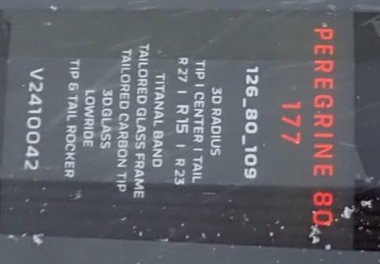

# 2025シーズンモデルのスキー板，試乗レポートその12…VOLKL PEREGRINE 80

📅 投稿日時: 2024-06-14 04:02:09

今日もまだ仕事が終わっておらず．

明日締め切りの資料がまだ2本もある状況…（泣）

今日は一体いつ寝れるのか？？

それなのに，この状況でもBlogを書くというのか？

ってなことで．

それでもBlogを書きました～！

ここしばらく，月山レポートが続いたので．

今日は久しぶりの2025モデルのスキー板の

試乗レポート．

今回はフォルクル編です！

〇VOLKL PEREGRINE 80 177cm

オールマウンテン

以前，[PEREGRINE82のレポート](ec47f85c1c7783c522132d9b2da602343.md)を書きましたが．

こいつのセンター幅が狭いモデルです．

82と比べてセンター幅が2mm狭いだけじゃなく，

フレックスもちょっと優しめになっていて，

お値段も2万円ほど安くなっており．

82はトップモデル，80はそれから一つ

下のモデルという位置づけみたいです．

実際に滑ってみると…

やっぱり，82の方がフレックスが強いですね．

こちらはメタルの張りが弱めで，

たわみがよりよく出る感じ．

前モデルのDEACON84と比べても，

柔らかめに感じます．

ただ，グリップの強さは82と比べてそこまで

大きく落ちている感じではなく，

グリップした中でよりたわみを出しやすく

なった感じですね．

なのでこの板も，セミファットと思えない

くらいしっかりトップからテールまで

グリップして，整地もキレイにカービングで

回っていけます！

そして，複合サイドカーブのおかげか．

柔らかめのフレックスでも，板が回り

過ぎることはなく．

スピードを出した中でも，縦目に落として

行くことも，たわみを出して小回りっぽく

回ることもできます．

トップがクイクイ勝手に内側に入ってくる

旋回性の高い板というより，たわませただけ

回ってくるすごい素直な感じの板で，

好きな旋回半径で回ることができます．

トップを抑えると割と縦目に落ちて，

かかと付近に荷重するとくるっと回って

キレ上がっていく感じですかね～…．

板のグリップはしっかりしていて，それでいて

旋回半径の自由度が高いので，あまり

ずらして滑らなくても，硬めの圧雪から

柔らかめの新雪が乗った斜面まで，

どんなところでもカービングだけで

滑っていける感じ．

177cmという長さは感じず，板が軽めなのも

あり，かなり軽快感じる板です．

軽さがあるのに，振動吸収性も強いからか．

荒れた斜面でも板が叩かれる感じがなく，

結構なハイスピードで新雪があら踏みされた

荒れた斜面をスムースに切っていくことが

できます．

センター80mmというのもあり，荒れた斜面の

走破性も高いし，新雪での浮力もそこそこ

あります．

結構スピード耐性もありそうで，

ガチガチの聖地でトップスピードを出すと

いうのでなければ，かなり荒れた斜面でも

結構なスピードで滑ることができるので…

整地もしっかり滑りたいけど，新雪や春雪の

荒れたところでも行ける，万能の

セミファットが欲しい…というならかなり

おススメできる板．

ただ，張りの強さや返りは

DEACON84やPEREGRINE82よりは

弱めに感じるので．

よりスピードを出したい人，

かなり締まった整地でもガッツリ

ハイスピード大回りをしたい人は，

PEREGRINE82の方がおススメかな～．
